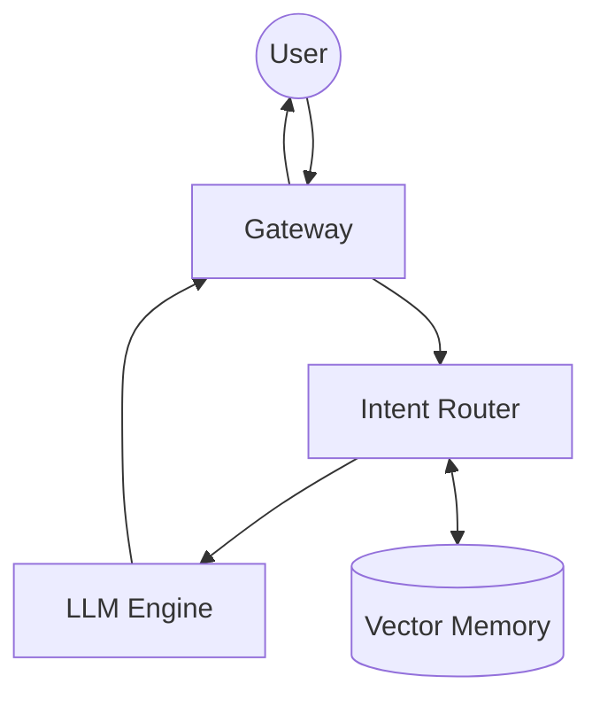
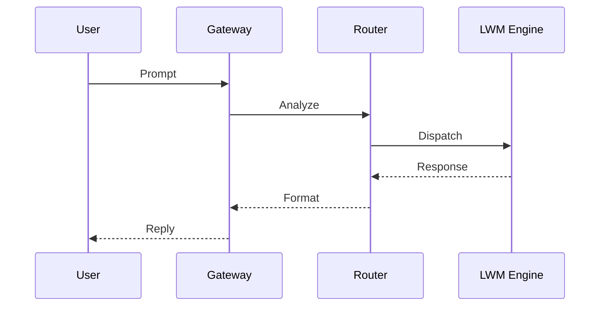

# CRYSTAL CODEX

## Mission
The codex anchors ABZU's purpose: to explore creative AI systems through a modular, chakra‑aligned architecture. It documents the guiding principles that shape development and maintains clarity around goals and responsibilities.

## Chakra Architecture
Each chakra layer corresponds to a functional tier in the codebase:

- **Root** – environment bootstrapping and configuration files.
- **Sacral** – data ingestion, memory storage and corpus tools.
- **Solar Plexus** – intent detection and decision logic.
- **Heart** – interaction handlers and emotional context modules.
- **Throat** – communication gateways and API surfaces.
- **Third Eye** – analytical engines and introspection utilities.
- **Crown** – orchestration scripts and operator consoles.

### High-Level Flow

## LWM Architecture
The Living Web Matrix (LWM) describes how messages traverse the chakra layers and interact with core services.

## Chakra-to-Module Mapping
| Chakra | Directories | Core Modules |
| --- | --- | --- |
| Root | `scripts/`, `config/` | `bootstrap.sh`, environment loaders |
| Sacral | `data/`, `memory/` | `memory_store.py`, corpus tools |
| Solar Plexus | `crown_router.py`, `intent_matrix.json` | intent parsing, decision logic |
| Heart | `emotional_state.py`, `emotion_registry.py` | affect trackers, resonance models |
| Throat | `communication/`, `server.py` | API gateways, WebRTC bridges |
| Third Eye | `insight_compiler.py`, `task_profiling.py` | analytics, introspection |
| Crown | `start_crown_console.sh`, `start_dev_agents.py` | orchestration scripts, operator consoles |

## Dependency Matrix
| Layer | Key Modules | Core Dependencies | External Services |
| --- | --- | --- | --- |
| Root | `scripts/bootstrap.sh` | Python, pip | — |
| Sacral | `memory/`, `data/` | sqlite3, json | — |
| Solar Plexus | `intent_matrix.json`, `crown_router.py` | pydantic | — |
| Heart | `emotional_state.py`, `emotion_registry.py` | librosa, opensmile | — |
| Throat | `communication/`, `server.py` | fastapi, websockets | WebRTC clients |
| Third Eye | `insight_compiler.py`, `task_profiling.py` | numpy, pandas | — |
| Crown | `start_crown_console.sh`, `start_dev_agents.py` | rich, typer | Terminal |

## Setup Guide
1. **Clone the Repository** – `git clone https://github.com/DINGIRABZU/ABZU.git && cd ABZU`.
2. **Create a Virtual Environment** – `python -m venv .venv && source .venv/bin/activate`.
3. **Install Requirements** – run `./scripts/bootstrap.sh` or `pip install -e .` for a lean setup.
4. **Configure Secrets** – copy `secrets.env.template` to `secrets.env` and populate required tokens.
5. **Validate Installation** – execute `pre-commit run --all-files` and `pytest` to ensure a healthy environment.
6. **Launch Console** – start the crown console with `python start_crown_console.py` and issue the `chat` command.

## Tutorials

### Quick Start
1. Clone the repository and run `./scripts/bootstrap.sh`.
2. Start a console with `python start_crown_console.py`.
3. Issue the `chat` command to interact with the local model.

### Adding a Module
1. Create the module under the chakra directory that matches its role.
2. Write accompanying tests under `tests/`.
3. Validate style and imports with `pre-commit run --files <path>`.
4. Run `pytest` to ensure coverage before committing.

## Operational Runbooks
- **Environment Setup** – `./scripts/bootstrap.sh` creates a virtualenv and installs dependencies.
- **Running Tests** – execute `pytest` from the repository root for unit validation.
- **Lint & Style Checks** – `pre-commit run --all-files` ensures formatting and linting rules.
- **Security Scan** – `bandit -r .` examines the codebase for common vulnerabilities.
- **Deployment** – use `./run_inanna.sh` for local demo or consult `docs/deployment_overview.md` for container and cloud options.
