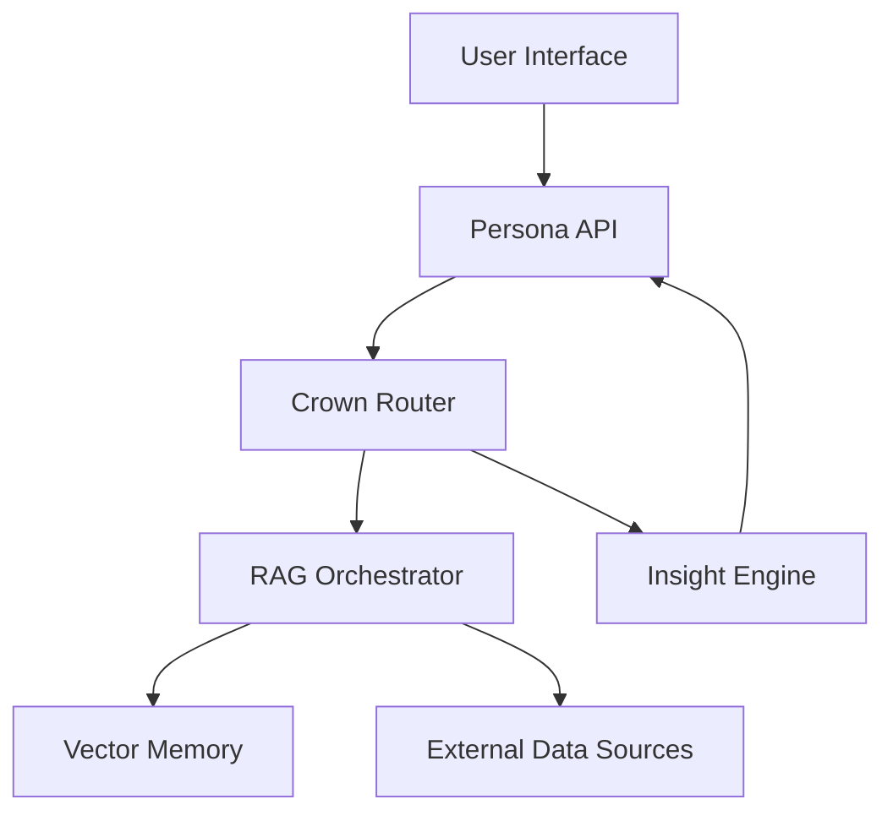

# ABZU Subsystem Overview

The diagram below outlines how the primary subsystems collaborate within ABZU.

**User Interface → Persona API**
: User intents enter through the interface and are normalized by the Persona API.

**Persona API → Crown Router**
: The Persona API forwards structured requests to the Crown Router, which coordinates system-level actions.

**Crown Router → RAG Orchestrator**
: When knowledge retrieval is required, the Crown Router invokes the RAG Orchestrator to gather context.

**RAG Orchestrator → Vector Memory**
: The RAG layer queries Vector Memory for stored embeddings relevant to the request.

**RAG Orchestrator → External Data Sources**
: If additional information is needed, the RAG layer reaches out to external connectors (see [Connector Index](connectors/CONNECTOR_INDEX.md)).

**Crown Router → Insight Engine**
: For higher-order reasoning over the collected context, the Crown Router engages the Insight Engine.

**Insight Engine → Persona API**
: Synthesized insights flow back through the Persona API before returning to the user.
