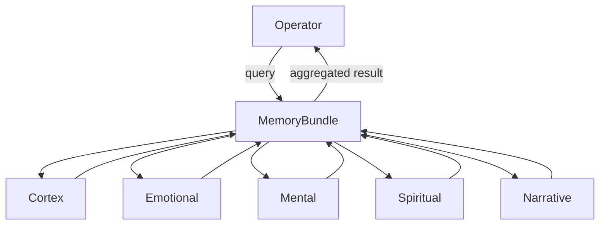
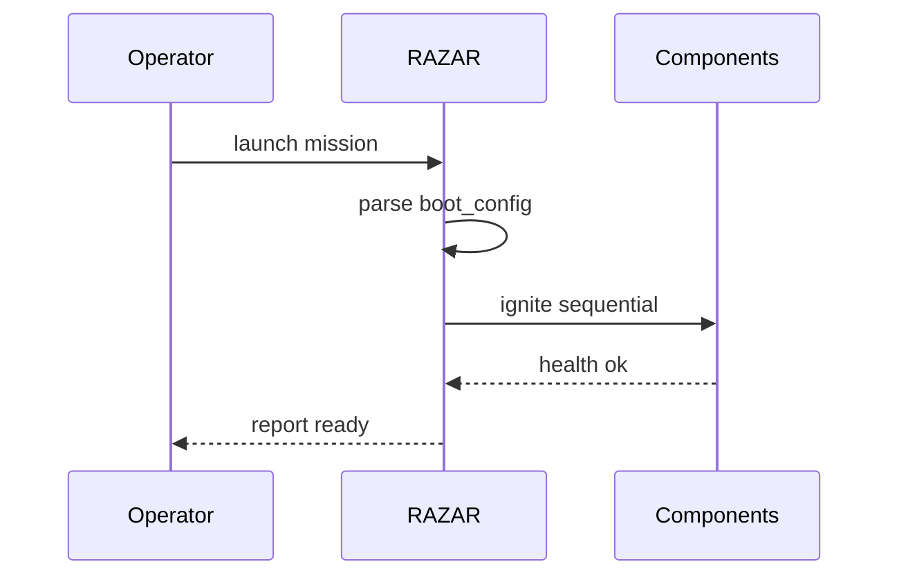
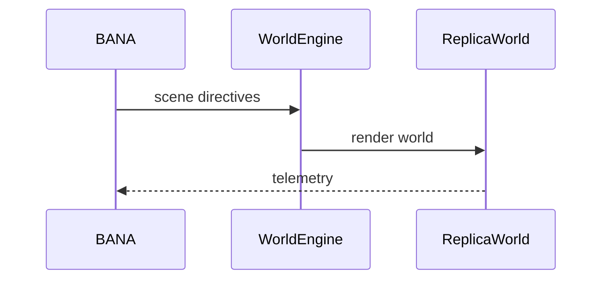

# ABZU Blueprint

**Version:** v0.1.0
**Last updated:** 2025-10-05

## Mission & Vision
ABZU ignites inner narratives before external action, weaving memory bundles, dynamic ignition, and operator guidance into a living system that "knows itself" before engaging others [project_mission_vision.md](project_mission_vision.md).

## Guiding Ethos
The project advances inward‑first intelligence, treats narrative as infrastructure, practices embodied co‑learning, preserves chakra balance, ensures portability, and enforces consent‑first ethics [project_mission_vision.md](project_mission_vision.md).

## Macro Architecture

### Memory Bundle
Unified memory layers exchange initialization signals through an event bus, allowing operators to query a consolidated memory spine [memory_layers_GUIDE.md](memory_layers_GUIDE.md).


### RAZAR Ignition
RAZAR orchestrates multi-layer boot sequences, prepares environments, launches components, and records mission outcomes for operator oversight [RAZAR_AGENT.md](RAZAR_AGENT.md).


### Agent Ecosystem & Relations
Crown brokers operator directives to Nazarick servants, who relay telemetry back to both Crown and the operator for continuous oversight. The diagram below maps these bidirectional flows [project_mission_vision.md](project_mission_vision.md).
```mermaid
{{#include figures/agent_relations.mmd}}
```

### World Replication
Narrative directives drive world engines that render immersive environments and feed telemetry back into the story loop [project_mission_vision.md](project_mission_vision.md).


## Chakra Architecture & HeartBeat Pulse
The chakra cycle engine synchronizes core modules with a unified pulse so agents can monitor and heal their aligned layers. The diagram maps primary modules to chakras and the returning heartbeat that keeps them in lockstep.

```mermaid
{{#include figures/chakra_architecture.mmd}}
```

## Stepping Stones
- Memory bundle implementation: [memory/bundle.py](../memory/bundle.py)
- Memory bootstrap script: [scripts/bootstrap_memory.py](../scripts/bootstrap_memory.py)
- RAZAR orchestrator: [razar/boot_orchestrator.py](../razar/boot_orchestrator.py)
- Agent roster and roles: [agents/nazarick/nazarick_core_architecture.md](../agents/nazarick/nazarick_core_architecture.md)
- World services scaffold: [worlds/services.py](../worlds/services.py)
- Additional guidance: [RAZAR_AGENT.md](RAZAR_AGENT.md), [memory_layers_GUIDE.md](memory_layers_GUIDE.md), [project_mission_vision.md](project_mission_vision.md)
