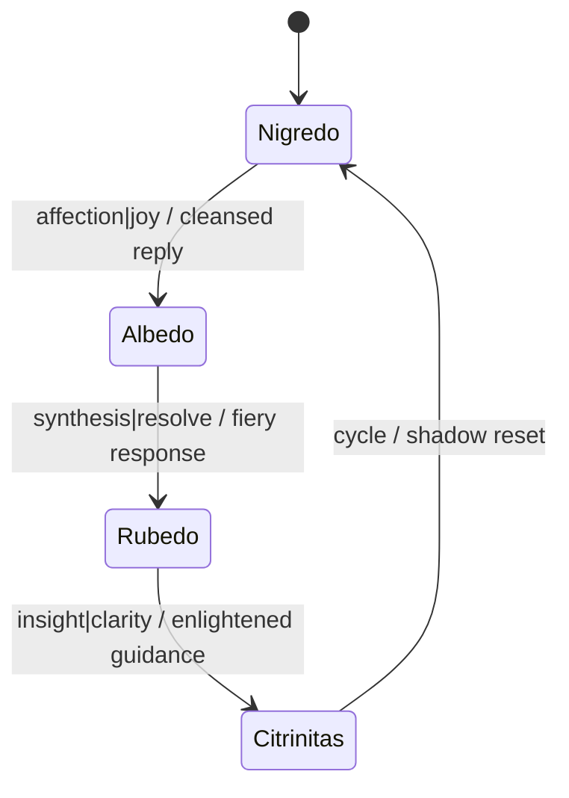

# Albedo Layer

Albedo is a personality layer that shapes responses through a four-phase alchemical cycle.

## State Machine



The Mermaid source lives at [assets/albedo_state_machine.mmd](assets/albedo_state_machine.mmd).

## Deployment

```bash
export GLM_API_URL=https://glm.example.com
export GLM_API_KEY=token
python -m INANNA_AI.main --personality albedo --duration 3
```

Set any additional parameters in [config/albedo_config.yaml](../config/albedo_config.yaml) including GLM endpoint, quantum context, and logging paths.

## Logging

`config/albedo_config.yaml` defines two log outputs:

- `conversation` – defaults to `logs/albedo_layer.log`
- `metrics` – defaults to `logs/albedo_metrics.jsonl`

Ensure the paths exist before launch so interactions and metrics persist.

## Cross-Links

- [Albedo Guide](Albedo_GUIDE.md)

## Version History

| Version | Date | Notes |
| --- | --- | --- |
| [Unreleased](../CHANGELOG.md#documentation-audit) | - | Added state machine diagram, deployment steps, and logging expectations. |
