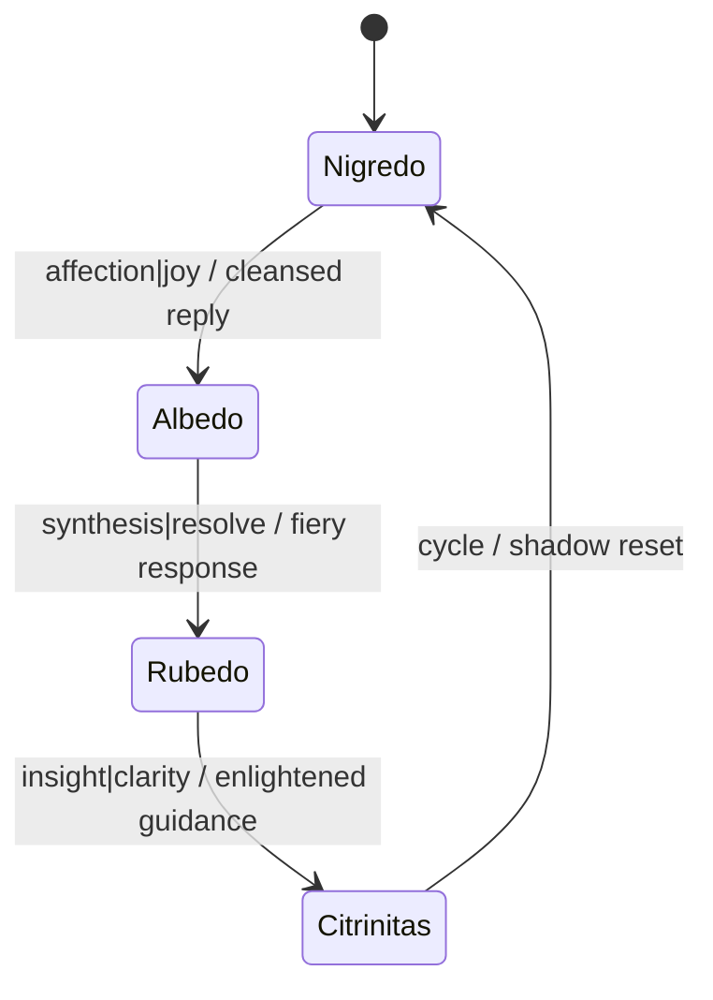

# Albedo Personality Layer

A four-phase state machine powers the **Albedo** layer, signalling Nazarick agents and driving responses through a remote GLM (Generative Language Model). Configuration lives under `config/albedo_config.yaml`, and all related modules reside in `INANNA_AI/personality_layers/albedo`. Mermaid sources for the flow and state machine diagrams live at `docs/assets/albedo_flow.mmd` and `docs/assets/albedo_state_machine.mmd`.

## Project structure

- `__init__.py` – exposes `AlbedoPersonality` used by the orchestrator.
- `alchemical_persona.py` – weighted state machine with `detect_state_trigger()`.
- `state_contexts.py` – prompt templates applied for each state.
- `glm_integration.py` – `GLMIntegration` class for HTTP requests.

`AlbedoPersonality` calls `detect_state_trigger()` to extract entities and emotional cues, builds a state specific prompt and updates shadow metrics after each response.

## Flow

```mermaid
flowchart LR
    input[Prompt] --> detect[detect_state_trigger()]
    detect --> build[Build Prompt]
    build --> glm[GLM Endpoint]
    glm --> reply[Response]
    reply --> update[Update Shadow Metrics]
```

The Mermaid source lives at [assets/albedo_flow.mmd](assets/albedo_flow.mmd).

## Configuring the GLM endpoint

`GLMIntegration` reads the endpoint and API key from environment variables by default.  Override them when instantiating the class or set `GLM_API_URL` and `GLM_API_KEY`:

```python
from INANNA_AI.glm_integration import GLMIntegration

glm = GLMIntegration(
    endpoint="https://glm.example.com/glm41v_9b",
    api_key="<your key>",
)
```

When no arguments are provided the class falls back to the `GLM_API_URL` and
`GLM_API_KEY` environment variables and attaches the key as an
`Authorization: Bearer` header when present.

## State Machine Diagram

The Albedo layer cycles through four chromatic states.  To engage the layer, create it and pass it to the orchestrator. The `INANNA_AI.main` script records microphone input and routes it through this state machine:

```bash
export GLM_API_KEY=<your key>
export GLM_API_URL=https://glm.example.com/glm41v_9b
python -m INANNA_AI.main --duration 3 --personality albedo
```

Each invocation cycles through Nigredo, Albedo, Rubedo and Citrinitas states before returning to Nigredo for a continuous loop. The diagram below labels each transition with the trigger inputs and resulting outputs.



The Mermaid source lives at [assets/albedo_state_machine.mmd](assets/albedo_state_machine.mmd).

### Transition details

| From | To | Inputs | Outputs |
| --- | --- | --- | --- |
| Nigredo | Albedo | Affection or joy triggers | Cleansed reflection |
| Albedo | Rubedo | Synthesis or resolve cues | Fiery transformation |
| Rubedo | Citrinitas | Insight or clarity signals | Enlightened guidance |
| Citrinitas | Nigredo | Cycle completion | Return to shadow baseline |

### Nazarick agent triggers

State shifts can alert specific Nazarick servants to intervene:

- Nigredo → Albedo engages the **Sebas Compassion Module**.
- Albedo → Rubedo alerts the **Cocytus Prompt Arbiter**.
- Rubedo → Citrinitas summons the **Demiurge Strategic Simulator**.
- Citrinitas → Nigredo pings the **Pandora Persona Emulator**.

| State | Agent ID | Channel |
| --- | --- | --- |
| Nigredo | Pandora Persona Emulator | `#treasure-vault` |
| Albedo | Sebas Compassion Module | `#royal-suite` |
| Rubedo | Cocytus Prompt Arbiter | `#glacier-prison` |
| Citrinitas | Demiurge Strategic Simulator | `#lava-pits` |

### Persona & Responsibilities

Each chromatic state embodies a narrative role with its own emotional tone:

| State | Role | Emotional Context |
| --- | --- | --- |
| Nigredo | Breaks down perception and exposes core wounds | Grief, emptiness |
| Albedo | Washes the shadow with compassionate reflection | Hope, empathy |
| Rubedo | Forges insight into decisive action | Passion, resolve |
| Citrinitas | Illuminates the path toward equilibrium | Wisdom, serenity |

You can also use the layer programmatically:

```python
from orchestrator import MoGEOrchestrator
from INANNA_AI.personality_layers import AlbedoPersonality

layer = AlbedoPersonality()
orchestrator = MoGEOrchestrator(albedo_layer=layer)
```

Calling `orchestrator.route()` with `text_modality=True` will return the GLM reply reflecting the current state.

## Quantum personality context

Version 2 introduces an optional *quantum context* argument.  The
``AlchemicalPersona`` computes a sentence embedding for each message using
``MUSIC_FOUNDATION.qnl_utils.quantum_embed``.  ``AlbedoPersonality.generate_response``
accepts a ``quantum_context`` string which is forwarded to
``GLMIntegration.complete`` and inserted into the state templates in
``state_contexts``.  The persona updates its state weights using the embedding
and the current emotional weight from :mod:`INANNA_AI.emotion_analysis`.

```python
layer.generate_response("I love Alice", quantum_context="entangled")
```

## Object context for avatar selection

External vision modules can influence which avatar texture the Albedo layer
uses. Feed :class:`vision.yoloe_adapter.Detection` objects into
``agents.albedo.consume_detections`` to update the current avatar based on the
scene. Detected objects are matched against a small mapping; for example a
``"cat"`` detection selects ``avatars/cat.png``. This hook allows environmental
context to steer avatar presentation alongside conversational state.

## Examples

The persona inspects each message to detect emotional keywords and entity types.
State metrics are updated after the model replies.

```python
from INANNA_AI.personality_layers.albedo import AlchemicalPersona

core = AlchemicalPersona()
entity, triggers = core.detect_state_trigger("I love Alice")
print(entity)           # "person"
print(triggers)         # {"affection"}
core.update_metrics(triggers)
print(core.entanglement, core.shadow_balance)
```

When combined with ``AlbedoPersonality`` the detected entity and triggers are
inserted into the prompt:

```python
from INANNA_AI.personality_layers import AlbedoPersonality
layer = AlbedoPersonality()
reply = layer.generate_response("I love Alice")
```

The first call uses the ``nigredo`` template and yields a prompt like:

```
[Nigredo] (person) I love Alice affection
```

## Deployment Guide

1. Copy the sample configuration at `config/albedo_config.yaml` or adapt the
   snippet below for your environment. This file centralizes the remote GLM
   settings, optional quantum context, and log locations.
2. Export `GLM_API_KEY` (and optionally `GLM_API_URL`) or set them inside the
   YAML file.
3. Launch the layer with `python -m INANNA_AI.main --personality albedo` or
   integrate the class directly as shown after the snippet.

Example `albedo_config.yaml`:

```yaml
glm:
  endpoint: https://glm.example.com/glm41v_9b
  api_key: ${GLM_API_KEY}  # falls back to environment variable
quantum:
  context: entangled
logging:
  conversation: logs/albedo_layer.log
  metrics: logs/albedo_metrics.jsonl
```

Leaving `api_key` blank relies on the `GLM_API_KEY` environment variable. The `quantum.context` value seeds the optional quantum embedding pipeline; omit it to run without quantum context.

Load the configuration before creating the personality:

```python
from pathlib import Path
import yaml
from INANNA_AI.glm_integration import GLMIntegration
from INANNA_AI.personality_layers import AlbedoPersonality

cfg = yaml.safe_load(Path("config/albedo_config.yaml").read_text())
glm = GLMIntegration(
    endpoint=cfg["glm"]["endpoint"],
    api_key=cfg["glm"]["api_key"],
)
layer = AlbedoPersonality(integration=glm)
reply = layer.generate_response("hello", quantum_context=cfg["quantum"]["context"])
```

The `conversation` and `metrics` paths separate human transcripts from state
statistics and can be tailored for production deployments.

## Additional Personality Layers

The project also provides three lightweight layers that can be invoked through the orchestrator or the
`learning_mutator.py --activate` option. These layers colour the response tone without invoking the
remote GLM.

### Nigredo layer

Represents dissolution and shadow work. Replies are hushed and introspective:

```python
from INANNA_AI.personality_layers.nigredo_layer import NigredoPersonality
layer = NigredoPersonality()
print(layer.speak("welcome"))
```

Expected output resembles:

```
Nigredo whispers from the void: welcome
```

### Rubedo layer

Celebrates fiery transformation with a triumphant voice:

```python
from INANNA_AI.personality_layers.rubedo_layer import RubedoPersonality
layer = RubedoPersonality()
print(layer.speak("it is done"))
```

Which returns something like:

```
Rubedo proclaims with blazing heart: it is done
```

### Citrinitas layer

Guides the user toward clarity and enlightenment:

```python
from INANNA_AI.personality_layers.citrinitas_layer import CitrinitasPersonality
layer = CitrinitasPersonality()
print(layer.speak("proceed"))
```

Typical output is:

```
Citrinitas speaks in golden clarity: proceed
```

## Deployment & Config

Use `config/albedo_config.yaml` to centralize the GLM endpoint, optional quantum context, and log locations:

```yaml
glm:
  endpoint: https://glm.example.com/glm41v_9b
  api_key: ${GLM_API_KEY}
logging:
  conversation: logs/albedo_layer.log
  metrics: logs/albedo_metrics.jsonl
```

Launch the layer with:

```bash
python -m INANNA_AI.main --personality albedo --config config/albedo_config.yaml
```

## Logging Expectations

Successful runs emit structured logs to the paths defined in the `logging` section:

```text
INFO albedo.layer state=Nigredo msg="I love Alice" emotion=affection
INFO albedo.layer state=Albedo msg="Response text" emotion=joy
```

The `conversation` file captures dialogue transcripts, while `metrics` records state statistics and can be tailored for production deployments.

## Version History

| Version | Date       | Summary |
|---------|------------|---------|
| 0.4.0   | 2025-09-01 | Clarified deployment config and logging expectations. |
| 0.3.0   | 2025-08-31 | Added Nazarick agent triggers and state-channel table. |
| 0.2.0   | 2025-08-30 | Documented transition inputs and outputs; externalized state diagram. |
| 0.1.0   | 2025-08-29 | Added state machine diagram and initial version table. |

