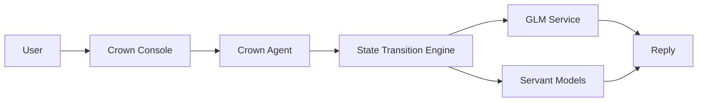
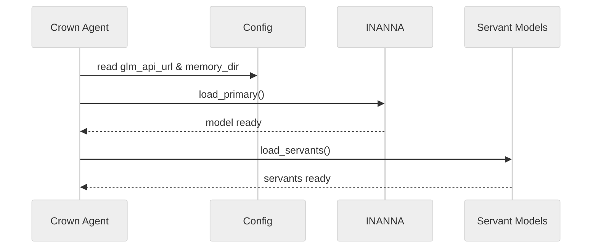

# Crown Agent Overview

The diagram below shows how the main components interact when using the console. A later section outlines deployment steps and escalation triggers.

```
+--------------------+
|    Crown Console   |
+---------+----------+
          |
          v
+---------+----------+
|   Crown Agent      |
| (GLMIntegration)   |
+---------+----------+
          |
          v
+---------+----------+
| State Transition   |
| Engine             |
+---------+----------+
          |
     +----+----+
     |         |
     v         v
+--------+ +---------------+
|  GLM   | | Servant Models|
| 4.1V   | | (DeepSeek etc)|
+--------+ +---------------+
```

User commands enter through the **Crown Console**. The **Crown Agent** sends
requests to the GLM service and keeps recent history in memory. The
**State Transition Engine** tracks ritual phrases and emotional cues. It may
delegate a prompt to one of the registered servant models when appropriate.

## Persona & Responsibilities

The Crown agent presents a steady, protocol‑focused persona. It channels
operator intent to the correct servant model while maintaining neutral tone
and precise ritual phrasing.

- **Session steward** – preserves dialogue context and routes prompts through
  the state engine.
- **Guardian of escalation** – raises repair requests to RAZAR when automated
  recovery fails and alerts a human operator if critical directives go
  unresolved.

## Flow



The Mermaid source lives at [assets/crown_flow.mmd](assets/crown_flow.mmd).

## Boot Sequence



The Mermaid source lives at [assets/crown_boot.mmd](assets/crown_boot.mmd).

## Configuration

| Model | Endpoint key | Memory path |
|-------|--------------|-------------|
| INANNA Core | `glm_api_url` | `data/vector_memory` |
| DeepSeek servant | `servant_models.deepseek` | `data/vector_memory` |
| Mistral servant | `servant_models.mistral` | `data/vector_memory` |
| Kimi K2 servant | `servant_models.kimi_k2` | `data/vector_memory` |

## Memory‑Aided Routing

The Crown router looks up previous expression decisions in `vector_memory`. When the stored `soul_state` aligns with the current emotion, the corresponding voice backend and avatar style are weighted higher. This memory‑aided approach keeps responses consistent with past interactions.

## Session Logger

Running the console interface now writes audio clips under `logs/audio/` and avatar frames to `logs/video/`. These helpers live in `tools/session_logger.py` and make it easier to review how voice modulation and streaming evolve across sessions.

## Automated Module Repair

The Crown stack can defer failing components to the RAZAR agent for automatic
patching. See [RAZAR Agent](RAZAR_AGENT.md) for details on the repair workflow
that queries an LLM for fixes and reintroduces modules after successful tests.

## Crown Link Protocol

RAZAR communicates with the Crown stack over a small WebSocket interface
implemented in `razar/crown_link.py`. Two JSON message types are exchanged:

- **Status updates** – `{"type": "status", "component": "state_engine", "result": "ok", "log_snippet": "..."}`
- **Repair requests** – `{"type": "repair", "stack_trace": "...", "config_summary": "..."}`

The Crown side replies with patch instructions which RAZAR uses to heal faulty
modules before reintroducing them into the boot cycle. See the
[RAZAR Agent](RAZAR_AGENT.md#crown-link-protocol) document for detailed schema
descriptions.

## Deployment & Operator Relay

Deployment begins with a short alignment between Crown and the RAZAR agent.
RAZAR expects a mission brief and acknowledgement before handling operator
commands.

### Startup Steps

1. Run [`init_crown_agent.py`](../init_crown_agent.py) to prepare memory
directories, register servant models, and validate the GLM endpoint.
2. Exchange a mission brief using [`razar/crown_handshake.py`](../razar/crown_handshake.py)
so both sides agree on capabilities.
3. Launch the console after an acknowledgement to begin the session.

### Mission Brief JSON Example

```json
// sent by RAZAR
{
  "type": "brief",
  "objective": "sync memory index",
  "priority_map": {"memory": "ok"},
  "escalation": {"on_failure": "operator"},
  "open_issues": ["missing_audio_stream"]
}

// received by Crown
{
  "type": "ack",
  "capabilities": ["glm", "avatar"],
  "session": "2025-10-01T12:00:00Z"
}
```

```text
[RAZAR WS] -> {"type":"brief","priority_map":{"memory":"ok"}}
[Crown WS] <- {"type":"ack","capabilities":["glm","avatar"]}
```

### Operator Command Relay

Operator directives are issued through `/operator/command`. Crown forwards them
over the WebSocket link to RAZAR and returns the result.

```json
POST /operator/command {"command": "status"}

[Crown WS] -> {"type": "operator", "command": "status"}
[RAZAR WS] <- {"type": "result", "output": "all green"}
```

### Operator Chat Transcript

```text
Operator: Crown, status report.
Crown: Systems nominal; memory and avatar channels online.
Operator: Escalate audio glitch to RAZAR.
Crown: Acknowledged. Notifying RAZAR for repair.
```

### Escalation Thresholds

- **Automated repair** – any component marked `degraded` for three cycles
  triggers a repair request to RAZAR.
- **Human override** – a mission brief with `priority_map` entries set to
  `critical` or repeated operator command failures escalates to a human
  operator.

## Service Wake Sequence

After the mission brief handshake, Crown brings its supporting servants
online. The stack uses [launch_servants.sh](../launch_servants.sh) to read the
`SERVANT_MODELS` mapping and start the listed Nazarick agents and the Bana
bio‑adaptive narrator. Each entry maps a servant name to its endpoint; if
`SERVANT_MODELS` is unset no servants are launched. Set `NAZARICK_ENV` to choose
the configuration profile (e.g., `dev`, `staging`) so agents load the correct
settings. For development workflows,
[start_dev_agents.py](../start_dev_agents.py) bootstraps the same servants after
RAZAR initializes. With these scripts and environment variables in place, Crown
signals the agents immediately after the handshake, ensuring they are ready for
subsequent prompts.

## Version History

| Version | Date       | Summary |
|---------|------------|---------|
| 0.3.0   | 2025-10-15 | Added boot sequence diagram and configuration table. |
| 0.2.0   | 2025-09-30 | Added deployment guidance and initial version table. |
| 0.1.0   | 2025-08-28 | Initial document outlining Crown agent architecture. |
