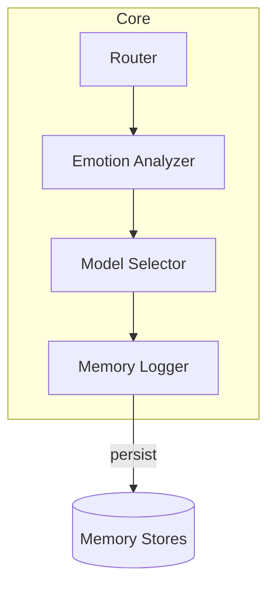
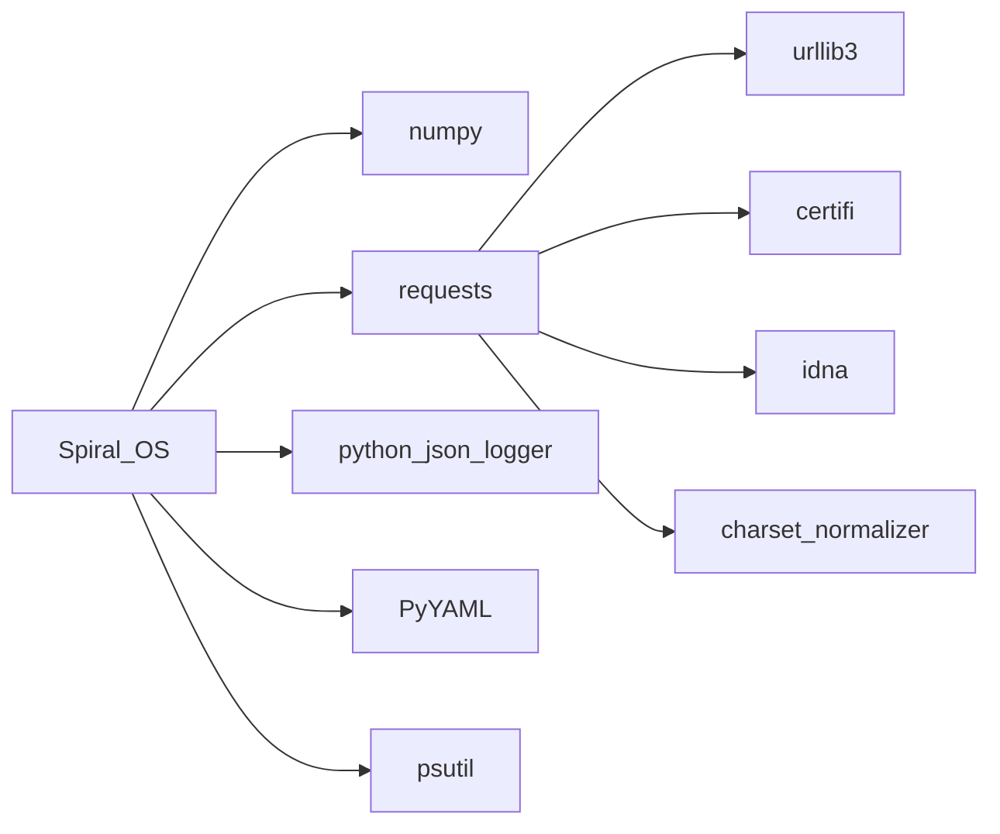
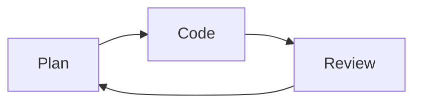
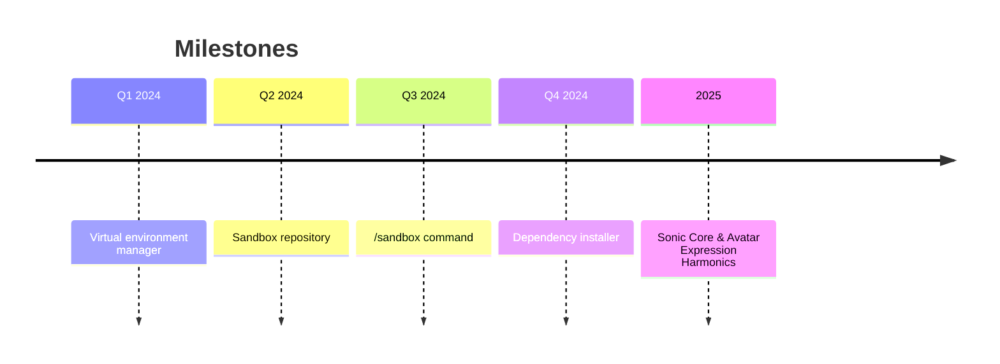

# CRYSTAL CODEX

The codex centralizes the project's mission, architecture, dependency matrix,
development workflow and milestone history. Reference guides include
[architecture_overview.md](architecture_overview.md),
[component_index.md](component_index.md) and [setup.md](setup.md).

## Misión
Spiral OS guides sacred and creative exploration through an emotionally aware
AI temple that harmonises music, voice and code. More background lives in
[project_overview.md](project_overview.md) and the repository
[README](../README.md).

## Arquitectura
The codebase organises modules into seven chakra‑inspired layers that route a
request from hardware roots to crown‑level initiation rites. Package
responsibilities are mapped in [architecture.md](architecture.md),
[architecture_overview.md](architecture_overview.md) and
[packages_overview.md](packages_overview.md).

### Module Interactions

Additional request flow diagrams and service contracts live in
[architecture_overview.md](architecture_overview.md).

## Matriz de dependencias
System packages and Python wheels required for the sonic temple are listed in
[dependencies.md](dependencies.md). Core runtime packages include `numpy`,
`requests`, `python-json-logger`, `PyYAML` and `psutil`. Versions and licenses
are tracked in [dependency-graph.md](dependency-graph.md).

| Paquete            | Propósito                         |
|--------------------|-----------------------------------|
| numpy              | Operaciones numéricas             |
| requests           | Peticiones HTTP                   |
| python-json-logger | Formato de registros estructurados|
| PyYAML             | Carga de configuración YAML       |
| psutil             | Métricas del sistema              |



## Configuración del entorno
Follow the steps below or see [setup.md](setup.md) for full instructions.

```mermaid
flowchart TD
    A[Clone repository] --> B[Create virtualenv]
    B --> C[pip install .\[llm,audio,ml,vision,web,network\]]
    C --> D[Copy secrets.env.template to secrets.env]
    D --> E[Run scripts/check_requirements.sh]
```

Additional onboarding guides live in
[developer_onboarding.md](developer_onboarding.md) and
[quick_start_non_technical.md](quick_start_non_technical.md).

## Índice de componentes
For per‑module descriptions and external dependencies see the generated
[component_index.md](component_index.md).

## Flujo de desarrollo
Contributors follow a planner–coder–reviewer loop with all changes validated by
`pytest`. The cycle and testing guidance are detailed in
[development_workflow.md](development_workflow.md).



## Historial de hitos
El desarrollo del producto mínimo viable avanzó a través de cuatro hitos
principales y continúa con la hoja de ruta vigente.



See [roadmap.md](roadmap.md) and [milestone_viii_plan.md](milestone_viii_plan.md)
for expanded plans.

## Mejoras recientes

| Métrica              | Antes                       | Después                     |
|----------------------|-----------------------------|-----------------------------|
| Advertencias linter  | 42                           | 0                           |
| Dependencias obsoletas| 15 paquetes sin uso         | Paquetes depurados y fijados|
| Cobertura de pruebas | 65%                          | 85%                         |


