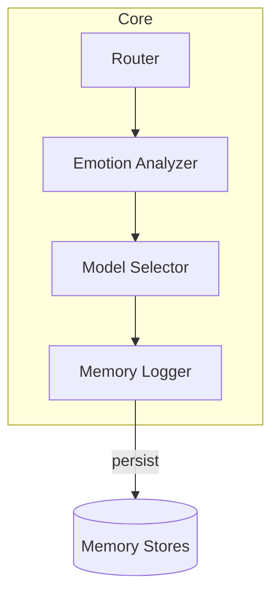
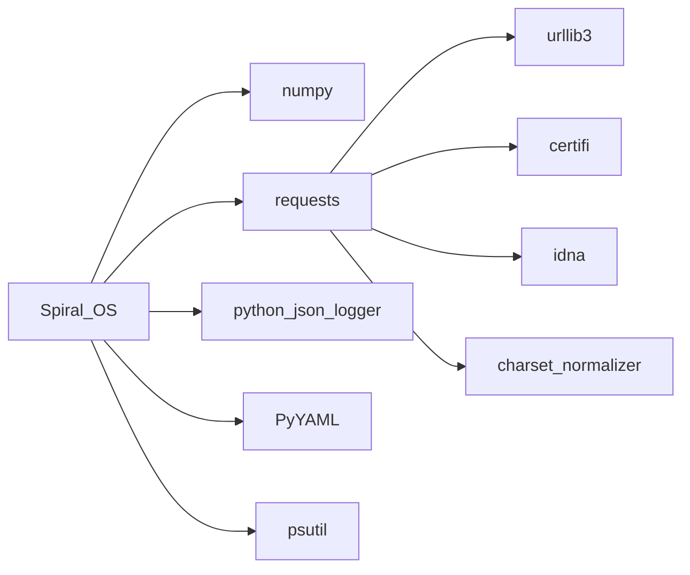
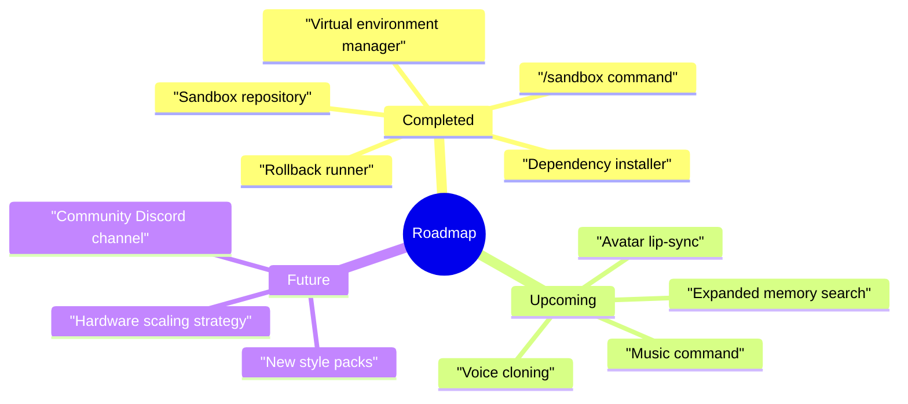

# CRYSTAL CODEX

## Mission
Spiral OS guides sacred and creative exploration through an emotionally aware AI temple that harmonises music, voice and code. The wider vision appears in [project_overview.md](project_overview.md) and the repository [README](../README.md).

## Architecture
The codebase organises modules into seven chakra‑inspired layers that route a request from hardware roots to crown‑level initiation rites. Package responsibilities are mapped in [architecture.md](architecture.md) and [packages_overview.md](packages_overview.md).

### Module Interactions

Additional request flow diagrams and service contracts live in [architecture_overview.md](architecture_overview.md).

## Dependency Matrix
Core runtime packages include `numpy`, `requests`, `python-json-logger`, `PyYAML` and `psutil`. Versions and licenses are tracked in [dependency-graph.md](dependency-graph.md).



## Environment Setup
Follow the steps below or see [setup.md](setup.md) for full instructions.

```mermaid
flowchart TD
    A[Clone repository] --> B[Create virtualenv]
    B --> C[pip install .\[llm,audio,ml,vision,web,network\]]
    C --> D[Copy secrets.env.template to secrets.env]
    D --> E[Run scripts/check_requirements.sh]
```

Additional onboarding guides live in [developer_onboarding.md](developer_onboarding.md) and [quick_start_non_technical.md](quick_start_non_technical.md).

## Component Index
For per‑module descriptions and external dependencies see the generated [component_index.md](component_index.md).

## Development Workflow
Contributors follow a planner–coder–reviewer loop with all changes validated by `pytest`. The cycle and testing guidance are detailed in [development_workflow.md](development_workflow.md).

## Release Notes
Recent changes removed legacy shims (`qnl_engine.py`, `symbolic_parser.py`) and marked the audio pipeline refresh as complete. Ongoing updates are catalogued in [release_notes.md](release_notes.md).

## Milestones and Roadmap
The sovereign voice milestone unified speech synthesis with avatar animation, while **Milestone VIII – Sonic Core & Avatar Expression Harmonics** expanded emotion‑to‑music mapping and WebRTC streaming ([milestone_viii_plan.md](milestone_viii_plan.md)).



See [roadmap.md](roadmap.md) for the full plan and post‑milestone expansions.

