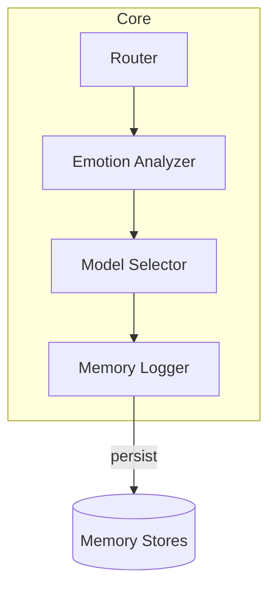
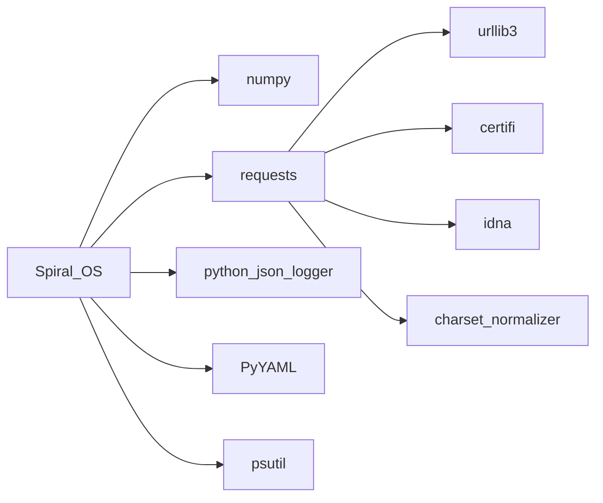
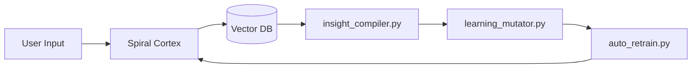
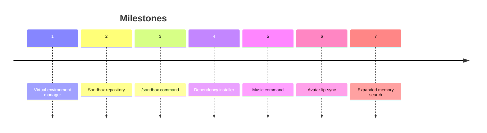

# CRYSTAL CODEX

The codex gathers the mission, dependency matrix, component index,
memory and learning architecture, and self‑improvement protocols. It
cross‑links modules and APIs so contributors can navigate the sonic
temple. Reference guides include
[architecture_overview.md](architecture_overview.md),
[component_index.md](component_index.md),
[api_reference.md](api_reference.md) and [setup.md](setup.md).

## Misión
Spiral OS guides sacred and creative exploration through an emotionally aware
AI temple that harmonises music, voice and code. More background lives in
[project_overview.md](project_overview.md) and the repository
[README](../README.md).

## Arquitectura
The codebase organises modules into seven chakra‑inspired layers that
route a request from hardware roots to crown‑level initiation rites.
Package responsibilities are mapped in
[architecture.md](architecture.md),
[architecture_overview.md](architecture_overview.md) and
[packages_overview.md](packages_overview.md).

### Module Interactions

Additional request flow diagrams and service contracts live in
[architecture_overview.md](architecture_overview.md).

## Matriz de dependencias
System packages and Python wheels required for the sonic temple are listed in
[dependencies.md](dependencies.md). Core runtime packages include `numpy`,
`requests`, `python-json-logger`, `PyYAML` and `psutil`. Versions and licenses
are tracked in [dependency-graph.md](dependency-graph.md).

| Paquete            | Propósito                         |
|--------------------|-----------------------------------|
| numpy              | Operaciones numéricas             |
| requests           | Peticiones HTTP                   |
| python-json-logger | Formato de registros estructurados|
| PyYAML             | Carga de configuración YAML       |
| psutil             | Métricas del sistema              |



## Configuración del entorno
Follow the steps below or see [setup.md](setup.md) for full instructions.

```mermaid
flowchart TD
    A[Clone repository] --> B[Create virtualenv]
    B --> C[pip install .\[llm,audio,ml,vision,web,network\]]
    C --> D[Copy secrets.env.template to secrets.env]
    D --> E[Run scripts/check_requirements.sh]
```

Additional onboarding guides live in
[developer_onboarding.md](developer_onboarding.md) and
[quick_start_non_technical.md](quick_start_non_technical.md).

## Índice de componentes
For per‑module descriptions and external dependencies see the generated
[component_index.md](component_index.md). API routes are documented in
[api_reference.md](api_reference.md). Notable modules include
[server.py](../server.py), [vector_memory.py](../vector_memory.py) and
[learning_mutator.py](../learning_mutator.py).

## Arquitectura de memoria y aprendizaje
Memory flows from the spiral cortex into a vector database and back
through learning helpers. The layers are described in
[memory_architecture.md](memory_architecture.md) and implemented by
[spiral_memory.py](../spiral_memory.py),
[vector_memory.py](../vector_memory.py) and
[insight_compiler.py](../insight_compiler.py).



Memory operations are exposed through the API endpoints listed in
[api_reference.md](api_reference.md#memory).

## Protocolos de auto‑mejora
The system refines itself through scheduled scripts and feedback loops:

- [archetype_feedback_loop.py](../archetype_feedback_loop.py) balances
  persona layers.
- [learning_mutator.py](../learning_mutator.py) proposes prompt
  mutations based on insight statistics.
- [auto_retrain.py](../auto_retrain.py) applies approved changes.
- [psychic_loop.md](psychic_loop.md) outlines the reflection cycle.

Training endpoints are documented in
[api_reference.md](api_reference.md#training).

## Pipelines de avatar y voz
Text responses traverse the voice stack and animate the avatar before
streaming to the client. Pipeline details live in
[avatar_pipeline.md](avatar_pipeline.md) and
[voice_aura.md](voice_aura.md).


Implementation modules: [music_generation.py](../music_generation.py),
[video_stream.py](../video_stream.py) and
[voice_avatar_config.yaml](../voice_avatar_config.yaml).

## Flujo de desarrollo
Contributors follow a planner–coder–reviewer loop with all changes validated by
`pytest`. The cycle and testing guidance are detailed in
[development_workflow.md](development_workflow.md).


## Progreso de hitos
Seven milestones guide development. Completed items are checked below.



| # | Hito                      | Estado      |
|---|---------------------------|-------------|
|1|Virtual environment manager|✅ Completo|
|2|Sandbox repository|✅ Completo|
|3|/sandbox command|✅ Completo|
|4|Dependency installer|✅ Completo|
|5|Music command|En progreso|
|6|Avatar lip-sync|Planificado|
|7|Expanded memory search|Planificado|

See [roadmap.md](roadmap.md) and [milestone_viii_plan.md](milestone_viii_plan.md)
for expanded plans.

## Mejoras recientes

| Métrica              | Antes                       | Después                     |
|----------------------|-----------------------------|-----------------------------|
| Advertencias linter  | 42                           | 0                           |
| Dependencias obsoletas| 15 paquetes sin uso         | Paquetes depurados y fijados|
| Cobertura de pruebas | 65%                          | 85%                         |


