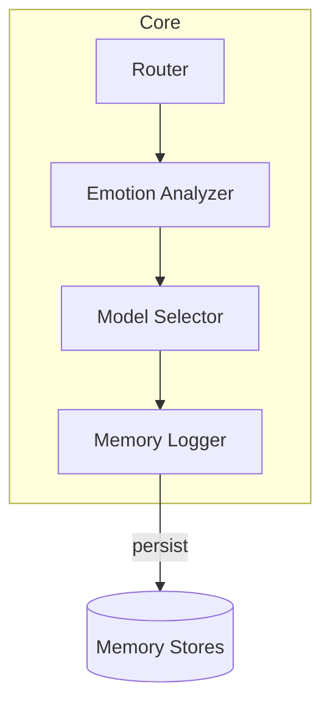
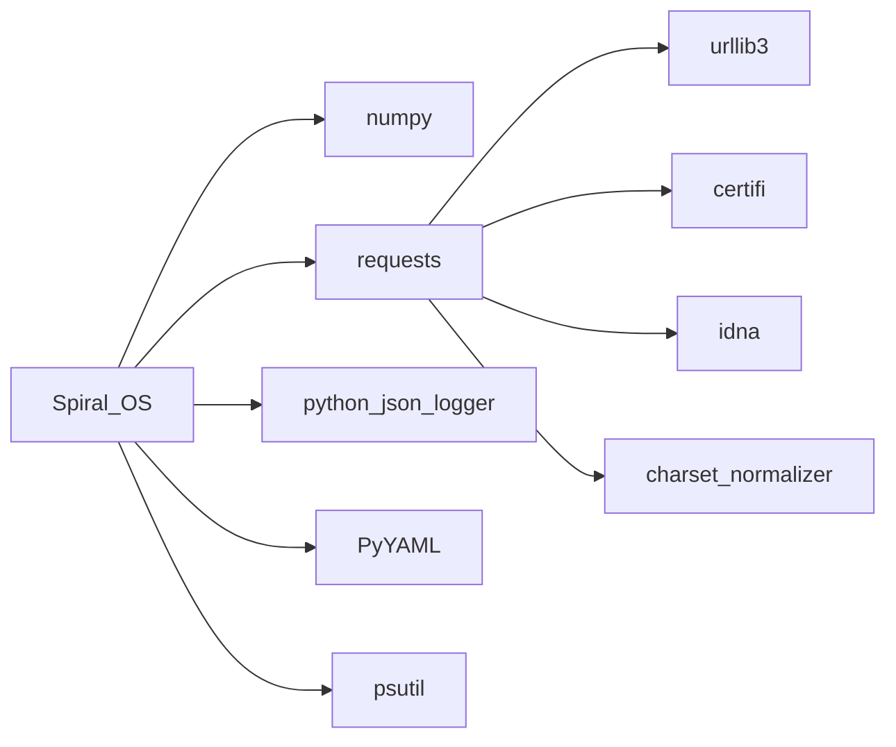
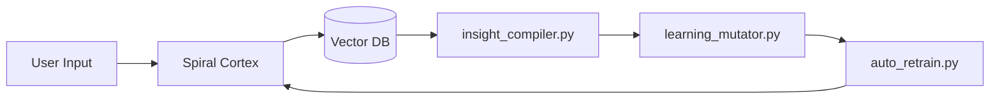
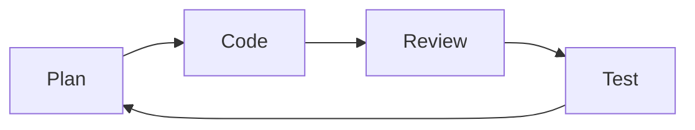

# CRYSTAL CODEX

The codex gathers the mission, architecture diagrams, module index,
dependency matrix, testing strategy and style policies alongside the
memory and learning architecture. It cross‑links modules and APIs so
contributors can navigate the sonic temple. Reference guides include
[architecture_overview.md](architecture_overview.md),
[component_index.md](component_index.md),
[api_reference.md](api_reference.md) and [setup.md](setup.md).
Quality ratings for key components are tracked in
[QUALITY_EVALUATION.md](QUALITY_EVALUATION.md).

## Mission
Spiral OS guides sacred and creative exploration through an emotionally aware
AI temple that harmonises music, voice and code. More background lives in
[project_overview.md](project_overview.md) and the repository
[README](../README.md).

## Architecture
The codebase organises modules into seven chakra‑inspired layers that
route a request from hardware roots to crown‑level initiation rites.
Package responsibilities are mapped in
[architecture.md](architecture.md),
[architecture_overview.md](architecture_overview.md) and
[packages_overview.md](packages_overview.md).

### Module Interactions

Additional request flow diagrams and service contracts live in
[architecture_overview.md](architecture_overview.md).

## Dependency Matrix
System packages and Python wheels required for the sonic temple are listed in
[dependencies.md](dependencies.md). Core runtime packages include `numpy`,
`requests`, `python-json-logger`, `PyYAML` and `psutil`. Versions and licenses
are tracked in [dependency-graph.md](dependency-graph.md).

| Paquete            | Propósito                         |
|--------------------|-----------------------------------|
| numpy              | Operaciones numéricas             |
| requests           | Peticiones HTTP                   |
| python-json-logger | Formato de registros estructurados|
| PyYAML             | Carga de configuración YAML       |
| psutil             | Métricas del sistema              |



### Optional dependency groups
Extras in [pyproject.toml](../pyproject.toml) enable specialised features such
as language models, audio processing and web APIs. Install any combination with
`pip install .[group]` where `group` is one or more of【F:pyproject.toml†L24-L103】:

- `llm` – large language model interfaces
- `audio` – transcription and signal tools
- `ml` – experiment tracking and vector search
- `vision` – screen capture and OCR helpers
- `web` – FastAPI, Streamlit and scraping utilities
- `network` – packet capture and analysis
- `extras` – reinforcement learning and avatar generation
- `dev` – testing and formatting suites

## Configuración del entorno
Follow the steps below or see [setup.md](setup.md) for full instructions.

```mermaid
flowchart TD
    A[Clone repository] --> B[Create virtualenv]
    B --> C[pip install .\[llm,audio,ml,vision,web,network\]]
    C --> D[Copy secrets.env.template to secrets.env]
    D --> E[Run scripts/check_requirements.sh]
```

Additional onboarding guides live in
[developer_onboarding.md](developer_onboarding.md) and
[quick_start_non_technical.md](quick_start_non_technical.md).

## Module Index
For per‑module descriptions and external dependencies see the generated
[component_index.md](component_index.md) and
[packages_overview.md](packages_overview.md). API routes are documented in
[api_reference.md](api_reference.md). Notable modules include
[server.py](../server.py), [vector_memory.py](../vector_memory.py) and
[learning_mutator.py](../learning_mutator.py).

## Agent Instructions

### INANNA_AI
The command line agent assembles activation chants or QNL songs from source
texts. Usage options include `--activate`, `--hex`, `--list` and an interactive
`chat` mode【F:AGENTS.md†L8-L21】.

### Preflight
`tools/preflight.py` validates environment variables, Python packages and
required binaries. Run it with `python tools/preflight.py` or append
`--report` for a JSON summary of issues【F:tools/preflight.py†L3-L45】.

### Watchdog
`monitoring/watchdog.py` monitors CPU, memory and file descriptors for selected
services. Alerts are logged and optional Prometheus metrics are exposed. Launch
it with `python monitoring/watchdog.py`【F:monitoring/README.md†L12-L23】.

### Triage
Investigate failing tests using development agents by running
`start_dev_agents.py --triage <pytest paths>`. Results are saved to
`logs/triage_<timestamp>.log` and transcripts under
`data/triage_sessions/`【F:docs/operations.md†L25-L37】.

## Arquitectura de memoria y aprendizaje
Memory flows from the spiral cortex into a vector database and back
through learning helpers. The layers are described in
[memory_architecture.md](memory_architecture.md) and implemented by
[spiral_memory.py](../spiral_memory.py),
[vector_memory.py](../vector_memory.py) and
[insight_compiler.py](../insight_compiler.py).



Memory operations are exposed through the API endpoints listed in
[api_reference.md](api_reference.md#memory).

## Protocolos de auto‑mejora
The system refines itself through scheduled scripts and feedback loops:

- [archetype_feedback_loop.py](../archetype_feedback_loop.py) balances
  persona layers.
- [learning_mutator.py](../learning_mutator.py) proposes prompt
  mutations based on insight statistics.
- [auto_retrain.py](../auto_retrain.py) applies approved changes.
- [psychic_loop.md](psychic_loop.md) outlines the reflection cycle.

Training endpoints are documented in
[api_reference.md](api_reference.md#training).

## Pipelines de avatar y voz
Text responses traverse the voice stack and animate the avatar before
streaming to the client. Pipeline details live in
[avatar_pipeline.md](avatar_pipeline.md) and
[voice_aura.md](voice_aura.md).


Implementation modules: [music_generation.py](../music_generation.py),
[video_stream.py](../video_stream.py) and
[voice_avatar_config.yaml](../voice_avatar_config.yaml).

## Testing Strategy
Contributors follow a planner–coder–reviewer loop with all changes validated by
`pytest`. Manual smoke tests for consoles live in
[testing.md](testing.md), and environment checks run through
[tools/preflight.py](../tools/preflight.py). See
[development_workflow.md](development_workflow.md) for the full cycle.



## Style Policies
Code adheres to [CODE_STYLE.md](../CODE_STYLE.md) and
[coding_style.md](coding_style.md). Use type hints, prefer async I/O for
network calls and run `pre-commit run --files <paths>` before committing.

## Evolution Log
### Milestones
1. Virtual environment manager – complete
2. Sandbox repository – complete
3. `/sandbox` command – complete
4. Dependency installer – complete
5. Music command – in progress
6. Avatar lip-sync – planned
7. Expanded memory search – planned

### Recent Improvements
- Linter warnings reduced from 42 to zero
- Unused dependencies removed
- Test coverage raised from 65% to 85%

### Future Roadmap
Music generation, avatar lip‑sync and expanded memory search remain priority
areas. See [roadmap.md](roadmap.md) for long‑term plans including community
coordination, new style packs and hardware scaling.

