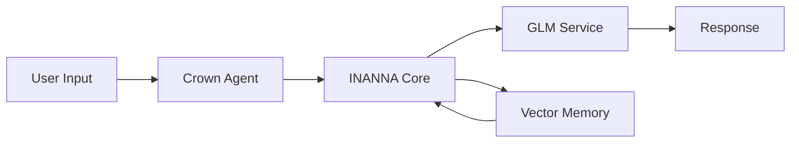
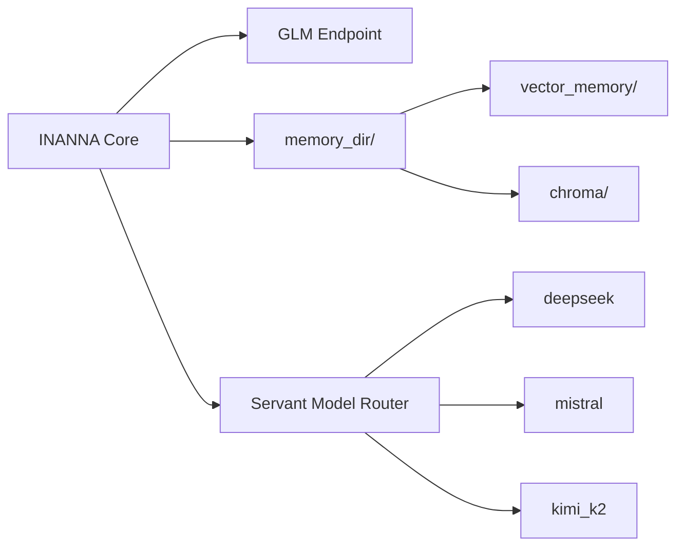

# INANNA Core Configuration

`crown_config/INANNA_CORE.yaml` defines the default settings used by the Crown agent. Each option can be overridden by an environment variable, allowing different deployments without editing the file.

## Flow



The Mermaid source lives at [assets/inanna_flow.mmd](assets/inanna_flow.mmd).

## Core Interfaces



*Figure: GLM endpoint, memory directories, and servant model routing.* The Mermaid source lives at [assets/inanna_core.mmd](assets/inanna_core.mmd).

## Fields

- **`glm_api_url`** – Base URL for the GLM service. Override with `GLM_API_URL`.
- **`glm_api_key`** – API key for the GLM service. Override with `GLM_API_KEY`.
- **`model_path`** – Path to the GLM‑4.1V‑9B weights. Override with `MODEL_PATH`.
- **`memory_dir`** – Root directory containing the persistent memories. Override with `MEMORY_DIR`.
  It should contain two subdirectories:
  
  ```
  memory_dir/
  ├── vector_memory/
  └── chroma/
  ```
  `vector_memory/` stores embeddings written by `vector_memory.py` and
  `chroma/` holds the corpus store used by `corpus_memory`.
- **`servant_models`** – Optional HTTP endpoints for auxiliary models.
  Each key can be overridden individually:
  - `deepseek` – override with `DEEPSEEK_URL`.
  - `mistral` – override with `MISTRAL_URL`.
  - `kimi_k2` – override with `KIMI_K2_URL`.
  The values should point to endpoints that accept a JSON body `{"prompt": "..."}`
  and return the completion text.

## Example

```yaml
glm_api_url: https://glm.example.com/glm41v_9b
glm_api_key: your-api-key
model_path: INANNA_AI/models/GLM-4.1V-9B
memory_dir: data/vector_memory
servant_models:
  deepseek: http://localhost:8002
  mistral: http://localhost:8003
  kimi_k2: http://localhost:8010
```

Environment variables with the same names as listed above override the
corresponding entries when `init_crown_agent.initialize_crown()` loads the file.

## Setup Steps

1. **Create memory directories**

   ```bash
   mkdir -p data/vector_memory/{vector_memory,chroma}
   ```

   This prepares the persistent stores used by `vector_memory.py` and
   `corpus_memory.py`.

2. **Initialize vector and Chroma stores**

   ```bash
   python -m INANNA_AI.corpus_memory --reindex
   ```

   This builds the Chroma index under `data/vector_memory/chroma` and
   confirms the vector store path.

   Verify the collection and optionally expose it for inspection:

   ```bash
   python - <<'PY'
   from spiral_vector_db import init_db
   col = init_db()
   print("records:", col.count())
   PY

   # optional: run a standalone Chroma API server
   python -m chromadb --path data/vector_memory/chroma --port 8030 &
   ```

3. **Launch servant model endpoints**

   Define the endpoints via `SERVANT_MODELS` and run the launcher:

   ```bash
   export SERVANT_MODELS="deepseek=http://localhost:8002,mistral=http://localhost:8003"
   ./launch_servants.sh
   ```

   Each endpoint must expose a `/health` route and accept a JSON body
   `{"prompt": "..."}`. Confirm they are reachable:

   ```bash
   curl -f http://localhost:8002/health
   curl -f http://localhost:8003/health
   ```

4. **Start INANNA core**

   The minimal startup script combines the above steps and verifies the
   configuration:

   ```bash
   scripts/start_inanna_core.sh
   ```

## Deployment

After the core passes initialization, deploy the interactive agent with:

```bash
./run_inanna.sh
```

The script loads environment variables from `secrets.env`, launches the FastAPI
server, verifies required model files, and opens the INANNA chat interface.

## Memory Layers

### Cortex – [memory/cortex.py](../memory/cortex.py)

#### Storage back-end options
- **File system** – JSONL log and index under `data/`. Override with `CORTEX_PATH`.
- **Vector database** – set `CORTEX_BACKEND=vector` and `SPIRAL_VECTOR_PATH` to a Chroma directory.

#### Initialization
```bash
export CORTEX_BACKEND=file        # or "vector"
export CORTEX_PATH=data/cortex.jsonl
export SPIRAL_VECTOR_PATH=/tmp/cortex_vectors  # for vector DB
```

#### Query example
```bash
python - <<'PY'
from memory.cortex import record_spiral, query_spirals

class Node:
    children = []

record_spiral(Node(), {"result": "demo", "tags": ["example"]})
print(query_spirals(tags=["example"]))
PY
```

### Emotional – [memory/emotional.py](../memory/emotional.py)

#### Storage back-end options
- **File system** – SQLite database at `data/emotions.db`; override with `EMOTION_DB_PATH`.
- **Vector database** – set `EMOTION_BACKEND=vector` and `SPIRAL_VECTOR_PATH`.

#### Initialization
```bash
export EMOTION_BACKEND=file       # or "vector"
export EMOTION_DB_PATH=/tmp/emotions.db
export SPIRAL_VECTOR_PATH=/tmp/emotion_vectors  # for vector DB
```

#### Query example
```bash
python - <<'PY'
from memory.emotional import get_connection, log_emotion, fetch_emotion_history

conn = get_connection()
log_emotion([0.1, 0.2], conn=conn)
print(fetch_emotion_history(window=60, conn=conn))
PY
```

### Mental – [memory/mental.py](../memory/mental.py)

#### Storage back-end options
- **Neo4j graph** – configure `NEO4J_URI`, `NEO4J_USER`, `NEO4J_PASSWORD`.
- **File system** – set `MENTAL_JSON_PATH` to log tasks when Neo4j is unavailable.

#### Initialization
```bash
export NEO4J_URI=bolt://localhost:7687
export NEO4J_USER=neo4j
export NEO4J_PASSWORD=pass
# Fallback file log
export MENTAL_JSON_PATH=/tmp/tasks.jsonl
```

#### Query example
```bash
python - <<'PY'
from memory.mental import init_rl_model, record_task_flow, query_related_tasks

init_rl_model()
record_task_flow("taskA", {"step": 1})
print(query_related_tasks("taskA"))
PY
```

### Spiritual – [memory/spiritual.py](../memory/spiritual.py)

#### Storage back-end options
- **File system** – SQLite ontology at `data/ontology.db`; override with `SPIRITUAL_DB_PATH`.
- **Vector database** – set `SPIRIT_BACKEND=vector` and `SPIRAL_VECTOR_PATH`.

#### Initialization
```bash
export SPIRITUAL_DB_PATH=/tmp/ontology.db
export SPIRIT_BACKEND=file       # or "vector"
export SPIRAL_VECTOR_PATH=/tmp/spirit_vectors  # for vector DB
```

#### Query example
```bash
python - <<'PY'
from memory.spiritual import get_connection, map_to_symbol, lookup_symbol_history

conn = get_connection()
map_to_symbol(("eclipse", "☾"), conn=conn)
print(lookup_symbol_history("☾", conn=conn))
PY
```

### Narrative – [memory/narrative_engine.py](../memory/narrative_engine.py)

#### Storage back-end options
- **In-memory** – default ephemeral list.
- **File system** – set `NARRATIVE_LOG_PATH` to append events.
- **Vector database** – set `NARRATIVE_BACKEND=vector` and `SPIRAL_VECTOR_PATH`.

#### Initialization
```bash
export NARRATIVE_LOG_PATH=/tmp/story.log
export NARRATIVE_BACKEND=file     # or "vector"
export SPIRAL_VECTOR_PATH=/tmp/narrative_vectors  # for vector DB
```

#### Query example
```bash
python - <<'PY'
from memory.narrative_engine import log_story, stream_stories

log_story("hero meets guide")
print(list(stream_stories()))
PY
```

## Resources

- [Default configuration `crown_config/INANNA_CORE.yaml`](../crown_config/INANNA_CORE.yaml)
- Test scripts validating the setup:
  - [tests/test_vector_memory.py](../tests/test_vector_memory.py)
  - [tests/test_corpus_memory.py](../tests/test_corpus_memory.py)
  - [tests/test_launch_servants_script.py](../tests/test_launch_servants_script.py)

## Version History

| Version | Date | Summary |
|---------|------|---------|
| [Unreleased](../CHANGELOG.md#documentation-audit) | - | Added deployment instructions and version history. |
