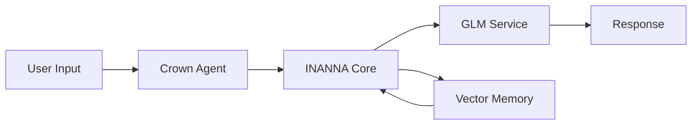
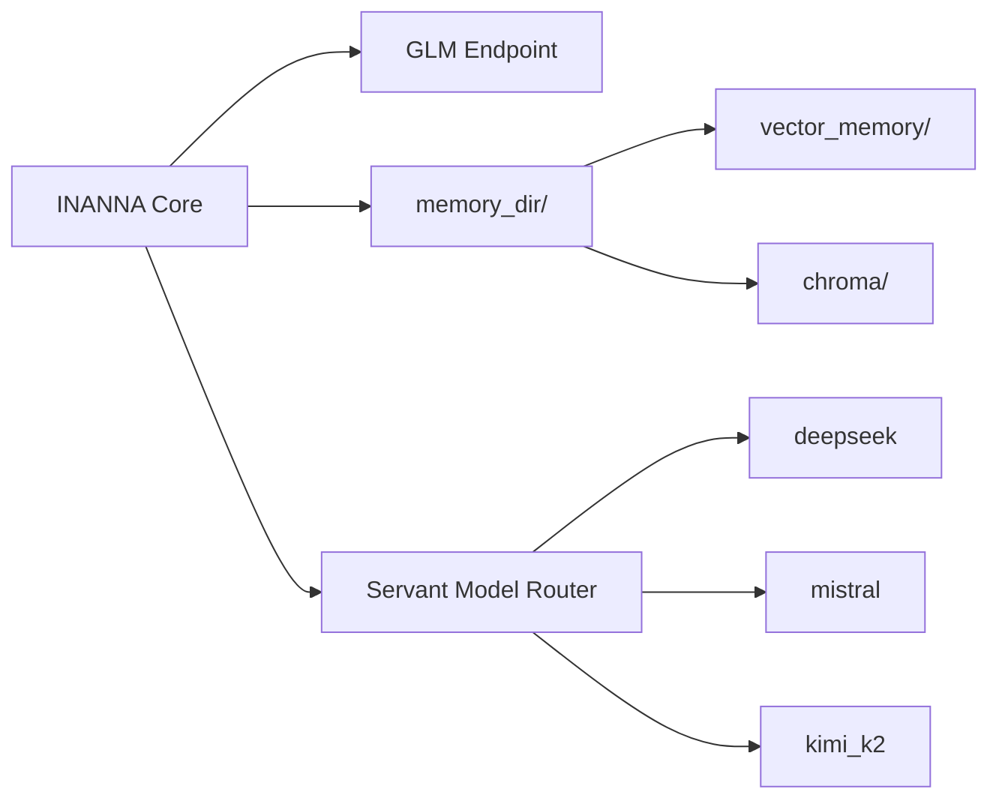

# INANNA Core Configuration

`crown_config/INANNA_CORE.yaml` defines the default settings used by the Crown agent. Each option can be overridden by an environment variable, allowing different deployments without editing the file.

## Flow



The Mermaid source lives at [assets/inanna_flow.mmd](assets/inanna_flow.mmd).

## Core Interfaces



*Figure: GLM endpoint, memory directories, and servant model routing.* The Mermaid source lives at [assets/inanna_core.mmd](assets/inanna_core.mmd).

## Fields

- **`glm_api_url`** – Base URL for the GLM service. Override with `GLM_API_URL`.
- **`glm_api_key`** – API key for the GLM service. Override with `GLM_API_KEY`.
- **`model_path`** – Path to the GLM‑4.1V‑9B weights. Override with `MODEL_PATH`.
- **`memory_dir`** – Root directory containing the persistent memories. Override with `MEMORY_DIR`.
  It should contain two subdirectories:
  
  ```
  memory_dir/
  ├── vector_memory/
  └── chroma/
  ```
  `vector_memory/` stores embeddings written by `vector_memory.py` and
  `chroma/` holds the corpus store used by `corpus_memory`.
- **`servant_models`** – Optional HTTP endpoints for auxiliary models.
  Each key can be overridden individually:
  - `deepseek` – override with `DEEPSEEK_URL`.
  - `mistral` – override with `MISTRAL_URL`.
  - `kimi_k2` – override with `KIMI_K2_URL`.
  The values should point to endpoints that accept a JSON body `{"prompt": "..."}`
  and return the completion text.

## Example

```yaml
glm_api_url: https://glm.example.com/glm41v_9b
glm_api_key: your-api-key
model_path: INANNA_AI/models/GLM-4.1V-9B
memory_dir: data/vector_memory
servant_models:
  deepseek: http://localhost:8002
  mistral: http://localhost:8003
  kimi_k2: http://localhost:8010
```

Environment variables with the same names as listed above override the
corresponding entries when `init_crown_agent.initialize_crown()` loads the file.

## Setup Steps

1. **Create memory directories**

   ```bash
   mkdir -p data/vector_memory/{vector_memory,chroma}
   ```

   This prepares the persistent stores used by `vector_memory.py` and
   `corpus_memory.py`.

2. **Launch servant model endpoints**

   Define the endpoints via `SERVANT_MODELS` and run the launcher:

   ```bash
   export SERVANT_MODELS="deepseek=http://localhost:8002,mistral=http://localhost:8003"
   ./launch_servants.sh
   ```

   Each endpoint must expose a `/health` route and accept a JSON body
   `{"prompt": "..."}`.

3. **Start INANNA core**

   The minimal startup script combines the above steps and verifies the
   configuration:

   ```bash
   scripts/start_inanna_core.sh
   ```
