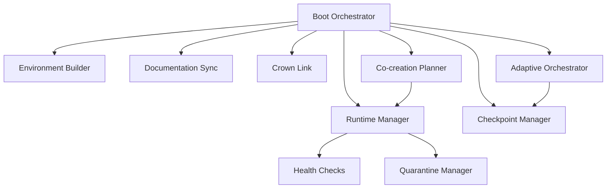

# RAZAR Agent

## Vision

The RAZAR agent bootstraps local services in a controlled environment. It
creates a Python virtual environment, installs component dependencies, and
launches each service in priority order. By aligning this startup flow with the
architecture outlined in the [System Blueprint](system_blueprint.md), RAZAR acts
as the bootstrap agent that grounds ABZU in a coherent foundation.

## Architecture

The RAZAR agent coordinates multiple modules during startup. The diagram below
highlights the primary interactions:



Boot Orchestrator derives the launch order, invoking the Environment Builder to
prepare isolated dependencies. The Runtime Manager starts services, running
Health Checks and isolating failures through the Quarantine Manager.
Documentation Sync, Checkpoint Manager, Crown Link, Adaptive Orchestrator, and
Co-creation Planner provide additional coordination around the core boot flow.
The Mermaid source lives at [assets/razar_architecture.mmd](assets/razar_architecture.mmd).

## Components & Links

| Source Module | Related Docs |
| --- | --- |
| [razar/environment_builder.py](../razar/environment_builder.py) | [Ignition](Ignition.md), [System Blueprint](system_blueprint.md) |
| [razar/boot_orchestrator.py](../razar/boot_orchestrator.py) | [Ignition](Ignition.md), [System Blueprint](system_blueprint.md) |
| [agents/razar/runtime_manager.py](../agents/razar/runtime_manager.py) | [Ignition](Ignition.md), [System Blueprint](system_blueprint.md) |
| [agents/razar/health_checks.py](../agents/razar/health_checks.py) | [Ignition](Ignition.md), [System Blueprint](system_blueprint.md) |
| [agents/razar/quarantine_manager.py](../agents/razar/quarantine_manager.py) | [Ignition](Ignition.md), [System Blueprint](system_blueprint.md) |
| [agents/razar/doc_sync.py](../agents/razar/doc_sync.py) | [Ignition](Ignition.md), [System Blueprint](system_blueprint.md) |
| [agents/razar/checkpoint_manager.py](../agents/razar/checkpoint_manager.py) | [Ignition](Ignition.md), [System Blueprint](system_blueprint.md) |
| [agents/razar/crown_link.py](../agents/razar/crown_link.py) | [Ignition](Ignition.md), [System Blueprint](system_blueprint.md) |
| [razar/adaptive_orchestrator.py](../razar/adaptive_orchestrator.py) | [Ignition](Ignition.md), [System Blueprint](system_blueprint.md) |
| [razar/cocreation_planner.py](../razar/cocreation_planner.py) | [Ignition](Ignition.md), [System Blueprint](system_blueprint.md) |

## Deployment

1. **Environment setup** – build isolated dependencies with
   `razar.environment_builder`:

   ```bash
   python -m razar.environment_builder
   ```

2. **Configuration** – adjust settings in `boot_config.json` to define
   service priorities and flags.

3. **Launch** – start the boot orchestrator to bring components online:

   ```bash
   python -m razar.boot_orchestrator
   ```

If a component fails to start, inspect the logs and consult the
[Recovery Playbook](recovery_playbook.md) for troubleshooting tips.

## Prioritized pytest runner

`agents/razar/pytest_runner.py` executes repository tests grouped by priority
tiers defined in `tests/priority_map.yaml`. Tiers `P1` through `P5` run
sequentially and results append to `logs/pytest_priority.log`. The runner stores
the last failing test in `logs/pytest_state.json` so reruns with `--resume`
continue from that point.

```bash
# Run all tiers in order
python agents/razar/pytest_runner.py

# Run only tier P1
python agents/razar/pytest_runner.py --priority P1

# Resume after fixing failures
python agents/razar/pytest_runner.py --resume
```

## Runtime manager

`agents/razar/runtime_manager.py` reads a configuration file that lists the
components to start and the shell command for each.  Successful launches are
recorded in `logs/razar_state.json` so subsequent runs resume from the last
healthy component.

```bash
python -m agents.razar.runtime_manager path/to/razar_config.yaml
```

Dependencies for a component can be declared in `razar_env.yaml` under a layer
with the same name.  They are installed into a private virtual environment under
`.razar_venv/`.

## Health checks

`agents/razar/health_checks.py` provides small probes that verify core
services.  The runtime manager invokes the check for a component after it starts
and may retry once if a restart command is defined.  When the optional
`prometheus_client` package is installed, a metrics endpoint is also exposed.

Individual checks can also be executed from the command line:

```bash
python -m agents.razar.health_checks
```

## Quarantine manager

Failed components are isolated by `agents/razar/quarantine_manager.py`.  A JSON
file describing the failure is written under `quarantine/` and a human readable
entry is appended to `docs/quarantine_log.md`.  Removing the JSON file and
adding a `resolved` entry to the log restores a component.

```bash
python - <<'PY'
from agents.razar import quarantine_manager as qm
qm.quarantine_component({'name': 'demo'}, 'startup failure')
PY
```

The quarantine utilities also track diagnostic data and patches applied to a
component, making it easier to audit recovery steps.

## Boot orchestrator

[`agents/razar/boot_orchestrator.py`](../agents/razar/boot_orchestrator.py)
derives the component startup order from `docs/system_blueprint.md`,
regenerates `docs/Ignition.md` with status markers, launches each service in
sequence, and records progress in `logs/razar_state.json`.

## Environment builder

[`razar/environment_builder.py`](../razar/environment_builder.py) ensures the
required Python version is available, creates an isolated virtual environment,
and installs dependency layers defined in `razar_env.yaml`.

## Documentation sync

[`agents/razar/doc_sync.py`](../agents/razar/doc_sync.py) refreshes core
references after component changes by regenerating Ignition, updating the
system blueprint, and rebuilding component indexes.

## Checkpoint manager

[`agents/razar/checkpoint_manager.py`](../agents/razar/checkpoint_manager.py)
persists boot progress in `logs/razar_state.json` so runs can resume from the
last successful component or clear the history to restart.

## Crown link

[`agents/razar/crown_link.py`](../agents/razar/crown_link.py) provides a minimal
WebSocket client for exchanging failure reports and status updates with the
CROWN stack, logging every dialogue in
`logs/razar_crown_dialogues.json`.

## Adaptive orchestrator

[`razar/adaptive_orchestrator.py`](../razar/adaptive_orchestrator.py) explores
different boot sequences, measuring time-to-ready and failures, and stores
results in `logs/razar_boot_history.json` to refine startup order.

## Co-creation planner

[`razar/cocreation_planner.py`](../razar/cocreation_planner.py) consolidates
component priorities, boot failures, and Crown suggestions into a dependency
ordered build plan saved to `logs/razar_cocreation_plans.json`.

## Code Considerations

### `razar_config.yaml`

**Schema**

```yaml
dependencies: []
enable_ai_handover: false
ai_agent:
  name: string
  endpoint: string
  auth_token: string
  models: [string, ...]  # optional fallback models
components:
  - name: string
    priority: int
    command: string
```

**Example**

```yaml
dependencies: []
enable_ai_handover: false
ai_agent:
  name: demo
  endpoint: http://localhost:3000
  auth_token: token
  models:
    - gpt-4
    - gpt-3.5
components:
  - name: memory_store
    priority: 1
    command: "echo 'starting memory_store'"
```

### `boot_config.json`

**Schema**

```json
{
  "components": [
    {
      "name": "string",
      "command": ["string", "..."],
      "health_check": ["string", "..."]
    }
  ]
}
```

**Example**

```json
{
  "components": [
    {
      "name": "demo",
      "command": ["python", "demo.py"],
      "health_check": ["python", "-m", "demo_health"]
    }
  ]
}
```

### `razar_env.yaml`

**Structure**

```yaml
layers:
  <layer_name>:
    - <dependency>
```

**Example**

```yaml
layers:
  demo:
    - requests
```

### `logs/razar_state.json` and quarantine entries

**State file format**

```json
{
  "last_component": "string"
}
```

**Example**

```json
{"last_component": "demo"}
```

**Quarantine entry format**

Each quarantined component is recorded as `quarantine/<name>.json`:

```json
{
  "name": "string",
  "reason": "string",
  "attempts": 1,
  "patches_applied": ["string"]
}
```

**Example**

```json
{
  "name": "demo",
  "reason": "startup failure",
  "attempts": 1,
  "patches_applied": []
}
```

## Version History

| Version | Date | Summary |
|---------|------|---------|
| [0.1.0](../CHANGELOG_razar.md#010---2025-08-30) | 2025-08-30 | Initial release of RAZAR runtime orchestrator and environment builder. |

