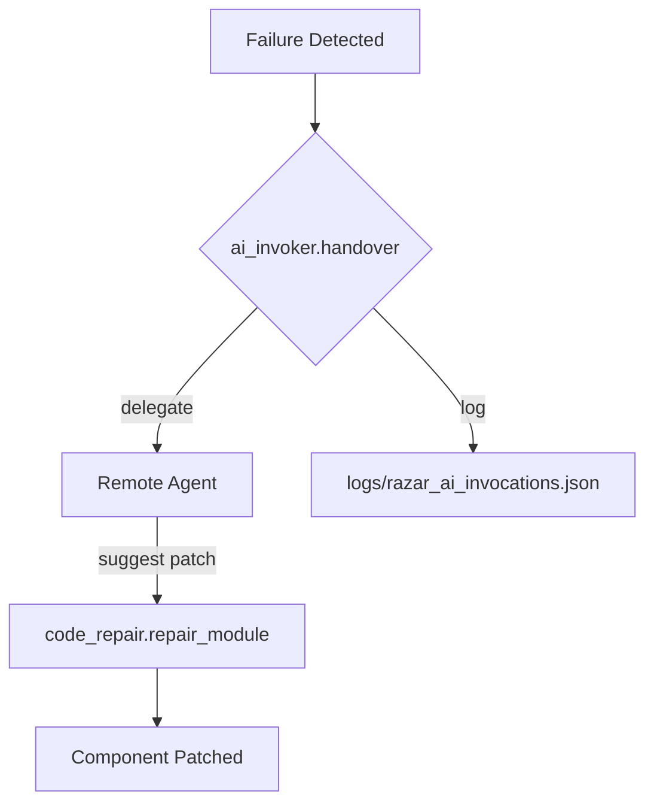
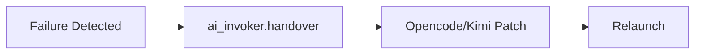
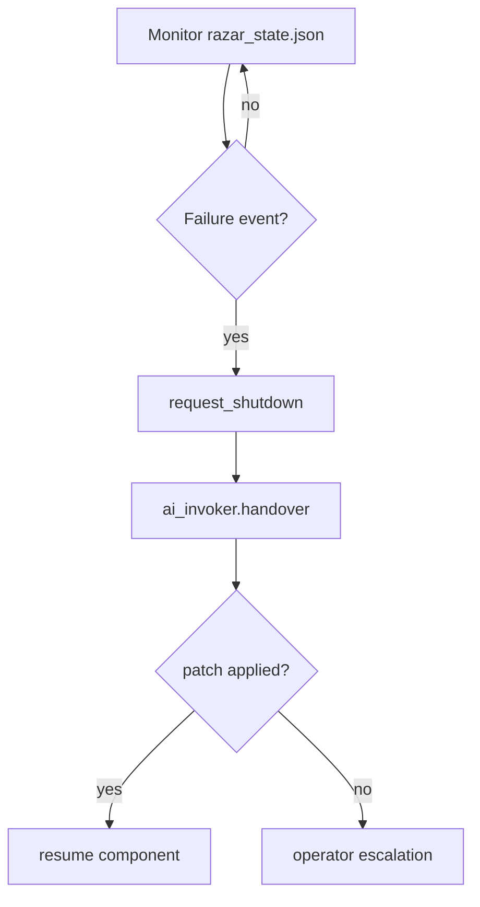
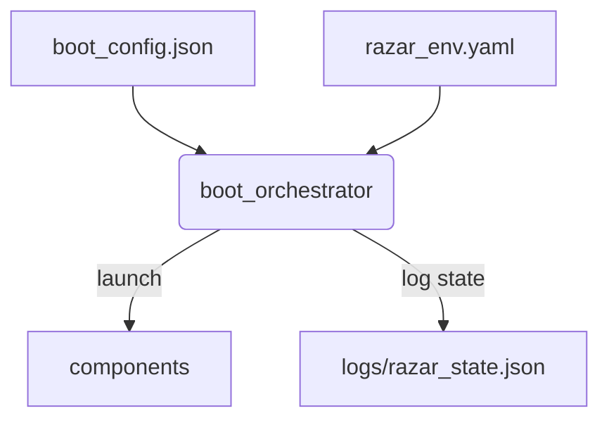
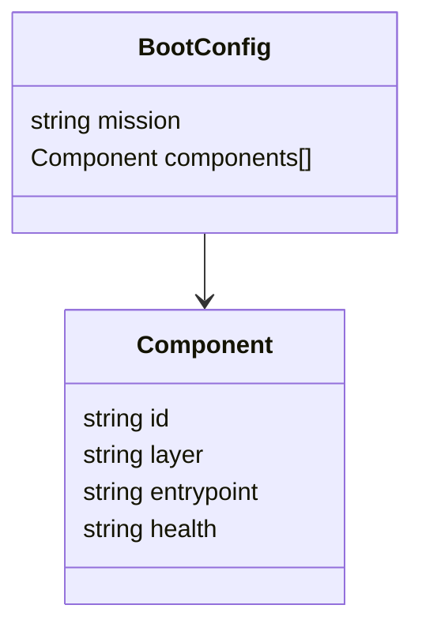
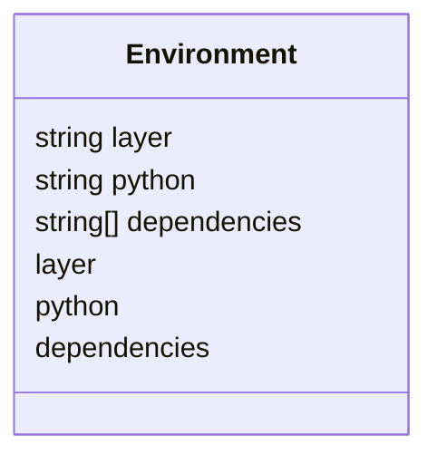
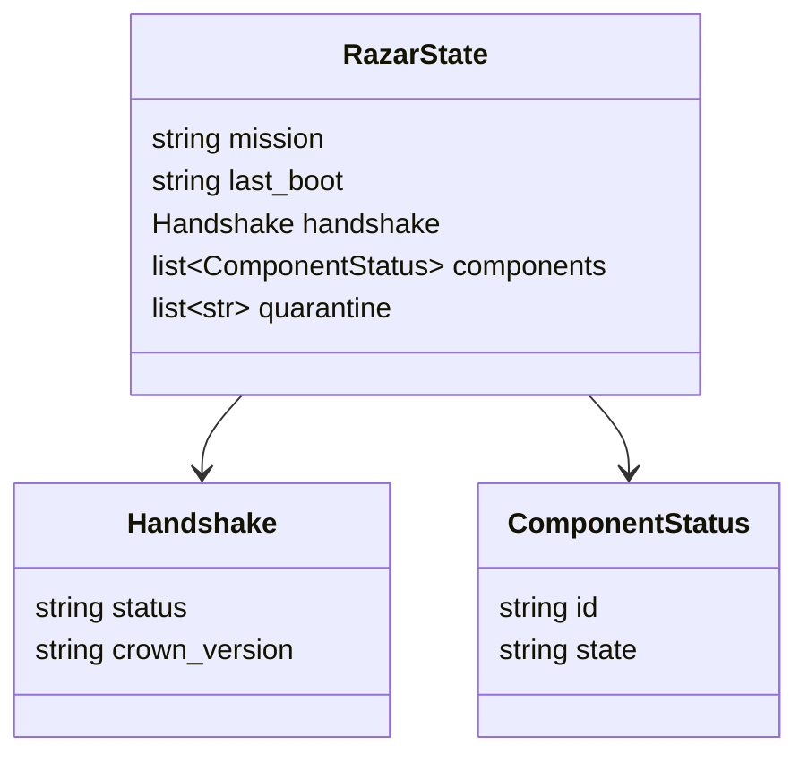

# RAZAR Agent

RAZAR orchestrates multi-layer ignition and tracks mission state for Crown and operator oversight.

See [Agent Ecosystem & Relations](ABZU_blueprint.md#agent-ecosystem--relations) for Crown ↔ Nazarick ↔ Operator flows.

RAZAR ↔ Crown ↔ Kimi2Code handoffs and recovery loops are diagrammed in the [Ignition Blueprint](ignition_blueprint.md).

For the mission-level narrative and escalation ordering, consult [Blueprint Spine – RAZAR Delegation Cascade](blueprint_spine.md#razar-delegation-cascade); it links back to this guide for the context-sharing and logging contract.

RAZAR now delegates crown routing and Kimicho fallback to the Rust crates `neoabzu_crown` and `neoabzu_kimicho`; the corresponding Python modules are stubs.

Mission brief exchange and servant routing are summarized in [Mission Brief Exchange & Servant Routing](mission_brief_exchange.md).

## Vision
RAZAR bootstraps ABZU services in a reproducible environment and negotiates startup handshakes with the Crown stack.

## Persona & Responsibilities
- Orchestrate multi-layer boot sequences under operator direction.
- Maintain mission state and quarantine failing components.
- Delegate complex repairs to remote agents when needed.

## Module Coverage
RAZAR reads mission briefs, prepares per-layer virtual environments, launches components defined in `boot_config.json`, and records runtime state in `logs/razar_state.json`.

Covered modules:
- `boot_orchestrator` – sequential component ignition.
- `crown_handshake` – capability negotiation with Crown.
- `environment_builder` – per-layer Python environment setup.
- `mission_logger` – mission progress persistence.
- `quarantine_manager` – isolates failed components.

## Functional Workflows

### Boot Orchestration
1. Parse `boot_config.json` to determine components and health probes.
2. Prepare Python environments from `razar_env.yaml`.
3. Ignite components sequentially, validating each with `health_checks.py`.
4. Persist handshake and mission outcomes to `logs/razar_state.json` and mission‑brief archives.

### Rust Memory Bundle Integration
RAZAR initializes the Rust-backed memory bundle and core engine via
[PyO3](https://pyo3.rs/) when booting. The boot orchestrator calls
[`memory/bundle.py`](../memory/bundle.py) and `neoabzu_core.evaluate_py` to
confirm the bindings. If available, the Crown router forwards text to the Rust
memory bundle and evaluates expressions through the core engine. OpenTelemetry
traces wrap these calls when the API is installed, providing cross-service
diagnostics.

### Remote Assistance
RAZAR can delegate missing or failing components to remote agents through
`ai_invoker.handover`. When a component fails, `ai_invoker` forwards context to a
configured remote agent, applies any suggested patch with
`code_repair.repair_module`, and records the interaction in
`logs/razar_ai_invocations.json` while applied patches are tracked in
`logs/razar_ai_patches.json`.

### Remote Agent Contracts

The handover contract with external repair agents is exercised in
`agents/razar/ai_invoker.py` and verified by
`tests/integration/remote_agents/test_ai_invoker_remote_agents.py`. Each
fixture replays a sample payload captured from the upstream projects:

- **MoonshotAI Kimi-K2 / AirStar.** The fixture stored in
  `tests/integration/remote_agents/kimi_k2_completion.json` mirrors the tool
  calling example published in the
  [MoonshotAI/Kimi-K2](https://github.com/MoonshotAI/Kimi-K2) documentation. It
  forwards a `messages` array, accompanying `tools` schema, and optional failure
  context for AirStar. When a bearer token is configured, `ai_invoker`
  supplements the payload with an `auth_token` field and propagates the value in
  both the `Authorization: Bearer` and `X-API-Key` headers.
- **Microsoft rStar.** The replay stored in
  `tests/integration/remote_agents/rstar_completion.json` reflects the
  completion request used in the
  [microsoft/rStar](https://github.com/microsoft/rStar) examples. The payload
  encodes tokenized prompts and generation controls (`max_tokens`,
  `skip_special_tokens`, `include_stop_str_in_output`).

The integration tests assert that `_invoke_kimi2`, `_invoke_airstar`, and
`_invoke_rstar` forward the fixture payloads verbatim, add authentication when a
token is available, and preserve the original context dictionaries so callers
can safely reuse them across retries.

Administrators can also exercise the same schemas outside of the retry loop by
running `python scripts/health_check_connectors.py --include-remote`. The script
probes any configured K2/AirStar/rStar endpoints with the recorded payloads,
reading `KIMI2_ENDPOINT`, `KIMI2_API_KEY`, `AIRSTAR_ENDPOINT`, and
`AIRSTAR_API_KEY` (plus the legacy `RSTAR_ENDPOINT` and `RSTAR_API_KEY` settings
when rStar escalation remains enabled) before issuing the requests. Results are
logged through the `monitoring.alerts.razar_failover` logger (see
`monitoring/alerts/razar_failover.yml` for the alert thresholds tied to these
checks).

### Shared Failure Context
Before every remote attempt, `boot_orchestrator._retry_with_ai` calls
`build_failure_context` to load the recent history for the component from
`logs/razar_ai_invocations.json`. The helper returns the last five interactions
— including attempt number, agent name, error, and whether a patch was applied —
and the resulting payload is passed directly to `ai_invoker.handover`. Because
`razar.utils.logging.log_invocation` appends a record after each delegation, later agents
automatically receive the trail of earlier failures, ensuring the final handler
can see which agents already attempted repairs and why they were rejected.

The [Blueprint Spine](blueprint_spine.md#razar-delegation-cascade) references this hand-off contract when describing how recovery context travels with each escalation step.

### Invocation Log Format
`razar.utils.logging` persists every handover attempt as a JSON line inside
`logs/razar_ai_invocations.json`. Each record contains a stable core of
telemetry fields:

- `component` – the failing service or module name.
- `attempt` – the 1-indexed retry counter for the component.
- `error` – the failure summary forwarded to the remote agent.
- `patched` – whether the agent returned a patch that repaired the component.
- `status` – convenience label (`success` / `failure`) derived from `patched`.
- `timestamp` – Unix epoch seconds captured when the event was stored.
- `timestamp_iso` – UTC ISO-8601 rendering of the same timestamp.

Optional attributes such as `agent`, `agent_original`, `event`, and `retries`
capture escalation decisions and remote service routing. Because the log is
append-only JSON lines, it can be tailed or streamed without loading the entire
file. A representative entry looks like:

```json
{"component": "crown_router", "attempt": 2, "error": "Health check failed", "patched": false, "event": "escalation", "agent": "rstar", "status": "failure", "timestamp": 1730481774.125, "timestamp_iso": "2024-11-01T04:02:54.125000Z"}
```

The blueprint narrative calls back to this logging schema in the
[RAZAR Delegation Cascade](blueprint_spine.md#razar-delegation-cascade) section to
explain how mission journals remain synchronized with the invocation trail.

### Invocation Metrics
`razar.metrics.init_metrics()` exposes Prometheus counters whenever
`prometheus_client` is installed. The boot orchestrator enables the endpoint
during startup and reuse from other scripts is automatic because
`log_invocation` wires each event into the counters. The server listens on port
`9360` by default (override with the `RAZAR_METRICS_PORT` environment
variable) and exports three primary metrics:

- `razar_ai_invocation_success_total{component="…"}` – patches successfully
  applied for a component.
- `razar_ai_invocation_failure_total{component="…"}` – failed attempts that
  still require attention.
- `razar_ai_invocation_retries_total{component="…"}` – cumulative retries
  beyond the initial attempt.

Scrape the endpoint with `curl http://localhost:9360/metrics` or point your
Prometheus server at the same URL to feed dashboards and alerts.

To run repairs locally, install the Opencode CLI and enable the optional
handover mode:

```bash
pip install opencode-cli
```

Invoke `ai_invoker.handover(..., use_opencode=True)` to stream the failure
context to `opencode run --json`. The CLI's patch suggestions are parsed and
forwarded to `code_repair.repair_module` for application.



### Self-Healing Overview
RAZAR blends automated recovery with operator playbooks. When a failure is detected,
`ai_invoker.handover` delegates the context to external helpers that can generate
patches through Opencode or the [Kimi Integration](tools/kimi_integration.md). The
patched component is relaunched following the steps in the
[Recovery Playbook](recovery_playbook.md).



### Kimi-powered repairs

Set the following variables to route handover through the Kimi backend:

- `OPENCODE_BACKEND=kimi`
- `KIMI2_ENDPOINT=<your K2 endpoint>`
- `KIMI2_API_KEY=<bearer token for the endpoint>`
- `AIRSTAR_ENDPOINT=<optional AirStar fallback endpoint>`
- `AIRSTAR_API_KEY=<AirStar API key>`

See [Kimi Integration](tools/kimi_integration.md) for step-by-step instructions.

```python
import os
from agents.razar import ai_invoker

os.environ["OPENCODE_BACKEND"] = "kimi"
os.environ["KIMI2_ENDPOINT"] = "https://k2.example/api"
os.environ["KIMI2_API_KEY"] = "k2-token"
os.environ["AIRSTAR_ENDPOINT"] = "https://airstar.example/api"
os.environ["AIRSTAR_API_KEY"] = "airstar-token"

ai_invoker.handover("crown_router", "Health check failed", use_opencode=True)
```

If Kimi supplies a patch, it is applied and the component relaunches.

### AirStar Escalation
RAZAR tracks consecutive repair attempts for each component. After nine
unsuccessful tries it escalates the failure context to the AirStar patch
service for external triage before any manual rStar follow-up.

Configuration knobs:

- `RAZAR_RSTAR_THRESHOLD` – attempts before escalation (default `9`)
- `AIRSTAR_ENDPOINT` – URL for the AirStar patch API
- `AIRSTAR_API_KEY` – access token for the API

Set `RAZAR_RSTAR_THRESHOLD=0` to disable escalation entirely.

### Recovery Flow


Example health event from `logs/razar_state.json`:
```json
{
  "step": "launch",
  "component": "crown_router",
  "status": "fail",
  "error": "Health check failed",
  "timestamp": 0
}
```

## Architecture Diagram


## Requirements
Requires `pyyaml`, `prometheus_client`, `websockets`, and a reachable `CROWN_WS_URL`.

## Deployment
1. `boot_orchestrator` exchanges a mission brief with Crown via
   `crown_handshake.perform` and writes the acknowledgement, capabilities, and
   downtime details to `logs/razar_state.json`.
2. If the handshake does not report `GLM-4.1V`, it runs
   `crown_model_launcher.sh` and appends the launch outcome to the same state
   file.
```bash
python -m razar.boot_orchestrator --mission demo
```

## Config Schemas

### boot_config.json


### razar_env.yaml


### logs/razar_state.json


## Example Runs
```bash
python -m razar.boot_orchestrator --mission demo --brief examples/demo_brief.json
```

Sample `boot_orchestrator.log`:
```text
[2025-09-21T00:00:00Z] INFO Booting component crown_router
[2025-09-21T00:00:01Z] INFO Health check passed for crown_router
[2025-09-21T00:00:05Z] INFO Mission demo complete
```

Excerpt from `logs/razar_state.json`:
```json
{
  "mission": "demo",
  "last_boot": "2025-09-21T00:00:05Z",
  "handshake": {"status": "ack", "crown_version": "1.4"},
  "components": [{"id": "crown_router", "state": "running"}],
  "quarantine": []
}
```

Mission‑brief archives:
```text
logs/mission_briefs/
└── demo_2025-09-21T00-00-05Z.json
```

## Troubleshooting

### Checklist
1. Ensure each component in `boot_config.json` defines a health probe.
2. Inspect `boot_orchestrator.log` for failed launches.
3. Run `python -m razar.issue_analyzer <logfile>` to classify failures and apply the suggested fix.
4. Review `docs/quarantine_log.md` for quarantined modules and remediation notes.

### Sample log outputs
`boot_orchestrator.log`:
```text
[2025-09-21T00:00:00Z] ERROR Health check failed for basic_service
```

`docs/quarantine_log.md`:
```text
| 2025-09-21T00:00:01Z | basic_service | dependency | Install missing packages or verify the environment. |
```

### Probe Failure Troubleshooting Matrix

| Component       | Health Probe                          | Failure Indicator                         | Remediation                                                  |
|-----------------|---------------------------------------|-------------------------------------------|--------------------------------------------------------------|
| basic_service   | `http://localhost:8000/healthz`       | `Health check failed for basic_service`   | Validate dependencies and restart the service.               |
| complex_service | `/var/log/complex_service.log`        | `Health check failed for complex_service` | Inspect configuration or escalate repair to a remote agent. |

### Migration Crosswalk

Port status and legacy mappings for RAZAR initialization are tracked in the [Migration Crosswalk](migration_crosswalk.md#razar-init).

## Cross-links
- [System Blueprint](system_blueprint.md)
- [RAZAR Guide](RAZAR_GUIDE.md)
- [Deployment Guide](deployment.md)
- [Monitoring Guide](monitoring.md)
- [Protocol Compliance](protocol_compliance.md)
- [Ignition Blueprint](ignition_blueprint.md)

## Component & Link
- [razar/boot_orchestrator.py](../razar/boot_orchestrator.py)

## Version History
| Version | Date | Notes |
|---------|------|-------|
| 0.2.5 | 2025-10-10 | Documented Rust memory bundle integration and tracing hooks. |
| 0.2.4 | 2025-10-09 | Linked mission brief exchange and servant routing guide. |
| 0.2.3 | 2025-09-21 | Added remote assistance section with flow diagram plus schema diagrams and ignition example. |
| 0.2.2 | 2025-09-21 | Expanded remote assistance workflow and patch logging. |
| 0.1.0 | 2025-08-30 | Initial release of RAZAR runtime orchestrator. |
