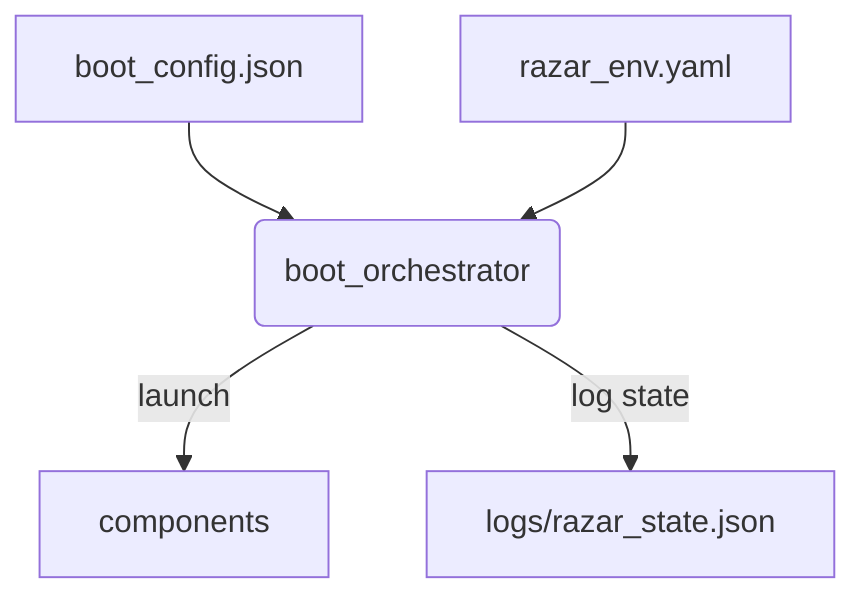
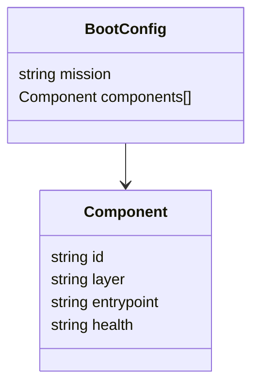
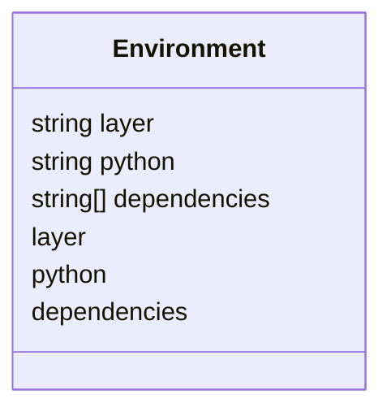
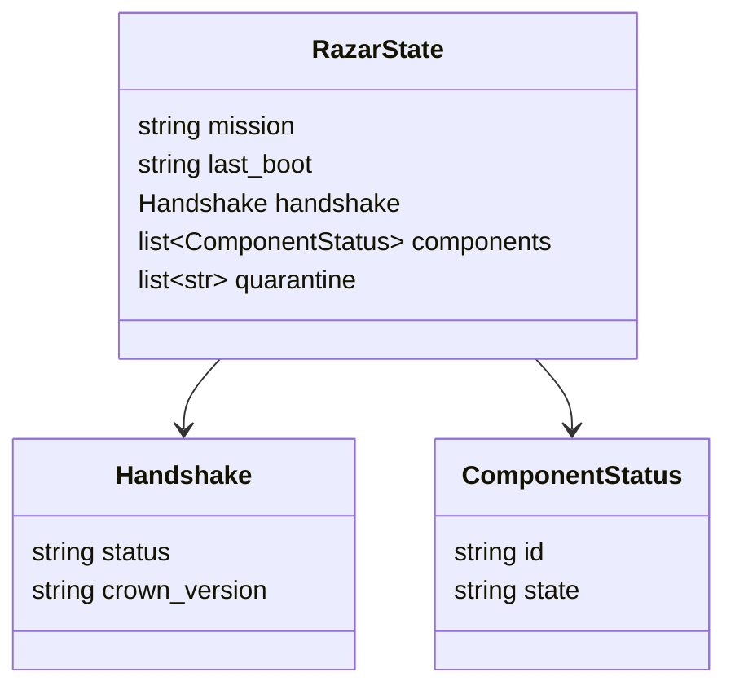

# RAZAR Agent

RAZAR orchestrates multi-layer ignition and tracks mission state for Crown and operator oversight.

## Vision
RAZAR bootstraps ABZU services in a reproducible environment and negotiates startup handshakes with the Crown stack.

## Module Overview
RAZAR reads mission briefs, prepares per-layer virtual environments, launches components defined in `boot_config.json`, and records runtime state in `logs/razar_state.json`.

## Workflow
1. Parse `boot_config.json` to determine components and health probes.
2. Prepare Python environments from `razar_env.yaml`.
3. Ignite components sequentially, validating each with `health_checks.py`.
4. Persist handshake and mission outcomes to `logs/razar_state.json` and mission‑brief archives.

## Architecture Diagram


## Requirements
Requires `pyyaml`, `prometheus_client`, `websockets`, and a reachable `CROWN_WS_URL`.

## Deployment
```bash
python -m razar.boot_orchestrator --mission demo
```

## Configuration Schemas

### boot_config.json


### razar_env.yaml


### logs/razar_state.json


## Ignition Example
```bash
python -m razar.boot_orchestrator --mission demo --brief examples/demo_brief.json
```

Sample `boot_orchestrator.log`:
```text
[2025-09-21T00:00:00Z] INFO Booting component crown_router
[2025-09-21T00:00:01Z] INFO Health check passed for crown_router
[2025-09-21T00:00:05Z] INFO Mission demo complete
```

Excerpt from `logs/razar_state.json`:
```json
{
  "mission": "demo",
  "last_boot": "2025-09-21T00:00:05Z",
  "handshake": {"status": "ack", "crown_version": "1.4"},
  "components": [{"id": "crown_router", "state": "running"}],
  "quarantine": []
}
```

Mission‑brief archives:
```text
logs/mission_briefs/
└── demo_2025-09-21T00-00-05Z.json
```

## Cross-Links
- [System Blueprint](system_blueprint.md)
- [RAZAR Guide](RAZAR_GUIDE.md)
- [Deployment Guide](deployment.md)
- [Monitoring Guide](monitoring.md)
- [Protocol Compliance](protocol_compliance.md)

## Version History
| Version | Date | Notes |
|---------|------|-------|
| 0.2.3 | 2025-09-21 | Added schema diagrams and ignition example with log excerpts. |
| 0.2.2 | 2025-09-21 | Expanded remote assistance workflow and patch logging. |
| 0.1.0 | 2025-08-30 | Initial release of RAZAR runtime orchestrator. |
