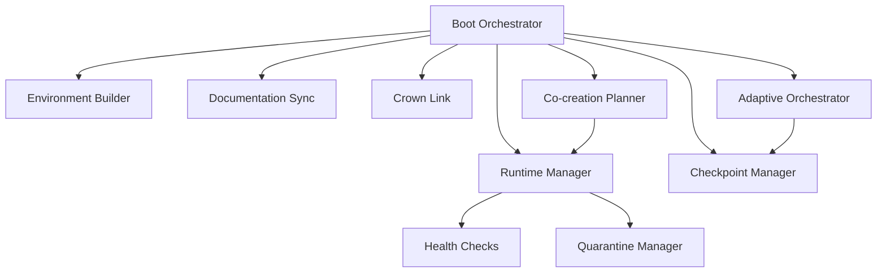
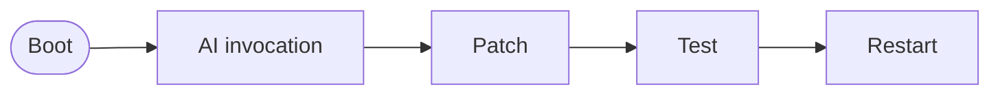

# RAZAR Agent

Bootstrapper for local services and mission brief exchange with the CROWN stack.

## Component Index Entry

- **ID:** `razar`
- **Path:** `agents/razar`

To update the index when RAZAR modules evolve:

1. Edit `component_index.json` with new paths or identifiers.
2. Run `python scripts/component_inventory.py` to rebuild component tables.
3. Regenerate the docs index with `pre-commit run doc-indexer --files docs/RAZAR_AGENT.md docs/INDEX.md`.

## Vision

The RAZAR agent bootstraps local services in a controlled environment. It
creates a Python virtual environment, installs component dependencies, and
launches each service in priority order. By aligning this startup flow with the
architecture outlined in the [System Blueprint](system_blueprint.md), RAZAR acts
as the bootstrap agent that grounds ABZU in a coherent foundation.

## Requirements

Core dependencies:

- `pyyaml`
- `prometheus_client`

Optional tools:

- `pyenv` — for managing Python versions

Layer-specific packages are defined in
[razar_env.yaml](../razar_env.yaml) and documented in
[dependencies.md](dependencies.md).

## Architecture

The RAZAR agent coordinates multiple modules during startup. The diagram below
highlights the primary interactions:



Boot Orchestrator derives the launch order, invoking the Environment Builder to
prepare isolated dependencies. The Runtime Manager starts services, running
Health Checks and isolating failures through the Quarantine Manager.
Documentation Sync, Checkpoint Manager, Crown Link, Adaptive Orchestrator, and
Co-creation Planner provide additional coordination around the core boot flow.
The Mermaid source lives at [assets/razar_architecture.mmd](assets/razar_architecture.mmd).

## Remote agent flow

RAZAR can fetch and integrate remote agents at runtime. The flow below shows how the remote loader downloads a module, runs configuration and patch hooks, and records the interaction:

```mermaid
flowchart LR
    start([Remote Loader]) --> fetch{Fetch Agent}
    fetch -->|HTTP/Git| agent[Remote Agent]
    agent --> config[configure()]
    agent --> patch[patch()]
    config --> log[(Audit Log)]
    patch --> log
```

The Mermaid source lives at [assets/razar_remote_flow.mmd](assets/razar_remote_flow.mmd).

## Module builder

`agents/razar/module_builder.py` scaffolds new components from a planning
specification. Instead of inserting ``# TODO`` or ``# FIXME`` markers, the builder
requires either a path to a template file or an inline implementation snippet in
accordance with the [no placeholder comments rule](The_Absolute_Protocol.md#no-placeholder-comments).
Patch suggestions from remote agents are applied inside an isolated sandbox and the
included tests are executed. The module is promoted into the repository only
after the tests pass.

### Example

```python
from agents.razar import module_builder

snippet = "def run() -> str:\n    return 'demo'\n"
tests = {
    "tests/test_demo.py": (
        "from agents import demo\n\n"
        "def test_run():\n"
        "    assert demo.run() == 'demo'\n"
    )
}
plan = {"demo": {"component": "agents/demo.py", "snippet": snippet, "tests": tests}}

module_builder.build("demo", plan=plan)
```

## Core Modules

### `boot_orchestrator.py`

[razar/boot_orchestrator.py](../razar/boot_orchestrator.py) sequences
components from `boot_config.json`, performs a CROWN handshake, and logs run
metrics.

### `environment_builder.py`

[razar/environment_builder.py](../razar/environment_builder.py) ensures the
requested Python version, creates a virtual environment, and installs dependency
layers from `razar_env.yaml`.

### `doc_sync.py`

[razar/doc_sync.py](../razar/doc_sync.py) regenerates system documentation using
boot history and lifecycle status updates.

### `checkpoint_manager.py`

[razar/checkpoint_manager.py](../razar/checkpoint_manager.py) persists boot
progress so interrupted runs can resume from the last successful component.

### `crown_link.py`

[razar/crown_link.py](../razar/crown_link.py) offers a minimal WebSocket client
for sending status updates and repair requests to the CROWN stack.

### `adaptive_orchestrator.py`

[razar/adaptive_orchestrator.py](../razar/adaptive_orchestrator.py) experiments
with alternate boot sequences and records the best-performing order in
`logs/razar_boot_history.json`.

### `cocreation_planner.py`

[razar/cocreation_planner.py](../razar/cocreation_planner.py) builds collaborative
plans by combining component priorities, failure counts, and CROWN suggestions.

## Components & Links

| Source Module | Related Docs |
| --- | --- |
| [razar/environment_builder.py](../razar/environment_builder.py) | [Ignition](Ignition.md), [System Blueprint](system_blueprint.md) |
| [razar/boot_orchestrator.py](../razar/boot_orchestrator.py) | [Ignition](Ignition.md), [System Blueprint](system_blueprint.md) |
| [agents/razar/module_builder.py](../agents/razar/module_builder.py) | [Ignition](Ignition.md), [System Blueprint](system_blueprint.md) |
| [agents/razar/runtime_manager.py](../agents/razar/runtime_manager.py) | [Ignition](Ignition.md), [System Blueprint](system_blueprint.md) |
| [agents/razar/health_checks.py](../agents/razar/health_checks.py) | [Ignition](Ignition.md), [System Blueprint](system_blueprint.md) |
| [agents/razar/quarantine_manager.py](../agents/razar/quarantine_manager.py) | [Ignition](Ignition.md), [System Blueprint](system_blueprint.md) |
| [agents/razar/doc_sync.py](../agents/razar/doc_sync.py) | [Ignition](Ignition.md), [System Blueprint](system_blueprint.md) |
| [agents/razar/checkpoint_manager.py](../agents/razar/checkpoint_manager.py) | [Ignition](Ignition.md), [System Blueprint](system_blueprint.md) |
| [agents/razar/crown_link.py](../agents/razar/crown_link.py) | [Ignition](Ignition.md), [System Blueprint](system_blueprint.md) |
| [razar/adaptive_orchestrator.py](../razar/adaptive_orchestrator.py) | [Ignition](Ignition.md), [System Blueprint](system_blueprint.md) |
| [razar/cocreation_planner.py](../razar/cocreation_planner.py) | [Ignition](Ignition.md), [System Blueprint](system_blueprint.md) |

## Deployment Workflow

1. **Environment setup** – build isolated dependencies with
   `razar.environment_builder`:

   ```bash
   python -m razar.environment_builder
   ```

2. **Configuration** – adjust settings in `boot_config.json` to define
   service priorities and flags.

3. **Handshake** – exchange a mission brief with the CROWN stack to learn
   which capabilities are online and whether any components require
   downtime. The handshake can be invoked directly:

   ```bash
   python -m razar.crown_handshake path/to/mission_brief.json
   ```

   During a full boot the orchestrator calls
   `crown_handshake.perform()`, logs the returned capabilities to
   `logs/razar.log`, records them in
   [logs/razar_state.json](../logs/razar_state.json), and if the
   `GLM-4.1V` capability is missing runs
   [`crown_model_launcher.sh`](../crown_model_launcher.sh), logging the
   launch under `launched_models`.

4. **Launch** – start the boot orchestrator to bring components online:

   ```bash
   python -m razar.boot_orchestrator
   ```

If a component fails to start, inspect the logs and consult the
[Recovery Playbook](recovery_playbook.md) for troubleshooting tips. The
handshake data persists in `logs/razar_state.json` so operators can
cross‑check advertised capabilities against runtime behaviour.

## Prioritized pytest runner

`agents/razar/pytest_runner.py` executes repository tests grouped by priority
tiers defined in `tests/priority_map.yaml`. Tiers `P1` through `P5` run
sequentially and results append to `logs/pytest_priority.log`. The runner stores
the last failing test in `logs/pytest_state.json` so reruns with `--resume`
continue from that point.

```bash
# Run all tiers in order
python agents/razar/pytest_runner.py

# Run only tier P1
python agents/razar/pytest_runner.py --priority P1

# Resume after fixing failures
python agents/razar/pytest_runner.py --resume
```

## Runtime manager

`agents/razar/runtime_manager.py` reads a configuration file that lists the
components to start and the shell command for each.  Successful launches are
recorded in `logs/razar_state.json` so subsequent runs resume from the last
healthy component.

```bash
python -m agents.razar.runtime_manager path/to/razar_config.yaml
```

Dependencies for a component can be declared in `razar_env.yaml` under a layer
with the same name.  They are installed into a private virtual environment under
`.razar_venv/`.

## Health checks

`agents/razar/health_checks.py` provides small probes that verify core
services.  The runtime manager invokes the check for a component after it starts
and may retry once if a restart command is defined.  When the optional
`prometheus_client` package is installed, a metrics endpoint is also exposed.

Individual checks can also be executed from the command line:

```bash
python -m agents.razar.health_checks
```

## Quarantine manager

Failed components are isolated by `agents/razar/quarantine_manager.py`.  A JSON
file describing the failure is written under `quarantine/` and a human readable
entry is appended to `docs/quarantine_log.md`.  Removing the JSON file and
adding a `resolved` entry to the log restores a component.

```bash
python - <<'PY'
from agents.razar import quarantine_manager as qm
qm.quarantine_component({'name': 'demo'}, 'startup failure')
PY
```

The quarantine utilities also track diagnostic data and patches applied to a
component, making it easier to audit recovery steps.

## Boot orchestrator

[`agents/razar/boot_orchestrator.py`](../agents/razar/boot_orchestrator.py)
derives the component startup order from `docs/system_blueprint.md`,
regenerates `docs/Ignition.md` with status markers, launches each service in
sequence, and records progress in `logs/razar_state.json`.

## Environment builder

[`razar/environment_builder.py`](../razar/environment_builder.py) ensures the
required Python version is available, creates an isolated virtual environment,
and installs dependency layers defined in `razar_env.yaml`.

## Documentation sync

[`agents/razar/doc_sync.py`](../agents/razar/doc_sync.py) refreshes core
references after component changes by regenerating Ignition, updating the
system blueprint, and rebuilding component indexes.

## Checkpoint manager

[`agents/razar/checkpoint_manager.py`](../agents/razar/checkpoint_manager.py)
persists boot progress in `logs/razar_state.json` so runs can resume from the
last successful component or clear the history to restart.

## Crown link

[`agents/razar/crown_link.py`](../agents/razar/crown_link.py) provides a minimal
WebSocket client for exchanging failure reports and status updates with the
CROWN stack, logging every dialogue in
`logs/razar_crown_dialogues.json`.

## Adaptive orchestrator

[`razar/adaptive_orchestrator.py`](../razar/adaptive_orchestrator.py) explores
different boot sequences, measuring time-to-ready and failures, and stores
results in `logs/razar_boot_history.json` to refine startup order.

## Co-creation planner

[`razar/cocreation_planner.py`](../razar/cocreation_planner.py) consolidates
component priorities, boot failures, and Crown suggestions into a dependency
ordered build plan saved to `logs/razar_cocreation_plans.json`.

## Code Considerations

### `razar_config.yaml`

**Schema**

```yaml
dependencies: []
enable_ai_handover: false
ai_agent:
  name: string
  endpoint: string
  auth_token: string
  models: [string, ...]  # optional fallback models
components:
  - name: string
    priority: int
    command: string
```

**Example**

```yaml
dependencies: []
enable_ai_handover: false
ai_agent:
  name: demo
  endpoint: http://localhost:3000
  auth_token: token
  models:
    - gpt-4
    - gpt-3.5
components:
  - name: memory_store
    priority: 1
    command: "echo 'starting memory_store'"
```

### `boot_config.json`

The default configuration lives at [razar/boot_config.json](../razar/boot_config.json).

**Schema**

```json
{
  "components": [
    {
      "name": "string",
      "command": ["string", "..."],
      "health_check": ["string", "..."]
    }
  ]
}
```

**Example**

```json
{
  "components": [
    {
      "name": "demo",
      "command": ["python", "demo.py"],
      "health_check": ["python", "-m", "demo_health"]
    }
  ]
}
```

### `razar_env.yaml`

The default environment file lives at [razar_env.yaml](../razar_env.yaml).

**Structure**

```yaml
layers:
  <layer_name>:
    - <dependency>
```

**Example**

```yaml
layers:
  demo:
    - requests
```

### `logs/razar_state.json` and quarantine entries

State snapshots are written to [logs/razar_state.json](../logs/razar_state.json).

**State file format**

```json
{
  "last_component": "string",
  "capabilities": ["string"],
  "downtime": {"component": {"patch": "info"}},
  "launched_models": ["string"]
}
```

**Example**

```json
{
  "last_component": "demo",
  "capabilities": ["chat", "vision"],
  "downtime": {"gateway": {"patch": "1.2.3"}},
  "launched_models": ["GLM4V"]
}
```

**Quarantine entry format**

Each quarantined component is recorded as `quarantine/<name>.json`:

```json
{
  "name": "string",
  "reason": "string",
  "attempts": 1,
  "patches_applied": ["string"]
}
```

**Example**

```json
{
  "name": "demo",
  "reason": "startup failure",
  "attempts": 1,
  "patches_applied": []
}
```

### Mission Brief Archive

Each CROWN handshake serializes a mission brief to
`logs/mission_briefs/<timestamp>.json`. These JSON files capture the
priority map and status snapshot for every boot attempt, providing an audit
trail for troubleshooting. Periodically prune old entries to manage disk
usage.

## Example Runs

### Startup and Handshake

```bash
$ python -m razar.crown_handshake logs/mission_briefs/demo.json
[HANDSHAKE] posting mission brief
[HANDSHAKE] Crown capabilities: chat, vision
$ python -m razar.boot_orchestrator
[BOOT] creating virtual environment
[BOOT] launching environment_builder
[BOOT] launching runtime_manager
[BOOT] writing mission brief to logs/mission_briefs/2025-05-16T12-00-00.json
[BOOT] wrote state snapshot to logs/razar_state.json
```

### Simulated Failure Recovery

```bash
$ python -m razar.boot_orchestrator --demo-fail runtime_manager
[BOOT] creating virtual environment
[BOOT] launching environment_builder
[FAIL] runtime_manager crashed
[HANDOVER] invoking ai_invoker
[HANDOVER] patch applied, restarting runtime_manager
[BOOT] runtime_manager recovered
```

Logs are stored in `logs/razar_state.json` and `logs/mission_briefs/`.

Sample `logs/razar_state.json` entry:

```json
{
  "last_component": "runtime_manager",
  "launched_models": ["GLM4V"]
}
```

Sample mission brief:

```json
{
  "priority_map": ["environment_builder", "runtime_manager"],
  "status": "success"
}
```

## AI Handover

RAZAR can delegate recovery to an external AI agent when repeated failures block the boot sequence. The goal is to restore service while following repository safety rules.

**Purpose**

- Apply minimal patches or configuration tweaks under supervision.
- Resume normal operation without manual intervention.

**Invocation sequence**

1. Repeated boot failures trigger the handover flag.
2. RAZAR packages logs and invokes the recovery helper via [ai_invoker.py](../agents/razar/ai_invoker.py).
3. The agent analyzes the context and drafts a fix using [code_repair.py](../agents/razar/code_repair.py) with justification per [The Absolute Protocol's change-justification rule](The_Absolute_Protocol.md#change-justification).
4. RAZAR applies the proposed patch in a sandbox and runs component tests.
5. If tests pass, services restart and the handover concludes.
6. If tests fail, RAZAR rolls back the patch and requests another fix, repeating steps 3–5 until the retry limit is reached.

The handover flow:



The Mermaid source lives at [assets/ai_handover_flow.mmd](assets/ai_handover_flow.mmd).

**Safety checks**

- Patches execute in a sandboxed environment.
- Required tests must pass before restart.
- Justification is logged and reviewed.

**Rollback**

If tests fail or regressions appear, RAZAR reverts to the previous state and records the failure for manual review.

## Version History

| Version | Date | Summary |
|---------|------|---------|
| [0.1.0](../CHANGELOG_razar.md#010---2025-08-30) | 2025-08-30 | Initial release of RAZAR runtime orchestrator and environment builder. |

