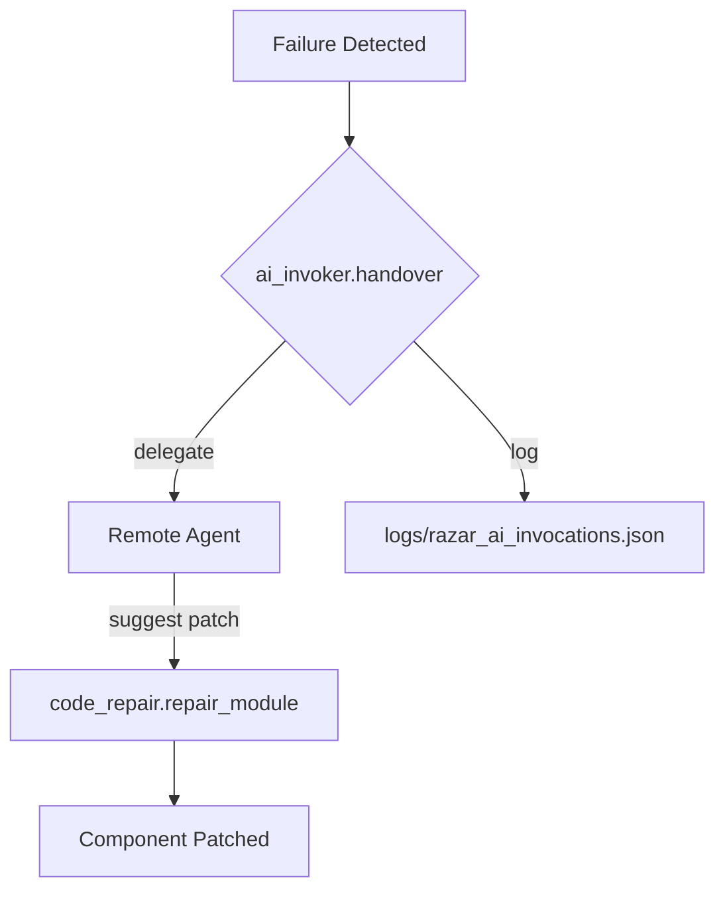
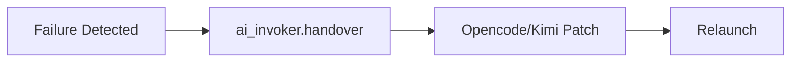
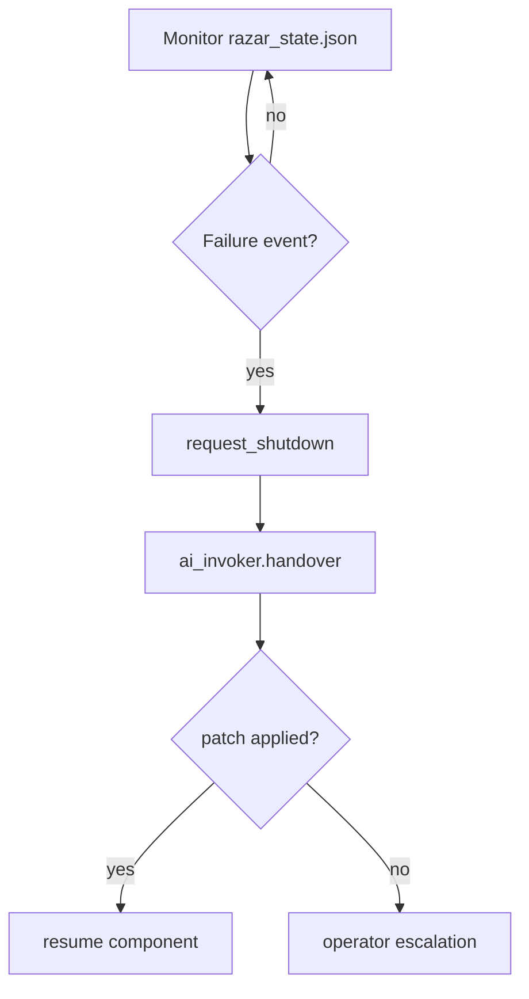
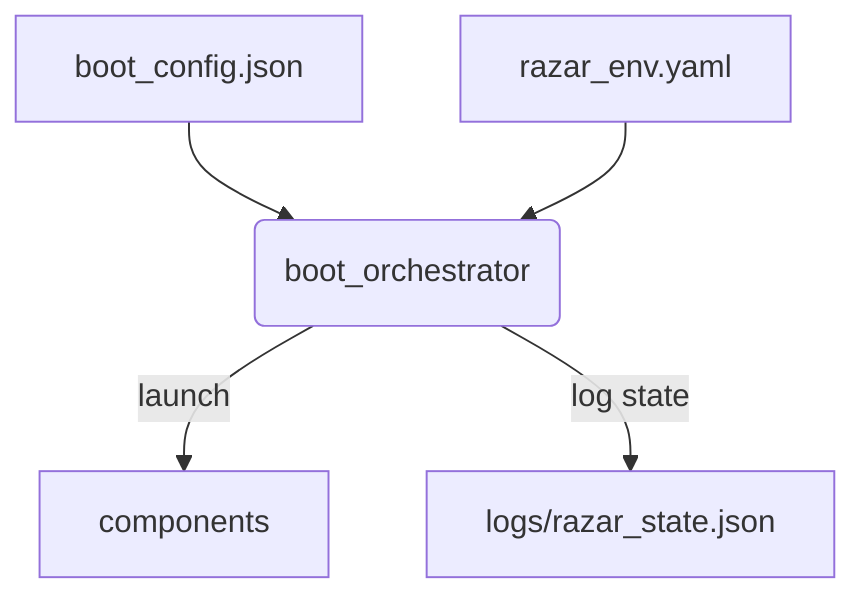
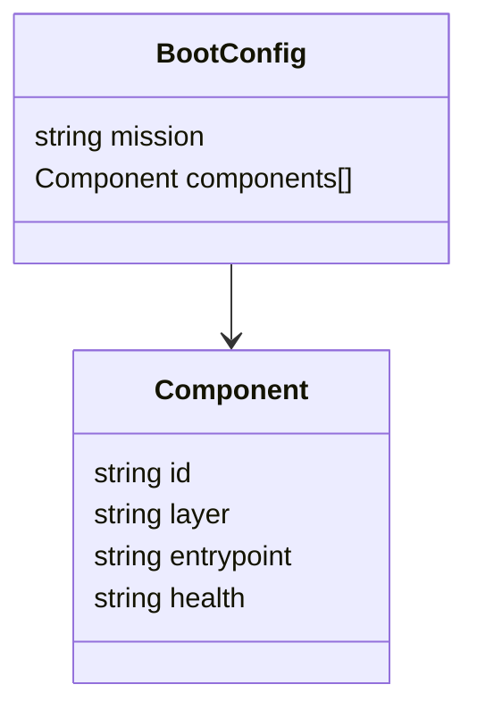
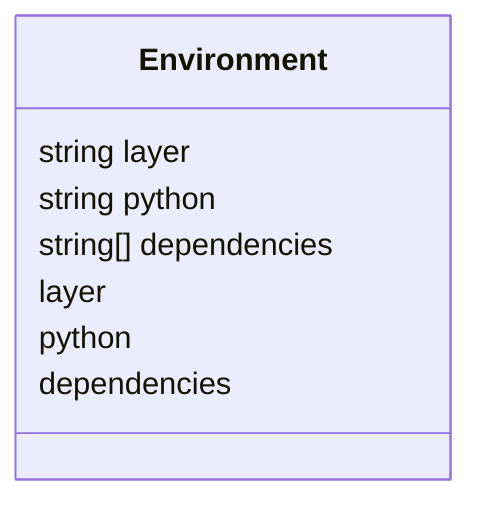
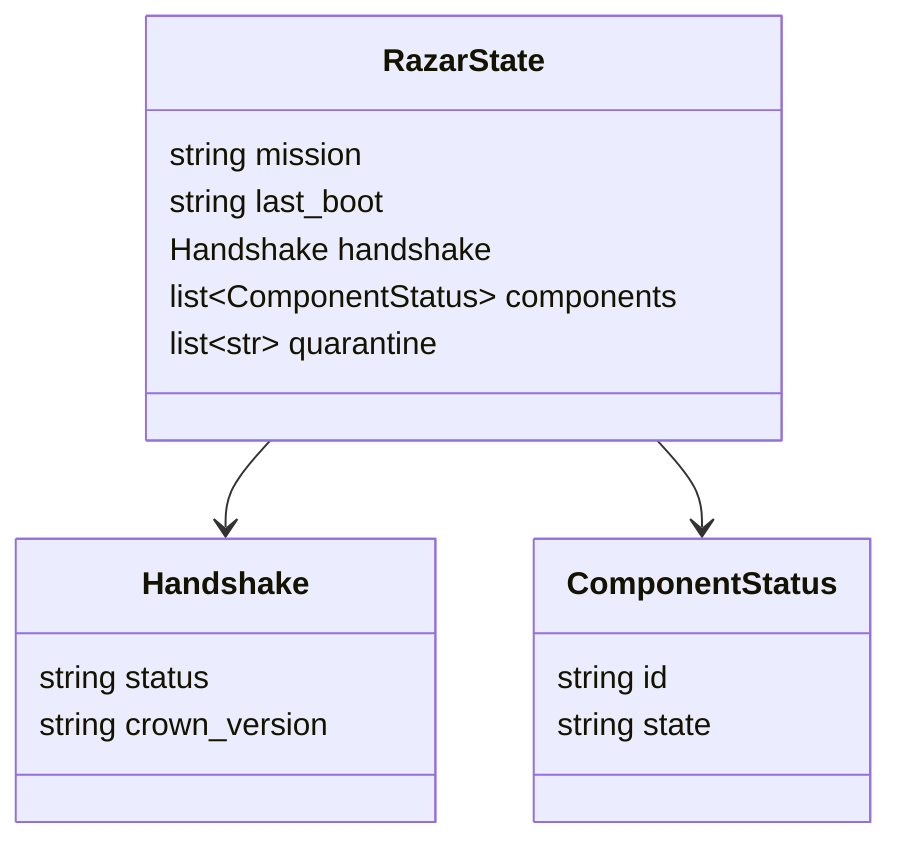

# RAZAR Agent

RAZAR orchestrates multi-layer ignition and tracks mission state for Crown and operator oversight.

## Vision
RAZAR bootstraps ABZU services in a reproducible environment and negotiates startup handshakes with the Crown stack.

## Persona & Responsibilities
- Orchestrate multi-layer boot sequences under operator direction.
- Maintain mission state and quarantine failing components.
- Delegate complex repairs to remote agents when needed.

## Module Coverage
RAZAR reads mission briefs, prepares per-layer virtual environments, launches components defined in `boot_config.json`, and records runtime state in `logs/razar_state.json`.

Covered modules:
- `boot_orchestrator` – sequential component ignition.
- `crown_handshake` – capability negotiation with Crown.
- `environment_builder` – per-layer Python environment setup.
- `mission_logger` – mission progress persistence.
- `quarantine_manager` – isolates failed components.

## Functional Workflows

### Boot Orchestration
1. Parse `boot_config.json` to determine components and health probes.
2. Prepare Python environments from `razar_env.yaml`.
3. Ignite components sequentially, validating each with `health_checks.py`.
4. Persist handshake and mission outcomes to `logs/razar_state.json` and mission‑brief archives.

### Remote Assistance
RAZAR can delegate missing or failing components to remote agents through
`ai_invoker.handover`. When a component fails, `ai_invoker` forwards context to a
configured remote agent, applies any suggested patch with
`code_repair.repair_module`, and records the interaction in
`logs/razar_ai_invocations.json` while applied patches are tracked in
`logs/razar_ai_patches.json`.

To run repairs locally, install the Opencode CLI and enable the optional
handover mode:

```bash
pip install opencode-cli
```

Invoke `ai_invoker.handover(..., use_opencode=True)` to stream the failure
context to `opencode run --json`. The CLI's patch suggestions are parsed and
forwarded to `code_repair.repair_module` for application.



### Self-Healing Overview
RAZAR blends automated recovery with operator playbooks. When a failure is detected,
`ai_invoker.handover` delegates the context to external helpers that can generate
patches through Opencode or the [Kimi Integration](tools/kimi_integration.md). The
patched component is relaunched following the steps in the
[Recovery Playbook](recovery_playbook.md).



### Recovery Flow


Example health event from `logs/razar_state.json`:
```json
{
  "step": "launch",
  "component": "crown_router",
  "status": "fail",
  "error": "Health check failed",
  "timestamp": 0
}
```

## Architecture Diagram


## Requirements
Requires `pyyaml`, `prometheus_client`, `websockets`, and a reachable `CROWN_WS_URL`.

## Deployment
1. `boot_orchestrator` exchanges a mission brief with Crown via
   `crown_handshake.perform` and writes the acknowledgement, capabilities, and
   downtime details to `logs/razar_state.json`.
2. If the handshake does not report `GLM-4.1V`, it runs
   `crown_model_launcher.sh` and appends the launch outcome to the same state
   file.
```bash
python -m razar.boot_orchestrator --mission demo
```

## Config Schemas

### boot_config.json


### razar_env.yaml


### logs/razar_state.json


## Example Runs
```bash
python -m razar.boot_orchestrator --mission demo --brief examples/demo_brief.json
```

Sample `boot_orchestrator.log`:
```text
[2025-09-21T00:00:00Z] INFO Booting component crown_router
[2025-09-21T00:00:01Z] INFO Health check passed for crown_router
[2025-09-21T00:00:05Z] INFO Mission demo complete
```

Excerpt from `logs/razar_state.json`:
```json
{
  "mission": "demo",
  "last_boot": "2025-09-21T00:00:05Z",
  "handshake": {"status": "ack", "crown_version": "1.4"},
  "components": [{"id": "crown_router", "state": "running"}],
  "quarantine": []
}
```

Mission‑brief archives:
```text
logs/mission_briefs/
└── demo_2025-09-21T00-00-05Z.json
```

## Troubleshooting

### Checklist
1. Ensure each component in `boot_config.json` defines a health probe.
2. Inspect `boot_orchestrator.log` for failed launches.
3. Run `python -m razar.issue_analyzer <logfile>` to classify failures and apply the suggested fix.
4. Review `docs/quarantine_log.md` for quarantined modules and remediation notes.

### Sample log outputs
`boot_orchestrator.log`:
```text
[2025-09-21T00:00:00Z] ERROR Health check failed for basic_service
```

`docs/quarantine_log.md`:
```text
| 2025-09-21T00:00:01Z | basic_service | dependency | Install missing packages or verify the environment. |
```

### Probe Failure Troubleshooting Matrix

| Component       | Health Probe                          | Failure Indicator                         | Remediation                                                  |
|-----------------|---------------------------------------|-------------------------------------------|--------------------------------------------------------------|
| basic_service   | `http://localhost:8000/healthz`       | `Health check failed for basic_service`   | Validate dependencies and restart the service.               |
| complex_service | `/var/log/complex_service.log`        | `Health check failed for complex_service` | Inspect configuration or escalate repair to a remote agent. |

## Cross-links
- [System Blueprint](system_blueprint.md)
- [RAZAR Guide](RAZAR_GUIDE.md)
- [Deployment Guide](deployment.md)
- [Monitoring Guide](monitoring.md)
- [Protocol Compliance](protocol_compliance.md)
- [Ignition Blueprint](ignition_blueprint.md)

## Component & Link
- [razar/boot_orchestrator.py](../razar/boot_orchestrator.py)

## Version History
| Version | Date | Notes |
|---------|------|-------|
| 0.2.3 | 2025-09-21 | Added remote assistance section with flow diagram plus schema diagrams and ignition example. |
| 0.2.2 | 2025-09-21 | Expanded remote assistance workflow and patch logging. |
| 0.1.0 | 2025-08-30 | Initial release of RAZAR runtime orchestrator. |
