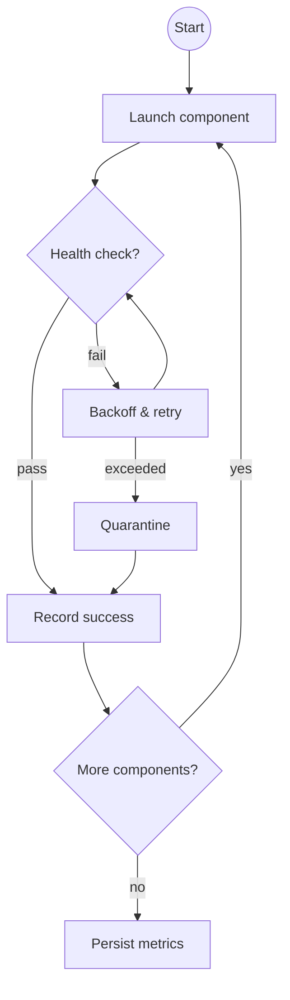

# RAZAR Agent

RAZAR acts as service 0 in the ABZU stack. It verifies the runtime
environment, sequenced component priorities, and continually rewrites
[Ignition.md](Ignition.md) with health markers so operators can track
startup progress. The agent forms a feedback loop with CROWN LLM to heal
faulty modules and ensures the system can cycle back to a ready state
without manual intervention.

## Ignition Workflow

`agents/razar/boot_orchestrator.py` drives the initial boot sequence. It
parses `docs/system_blueprint.md` to derive component priorities and
regenerates `docs/Ignition.md` with a status column. Each component is
launched in priority order using commands from
`config/razar_config.yaml`. After a component reports healthy via
`agents/razar/health_checks.py` the marker flips to ✅ and progress is
persisted to `logs/razar_state.json` so later runs resume from the last
successful step. Failures are marked ❌ and halt the sequence. Invoke the
workflow with `python -m agents.razar.boot_orchestrator`.

## Perpetual Ignition Loop

RAZAR runs a perpetual ignition loop that:

1. Reads component priorities from `Ignition.md` and
   `config/razar_config.yaml`.
2. Builds the dedicated virtual environment and installs dependencies
   defined in `razar_env.yaml`.
3. Boots each component in priority order using
   `agents/razar/runtime_manager.py`.
4. Probes `/ready` and `/health` endpoints via
   `agents/razar/health_checks.py`.
5. Rewrites the status column in `Ignition.md` (✅/⚠️/❌) and loops back to
   monitor the stack.  The loop never exits on its own—it continually
   verifies that previously healthy services stay responsive.

### Iterative Boot Loop

The loop now tracks launch metrics on every pass. Each component receives
exponential backoff and retry attempts. After a configurable number of
failures, stubborn modules are quarantined and skipped on future runs. Metrics
and the best performing sequence are persisted to `logs/razar_boot_history.json`
for later analysis.



## Adaptive Startup Orchestrator

The `razar/adaptive_orchestrator.py` helper experiments with different
component start orders defined in `component_priorities.yaml`.  Each run
records the overall time to reach a ready state and any failure points, then
stores the results in `logs/razar_boot_history.json` so future launches can
reuse the quickest sequence.

### CLI Options

- `--strategy` – choose `priority` \(default\) to start components in declared
  order or `random` to explore shuffled sequences.
- `--resume` – reuse the best sequence from previous history entries.

### Checkpoint recovery

The adaptive orchestrator persists its progress to `logs/razar_checkpoint.json`.
If RAZAR restarts, the orchestrator loads this checkpoint and continues from the
last successful component automatically. Operators can override this behaviour:

- `razar resume` – force continuation from the saved checkpoint.
- `razar rollback` – delete the checkpoint and rerun the full sequence.


## CROWN LLM Diagnostics and Patching

When a component fails a health check, RAZAR collects logs and test
artifacts and asks the CROWN LLM for repair guidance.  The
`agents/razar/code_repair.py` helper submits the failing module and error
context to the LLM, receives a patch suggestion, and validates the result
in a sandbox.  Successful patches are committed back to the repository
and the component is marked ready for reactivation.

## Prioritized Pytest Runner

`agents/razar/pytest_runner.py` drives tiered test execution.  Test files are
grouped into priorities in `tests/priority_map.yaml` and executed sequentially
with the `pytest-order` plug‑in.  Output from each tier is appended to
`logs/pytest_priority.log`.  When a test fails, the runner invokes the code
repair workflow to solicit a patch, applies it in a temporary workspace, and
reruns the affected tests before resuming the remaining tiers.

## Remote Agent Registration

External helper agents can be loaded at runtime via
`agents/razar/remote_loader.py`.  The loader supports both plain HTTP
endpoints and Git repositories (via GitPython).  Remote modules must implement
two functions:

```
def configure() -> dict:
    """Return runtime configuration parameters."""

def patch(context: Any | None = None):
    """Return a patch suggestion or diff for the given ``context``."""
```

Use `load_remote_agent` for simple HTTP sources or
`load_remote_agent_from_git` for repositories:

```
from agents.razar import load_remote_agent_from_git

module, config, suggestion = load_remote_agent_from_git(
    "helper", "https://github.com/example/agent.git", "agent.py"
)
```

Each invocation records configurations and patch suggestions to
`logs/razar_remote_agents.json` for audit and replay.

## Lifecycle Bus and Recovery Protocol

`agents/razar/lifecycle_bus.py` exposes a lightweight Redis pub/sub layer used
by RAZAR components. Status updates are published to the ``razar:status``
channel and persisted in a Redis hash of the same name so operators can query
the last reported state for any component.  Issues and control messages travel
over ``razar:issues`` and ``razar:control`` respectively.

When a component encounters an unrecoverable error it sends a JSON payload to
the ZeroMQ endpoint managed by
`agents/razar/recovery_manager.py`. The payload must include ``module`` and may
optionally provide a serialisable ``state`` snapshot. The recovery manager:

1. Broadcasts a ``pause`` instruction on the lifecycle bus.
2. Saves the provided state under ``recovery_state/<module>.json``.
3. Requests a patch from the remote code agent via
   ``code_repair.repair_module``.
4. Signals a restart for the module through the bus.
5. Sends a ``restore`` control so the component reloads its saved state and
   finally broadcasts ``resume`` to re‑enable the system.

This protocol ensures components can be halted, patched and resumed without
human intervention while maintaining state continuity.

## Crown Link Protocol

Diagnostics and repair hand‑offs are transported over a lightweight WebSocket
channel implemented in `razar/crown_link.py`. Two message shapes are used:

- **Status updates** – `{"type": "status", "component": "decoder", "result": "failed", "log_snippet": "..."}`
- **Repair requests** – `{"type": "repair", "stack_trace": "...", "config_summary": "..."}`

The `build_patch_prompt` helper fills the `PATCH_PROMPT_TEMPLATE` so the
GLM‑4.1V‑9B model replies with a JSON object describing the patch, tests to run,
and a short rationale.

## Mission Brief Handshake

Prior to the boot cycle, RAZAR transmits `mission_brief.json` to the Crown stack. The brief captures the priority map, current status and unresolved issues and is sent through `razar/crown_handshake.py`. Crown responds with an acknowledgement and a list of capabilities for the upcoming session. All messages are appended to `logs/razar_crown_dialogues.json` for traceability.


## Shutdown–Repair–Restart Handshake

RAZAR performs a handshake with unhealthy services:

1. **Shutdown** – instruct the component to stop gracefully and move its
   metadata to `quarantine/`.
2. **Repair** – run diagnostics, solicit a patch from the CROWN LLM, and
   rerun the module's tests.
3. **Restart** – if tests pass, call
   `quarantine_manager.reactivate_component` and relaunch via the runtime
   manager.  Status in `Ignition.md` returns to ✅.

This handshake guarantees that faulty code is isolated, repaired, and
brought back online under explicit operator control.

## Further Reading

- [System Blueprint](system_blueprint.md)
- [Nazarick Agents](nazarick_agents.md)
- [Developer Onboarding](developer_onboarding.md)
