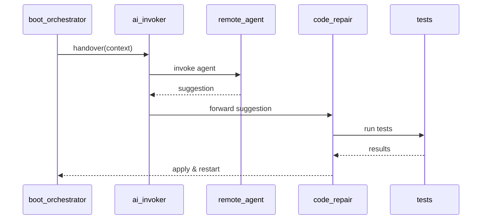
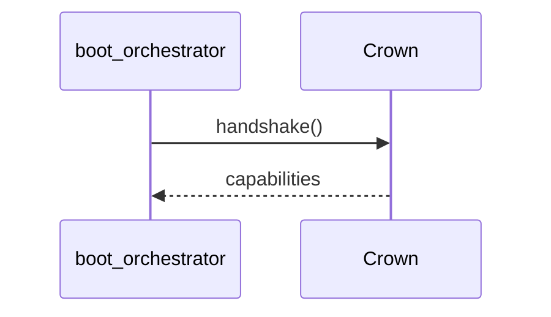
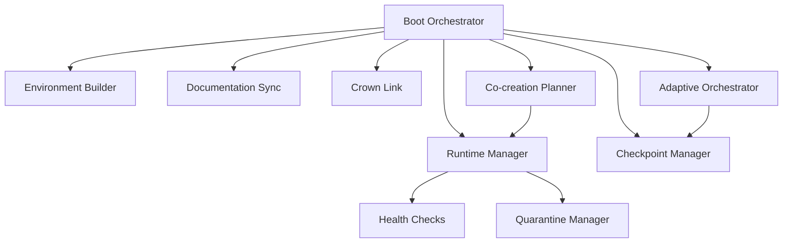

# RAZAR Agent

Bootstrapper for local services, operator protocol alignment, and mission brief exchange with the CROWN stack.

## Component Index Entry

- **ID:** `razar`
- **Path:** `agents/razar`

To update the index when RAZAR modules evolve:

1. Edit `component_index.json` with new paths or identifiers.
2. Run `python scripts/component_inventory.py` to rebuild component tables.
3. Regenerate the docs index with `pre-commit run doc-indexer --files docs/RAZAR_AGENT.md docs/INDEX.md`.

## Vision

The RAZAR agent bootstraps local services in a controlled environment. It
creates a Python virtual environment, installs component dependencies, and
launches each service in priority order. By aligning this startup flow with the
architecture outlined in the [System Blueprint](system_blueprint.md), RAZAR acts
as the bootstrap agent that grounds ABZU in a coherent foundation. After INANNA
initializes its memory layers, RAZAR triggers the [Bana engine](bana_engine.md)
to narrate system state.

## Submodules

| Submodule | Responsibility | Chakra Alignment | Source Path | Downstream Agents |
|-----------|----------------|-----------------|-------------|-------------------|
| `adaptive_orchestrator.py` | Searches for efficient boot sequences using component priorities and history. | Crown | [`razar/adaptive_orchestrator.py`](../razar/adaptive_orchestrator.py) | [`checkpoint_manager.py`](../razar/checkpoint_manager.py) |
| `boot_orchestrator.py` | Launches components, runs health checks, and negotiates Crown capabilities. | Root | [`razar/boot_orchestrator.py`](../razar/boot_orchestrator.py) | [`crown_handshake.py`](../razar/crown_handshake.py), [`service_launcher`](../agents/nazarick/service_launcher.py) |
| `checkpoint_manager.py` | Persists boot progress so adaptive runs can resume after failures. | Root | [`razar/checkpoint_manager.py`](../razar/checkpoint_manager.py) | [`adaptive_orchestrator.py`](../razar/adaptive_orchestrator.py) |
| `cocreation_planner.py` | Merges blueprints, failure counts, and Crown advice into build plans. | Crown | [`razar/cocreation_planner.py`](../razar/cocreation_planner.py) | [`crown_link.py`](../razar/crown_link.py) |
| `crown_handshake.py` | Performs startup handshake with the CROWN stack and records capabilities. | Crown | [`razar/crown_handshake.py`](../razar/crown_handshake.py) | [CROWN agent](CROWN_OVERVIEW.md) |
| `crown_link.py` | WebSocket bridge for diagnostics and repair requests. | Crown | [`razar/crown_link.py`](../razar/crown_link.py) | [CROWN agent](CROWN_OVERVIEW.md) |
| `doc_sync.py` | Regenerates ignition and blueprint docs based on runtime state. | Throat | [`razar/doc_sync.py`](../razar/doc_sync.py) | [`lifecycle_bus`](../agents/razar/lifecycle_bus.py) |
| `environment_builder.py` | Creates isolated Python environments and installs per-layer dependencies. | Root | [`razar/environment_builder.py`](../razar/environment_builder.py) | [`boot_orchestrator.py`](../razar/boot_orchestrator.py) |
| `health_checks.py` | Provides ready signals and subprocess health probes for components. | Root | [`razar/health_checks.py`](../razar/health_checks.py) | [`boot_orchestrator.py`](../razar/boot_orchestrator.py) |
| `issue_analyzer.py` | Classifies failure logs into dependency, logic, or external issues. | Third Eye | [`razar/issue_analyzer.py`](../razar/issue_analyzer.py) | [`recovery_manager.py`](../razar/recovery_manager.py) |
| `mission_logger.py` | Proxies mission events to the full agents module without heavy imports. | Heart | [`razar/mission_logger.py`](../razar/mission_logger.py) | [`agents/razar/mission_logger.py`](../agents/razar/mission_logger.py) |
| `module_sandbox.py` | Applies Crown-suggested patches in an isolated workspace before promotion. | Crown | [`razar/module_sandbox.py`](../razar/module_sandbox.py) | [`code_repair.py`](../agents/razar/code_repair.py) |
| `quarantine_manager.py` | Moves failing components to isolation and logs diagnostic context. | Root | [`razar/quarantine_manager.py`](../razar/quarantine_manager.py) | [`recovery_manager.py`](../razar/recovery_manager.py) |
| `recovery_manager.py` | Coordinates shutdown, patching, and resumption workflows. | Crown | [`razar/recovery_manager.py`](../razar/recovery_manager.py) | [`code_repair.py`](../agents/razar/code_repair.py) |
| `status_dashboard.py` | CLI dashboard summarising boot progress and quarantine state. | Throat | [`razar/status_dashboard.py`](../razar/status_dashboard.py) | [`quarantine_manager.py`](../razar/quarantine_manager.py) |

## Module Coverage

Tests in [`tests/agents/razar/`](../tests/agents/razar/) exercise the boot
orchestrator and supporting helpers. Coverage results roll into the repository
report ([coverage.svg](../coverage.svg)), ensuring each module's behaviour is
verified during continuous integration.

## Requirements

Install these packages and tools before launching the agent:

- `pyyaml`
- `prometheus_client`
- `websockets`
- `pyenv` — Python version management
- `pre-commit` — repository hooks
- `CROWN_WS_URL` environment variable pointing to a running Crown WebSocket
  endpoint. RAZAR aborts boot if the Crown server is unreachable.

Run `python scripts/check_env.py` to verify the environment.

Layer-specific packages are defined in
[razar_env.yaml](../razar_env.yaml) and documented in
[dependencies.md](dependencies.md).

## Configuration Schemas

The environment builder validates its settings against
[`schemas/razar_env.schema.yaml`](schemas/razar_env.schema.yaml), which
declares the Python version and package layers used during boot.

```yaml
python_version: "3.11"
layers:
  razar:
    - pyyaml
    - prometheus_client
```

## Deployment Overview

The orchestrator prepares core services before handing control to CROWN:

1. Launch the Primordials container.
2. Poll its `/health` endpoint until a `200` response confirms readiness.
3. Perform the Crown handshake, persist returned capabilities, and record a `handshake` event in `logs/razar_state.json`.
4. If the GLM‑4.1V model is absent, trigger `crown_model_launcher.sh` to load it and log a `model_launch` event in `logs/razar_state.json`.

## AI Handover



The Mermaid source lives at [assets/remote_assistance_sequence.mmd](assets/remote_assistance_sequence.mmd).

After boot, RAZAR delegates repairs to autonomous helpers. The
[ai_invoker.py](../agents/razar/ai_invoker.py) dispatches tasks to remote
workers while [code_repair.py](../agents/razar/code_repair.py) applies patches
and reruns failing checks.

### `boot_config.json`

```json
{
  "components": [
    {
      "name": "basic_service",
      "command": ["python", "-c", "print('basic service running')"],
      "health_check": ["python", "-c", "import sys; sys.exit(0)"]
    }
  ]
}
```

**Schema snippet** ([full schema](schemas/boot_config.schema.json))

```json
{
  "type": "object",
  "required": ["components"],
  "properties": {
    "components": {"type": "array"}
  }
}
```

### Example run

```bash
# Plan a remote patch
python -m agents.razar.ai_invoker examples/repair_plan.json

# Apply the suggested fix
python -m agents.razar.code_repair patches/fix.diff
```

## Crown Handshake



The Mermaid source lives at [assets/crown_handshake_sequence.mmd](assets/crown_handshake_sequence.mmd).

`boot_orchestrator` establishes trust with the Crown stack and builds the
environment defined in `razar_env.yaml` before launching services. It calls
[boot_orchestrator.py](../razar/boot_orchestrator.py) to perform the handshake
and persist capability data.

### `razar_env.yaml`

```yaml
layers:
  razar:
    - pyyaml
  inanna:
    - requests
  crown:
    - numpy
```

**Schema snippet** ([full schema](schemas/razar_env.schema.yaml))

```yaml
type: object
required:
  - layers
properties:
  layers:
    type: object
```

### Example run

```bash
python -m razar.boot_orchestrator --handshake-only
```

## Module Overviews

### `boot_orchestrator.py`
Coordinates startup, loads component configs, performs the Crown handshake, and
records state snapshots. [Source](../razar/boot_orchestrator.py)

### `environment_builder.py`
Ensures the correct Python version is present, creates a virtual environment,
and installs layer‑specific packages. [Source](../razar/environment_builder.py)

### `doc_sync.py`
Regenerates ignition docs and updates the System Blueprint and component tables
based on runtime results. [Source](../razar/doc_sync.py)

### `checkpoint_manager.py`
Persists boot progress so interrupted runs can resume from the last successful
component. [Source](../razar/checkpoint_manager.py)

### `crown_link.py`
Provides a minimal WebSocket client for diagnostics and repair exchanges with
the Crown stack. [Source](../razar/crown_link.py)

### `adaptive_orchestrator.py`
Explores alternative component launch sequences and records the fastest path to
ready state. [Source](../razar/adaptive_orchestrator.py)

### `cocreation_planner.py`
Builds dependency‑ordered plans by combining component priorities, failure
counts, and Crown suggestions. [Source](../razar/cocreation_planner.py)

### `runtime_manager.py`
Manages component processes, restarts services on failure, and tracks boot state. [Source](../razar/runtime_manager.py)

### `health_checks.py`
Runs service probes and exposes optional Prometheus metrics. [Source](../razar/health_checks.py)

### `quarantine_manager.py`
Isolates failing components and maintains the quarantine ledger. [Source](../razar/quarantine_manager.py)

### `recovery_manager.py`
Coordinates repair attempts and reintegrates restored components. [Source](../razar/recovery_manager.py)

### `status_dashboard.py`
Streams boot and runtime metrics to a lightweight dashboard. [Source](../razar/status_dashboard.py)

### `issue_analyzer.py`
Classifies failure logs to suggest remediation paths. [Source](../razar/issue_analyzer.py)

### `mission_logger.py`
Aggregates boot events into persistent mission logs. [Source](../razar/mission_logger.py)

### `module_sandbox.py`
Executes high-risk modules in a restricted environment. [Source](../razar/module_sandbox.py)

### `crown_handshake.py`
Performs the initial capability exchange with the Crown stack. [Source](../razar/crown_handshake.py)

## Interaction Logging

Per [The Absolute Protocol](The_Absolute_Protocol.md#razar-crown-operator-interaction-logging),
all exchanges between RAZAR, Crown, and the Operator must append records to
[`../logs/interaction_log.jsonl`](../logs/interaction_log.jsonl) with:

- timestamp
- initiator
- action or request
- response summary

See [logging_guidelines.md](logging_guidelines.md) for structured JSON formats
and approved log levels.

## Functional Workflows

RAZAR operations revolve around several coordinated flows:

- [Boot Flow](#boot-flow)
- [Remote Assistance](#remote-assistance)

## Boot Flow


The Mermaid source lives at [assets/razar_flow.mmd](assets/razar_flow.mmd).

## Architecture

The RAZAR agent coordinates multiple modules during startup. The Mermaid diagram
below highlights the primary interactions without relying on binary images:



Boot Orchestrator derives the launch order, invoking the Environment Builder to
prepare isolated dependencies. The Runtime Manager starts services, running
Health Checks and isolating failures through the Quarantine Manager.
Documentation Sync, Checkpoint Manager, Crown Link, Adaptive Orchestrator, and
Co-creation Planner provide additional coordination around the core boot flow.
The Mermaid source lives at [assets/razar_architecture.mmd](assets/razar_architecture.mmd).

## Remote Assistance

RAZAR can delegate recovery to an external AI agent when repeated failures block the boot sequence. The goal is to restore service while following repository safety rules.

Authorized handover agents, their endpoints, and authentication tokens live in [config/razar_ai_agents.json](../config/razar_ai_agents.json).

### Workflow

1. Repeated boot failures or missing components trigger the handover flag.
2. `boot_orchestrator` calls [ai_invoker.handover](../agents/razar/ai_invoker.py), which selects the configured agent and logs the invocation to [`../logs/razar_ai_invocations.json`](../logs/razar_ai_invocations.json).
3. The remote agent analyzes the context and returns a patch suggestion.
4. The suggestion is logged to [`../logs/razar_ai_patches.json`](../logs/razar_ai_patches.json) and forwarded to [code_repair.repair_module](../agents/razar/code_repair.py).
5. `code_repair` applies the patch in a sandbox, runs the supplied tests, and on success records the diff in `razar_ai_patches.json`.
6. `boot_orchestrator` reloads the component and resumes the boot sequence. If tests fail, the patch is rolled back and the cycle repeats until the retry limit is reached.


The Mermaid source lives at [assets/remote_assistance_sequence.mmd](assets/remote_assistance_sequence.mmd).

### Logging

- Invocations append records to [`../logs/razar_ai_invocations.json`](../logs/razar_ai_invocations.json).
- Suggestions and applied diffs append records to [`../logs/razar_ai_patches.json`](../logs/razar_ai_patches.json).

Each entry includes the agent name, timestamp, and relevant context for auditing.

### Safety checks

- Patches execute in a sandboxed environment.
- Required tests must pass before restart.
- Justification is logged and reviewed.

### Rollback

If tests fail or regressions appear, RAZAR reverts to the previous state and requests another fix.

## Module builder

`agents/razar/module_builder.py` scaffolds new components from a planning
specification. Instead of inserting ``# TODO`` or ``# FIXME`` markers, the builder
requires either a path to a template file or an inline implementation snippet in
accordance with the [no placeholder comments rule](The_Absolute_Protocol.md#no-placeholder-comments).
Patch suggestions from remote agents are applied inside an isolated sandbox and the
included tests are executed. The module is promoted into the repository only
after the tests pass.

### Example

```python
from agents.razar import module_builder

snippet = "def run() -> str:\n    return 'demo'\n"
tests = {
    "tests/test_demo.py": (
        "from agents import demo\n\n"
        "def test_run():\n"
        "    assert demo.run() == 'demo'\n"
    )
}
plan = {"demo": {"component": "agents/demo.py", "snippet": snippet, "tests": tests}}

module_builder.build("demo", plan=plan)
```

## Core Modules

### `boot_orchestrator.py`

[razar/boot_orchestrator.py](../razar/boot_orchestrator.py) sequences
components from `boot_config.json`, performs a CROWN handshake, and logs run
metrics.

### `environment_builder.py`

[razar/environment_builder.py](../razar/environment_builder.py) ensures the
requested Python version, creates a virtual environment, and installs dependency
layers from `razar_env.yaml`.

### `doc_sync.py`

[razar/doc_sync.py](../razar/doc_sync.py) regenerates system documentation using
boot history and lifecycle status updates.

### `checkpoint_manager.py`

[razar/checkpoint_manager.py](../razar/checkpoint_manager.py) persists boot
progress so interrupted runs can resume from the last successful component.

### `crown_link.py`

[razar/crown_link.py](../razar/crown_link.py) offers a minimal WebSocket client
for sending status updates and repair requests to the CROWN stack.

### `adaptive_orchestrator.py`

[razar/adaptive_orchestrator.py](../razar/adaptive_orchestrator.py) experiments
with alternate boot sequences and records the best-performing order in
`logs/razar_boot_history.json`.

### `cocreation_planner.py`

[razar/cocreation_planner.py](../razar/cocreation_planner.py) builds collaborative
plans by combining component priorities, failure counts, and CROWN suggestions.

## Components & Links

| Source Module | Related Docs |
| --- | --- |
| [razar/environment_builder.py](../razar/environment_builder.py) | [Ignition](Ignition.md), [System Blueprint](system_blueprint.md) |
| [razar/boot_orchestrator.py](../razar/boot_orchestrator.py) | [Ignition](Ignition.md), [System Blueprint](system_blueprint.md) |
| [agents/razar/module_builder.py](../agents/razar/module_builder.py) | [Ignition](Ignition.md), [System Blueprint](system_blueprint.md) |
| [agents/razar/runtime_manager.py](../agents/razar/runtime_manager.py) | [Ignition](Ignition.md), [System Blueprint](system_blueprint.md) |
| [agents/razar/health_checks.py](../agents/razar/health_checks.py) | [Ignition](Ignition.md), [System Blueprint](system_blueprint.md) |
| [agents/razar/quarantine_manager.py](../agents/razar/quarantine_manager.py) | [Ignition](Ignition.md), [System Blueprint](system_blueprint.md) |
| [agents/razar/doc_sync.py](../agents/razar/doc_sync.py) | [Ignition](Ignition.md), [System Blueprint](system_blueprint.md) |
| [agents/razar/checkpoint_manager.py](../agents/razar/checkpoint_manager.py) | [Ignition](Ignition.md), [System Blueprint](system_blueprint.md) |
| [agents/razar/crown_link.py](../agents/razar/crown_link.py) | [Ignition](Ignition.md), [System Blueprint](system_blueprint.md) |
| [razar/adaptive_orchestrator.py](../razar/adaptive_orchestrator.py) | [Ignition](Ignition.md), [System Blueprint](system_blueprint.md) |
| [razar/cocreation_planner.py](../razar/cocreation_planner.py) | [Ignition](Ignition.md), [System Blueprint](system_blueprint.md) |

## Deployment Workflow

1. **Environment setup** – build isolated dependencies with
   `razar.environment_builder`:

   ```bash
   python -m razar.environment_builder
   ```

2. **Configuration** – adjust settings in `boot_config.json` to define
   service priorities and flags.

3. **Handshake** – before any component starts, exchange a mission brief
   with the CROWN stack to learn which capabilities are online and
   whether any components require downtime. The handshake can be invoked
   directly:

   ```bash
   python -m razar.crown_handshake path/to/mission_brief.json
   ```

   During a full boot the orchestrator calls
   `crown_handshake.perform()` before any components launch, archives the
   mission brief to `logs/mission_briefs/<timestamp>.json`, saves the
   handshake response to `logs/mission_briefs/<timestamp>_response.json`,
   logs capabilities in `logs/razar.log`, and persists the full response
   under the `handshake` key in
   [logs/razar_state.json](../logs/razar_state.json). If the advertised
   capabilities omit `GLM4V`, the orchestrator executes
   [`crown_model_launcher.sh`](../crown_model_launcher.sh), records the
   launch under `launched_models`, appends a `model_launch` event in the
   state file, and archives the trigger as
   `logs/mission_briefs/<timestamp>_glm4v_launch.json`.

   RAZAR maintains at most 20 mission brief archives, rotating older pairs
   from `logs/mission_briefs/` to preserve space while keeping recent
   exchanges for audit.

4. **Launch** – with capabilities recorded, start the boot orchestrator
   to bring components online:

   ```bash
   python -m razar.boot_orchestrator
   ```

If a component fails to start, inspect the logs and consult the
[Recovery Playbook](recovery_playbook.md) for troubleshooting tips. The
handshake data persists in `logs/razar_state.json` so operators can
cross‑check advertised capabilities against runtime behaviour. For end‑to‑end
rollout steps see [deployment.md](deployment.md) and operational runbooks in
[operations.md](operations.md).

## Prioritized pytest runner

`agents/razar/pytest_runner.py` executes repository tests grouped by priority
tiers defined in `tests/priority_map.yaml`. Tiers `P1` through `P5` run
sequentially and results append to `logs/pytest_priority.log`. The runner stores
the last failing test in `logs/pytest_state.json` so reruns with `--resume`
continue from that point.

```bash
# Run all tiers in order
python agents/razar/pytest_runner.py

# Run only tier P1
python agents/razar/pytest_runner.py --priority P1

# Resume after fixing failures
python agents/razar/pytest_runner.py --resume
```

## Runtime manager

`agents/razar/runtime_manager.py` reads a configuration file that lists the
components to start and the shell command for each.  Successful launches are
recorded in `logs/razar_state.json` so subsequent runs resume from the last
healthy component.

```bash
python -m agents.razar.runtime_manager path/to/razar_config.yaml
```

Dependencies for a component can be declared in `razar_env.yaml` under a layer
with the same name.  They are installed into a private virtual environment under
`.razar_venv/`.

## Health checks

`agents/razar/health_checks.py` provides small probes that verify core
services.  The runtime manager invokes the check for a component after it starts
and may retry once if a restart command is defined.  When the optional
`prometheus_client` package is installed, a metrics endpoint is also exposed.

Individual checks can also be executed from the command line:

```bash
python -m agents.razar.health_checks
```

## Quarantine manager

Failed components are isolated by `agents/razar/quarantine_manager.py`.  A JSON
file describing the failure is written under `quarantine/` and a human readable
entry is appended to `docs/quarantine_log.md`.  Removing the JSON file and
adding a `resolved` entry to the log restores a component.

```bash
python - <<'PY'
from agents.razar import quarantine_manager as qm
qm.quarantine_component({'name': 'demo'}, 'startup failure')
PY
```

The quarantine utilities also track diagnostic data and patches applied to a
component, making it easier to audit recovery steps.

## Boot orchestrator

[`agents/razar/boot_orchestrator.py`](../agents/razar/boot_orchestrator.py)
derives the component startup order from `docs/system_blueprint.md`,
regenerates `docs/Ignition.md` with status markers, launches each service in
sequence, and records progress in `logs/razar_state.json`.

## Environment builder

[`razar/environment_builder.py`](../razar/environment_builder.py) ensures the
required Python version is available, creates an isolated virtual environment,
and installs dependency layers defined in `razar_env.yaml`.

## Documentation sync

[`agents/razar/doc_sync.py`](../agents/razar/doc_sync.py) refreshes core
references after component changes by regenerating Ignition, updating the
system blueprint, and rebuilding component indexes.

## Checkpoint manager

[`agents/razar/checkpoint_manager.py`](../agents/razar/checkpoint_manager.py)
persists boot progress in `logs/razar_state.json` so runs can resume from the
last successful component or clear the history to restart.

## Crown link

[`agents/razar/crown_link.py`](../agents/razar/crown_link.py) provides a minimal
WebSocket client for exchanging failure reports and status updates with the
CROWN stack, logging every dialogue in
`logs/razar_crown_dialogues.json`.

## Adaptive orchestrator

[`razar/adaptive_orchestrator.py`](../razar/adaptive_orchestrator.py) explores
different boot sequences, measuring time-to-ready and failures, and stores
results in `logs/razar_boot_history.json` to refine startup order.

## Co-creation planner

[`razar/cocreation_planner.py`](../razar/cocreation_planner.py) consolidates
component priorities, boot failures, and Crown suggestions into a dependency
ordered build plan saved to `logs/razar_cocreation_plans.json`.

## Code Considerations

### `razar_config.yaml`

**Schema**

```yaml
dependencies: []
enable_ai_handover: false
ai_agent:
  name: string
  endpoint: string
  auth_token: string
  models: [string, ...]  # optional fallback models
components:
  - name: string
    priority: int
    command: string
```

**Example**

```yaml
dependencies: []
enable_ai_handover: false
ai_agent:
  name: demo
  endpoint: http://localhost:3000
  auth_token: token
  models:
    - gpt-4
    - gpt-3.5
components:
  - name: memory_store
    priority: 1
    command: "echo 'starting memory_store'"
```

### `boot_config.json`

The default configuration lives at [razar/boot_config.json](../razar/boot_config.json).

**Schema**

```json
{
  "components": [
    {
      "name": "string",
      "command": ["string", "..."],
      "health_check": ["string", "..."]
    }
  ]
}
```

**Example**

```json
{
  "components": [
    {
      "name": "demo",
      "command": ["python", "demo.py"],
      "health_check": ["python", "-m", "demo_health"]
    }
  ]
}
```

### `razar_env.yaml`

The default environment file lives at [razar_env.yaml](../razar_env.yaml).

**Structure**

```yaml
layers:
  <layer_name>:
    - <dependency>
```

**Example**

```yaml
layers:
  demo:
    - requests
```

### `logs/razar_state.json` and quarantine entries

State snapshots are written to [logs/razar_state.json](../logs/razar_state.json).

**State file format**

```json
{
  "last_component": "string",
  "capabilities": ["string"],
  "downtime": {"component": {"patch": "info"}},
  "launched_models": ["string"]
}
```

**Example**

```json
{
  "last_component": "demo",
  "capabilities": ["chat", "vision"],
  "downtime": {"gateway": {"patch": "1.2.3"}},
  "launched_models": ["GLM4V"]
}
```

**Quarantine entry format**

Each quarantined component is recorded as `quarantine/<name>.json`:

```json
{
  "name": "string",
  "reason": "string",
  "attempts": 1,
  "patches_applied": ["string"]
}
```

**Example**

```json
{
  "name": "demo",
  "reason": "startup failure",
  "attempts": 1,
  "patches_applied": []
}
```

### Mission Brief Archive

Each CROWN handshake serializes a mission brief to
`logs/mission_briefs/<timestamp>.json`. These JSON files capture the
priority map and status snapshot for every boot attempt, providing an audit
trail for troubleshooting. Periodically prune old entries to manage disk
usage.

### Handshake Sequence

1. The boot orchestrator builds a mission brief from component priorities and
   current statuses.
2. The brief is archived in `logs/mission_briefs/<timestamp>.json`.
3. A `crown_handshake` is performed over the configured WebSocket.
4. Handshake results — capabilities and downtime — are logged to
   `logs/razar.log` and persisted in `logs/razar_state.json`.
5. If the returned capability list lacks `GLM4V`, the orchestrator triggers
   `crown_model_launcher.sh` to start the model.

### Rollback Steps

1. On handshake failure or a model launch error, the failure is recorded in
   `logs/razar.log` and the previous state snapshot is preserved.
2. The orchestrator regenerates the mission brief and retries the handshake.
3. After repeated failures, the affected component is quarantined and AI
   handover or manual intervention is required before reboot.

## Deployment Examples

Typical deployment builds the environment, launches components, and records state
for auditing. The snippets below show a clean startup and a simulated recovery.

### Startup and Handshake

```bash
$ python -m razar.crown_handshake logs/mission_briefs/demo.json
[HANDSHAKE] posting mission brief
[HANDSHAKE] Crown capabilities: chat, vision
$ python -m razar.boot_orchestrator
[BOOT] creating virtual environment
[BOOT] launching environment_builder
[BOOT] launching runtime_manager
[BOOT] writing mission brief to logs/mission_briefs/2025-05-16T12-00-00.json
[BOOT] wrote state snapshot to logs/razar_state.json
```

### Simulated Failure Recovery

```bash
$ python -m razar.boot_orchestrator --demo-fail runtime_manager
[BOOT] creating virtual environment
[BOOT] launching environment_builder
[FAIL] runtime_manager crashed
[HANDOVER] invoking ai_invoker
[HANDOVER] patch applied, restarting runtime_manager
[BOOT] runtime_manager recovered
```

Logs are stored in `logs/razar_state.json` and `logs/mission_briefs/`.

Sample `logs/razar_state.json` entry:

```json
{
  "last_component": "runtime_manager",
  "launched_models": ["GLM4V"],
  "glm4v_present": true,
  "events": [
    {"event": "handshake", "timestamp": "2025-09-01T00:00:00Z"},
    {"event": "model_launch", "model": "GLM-4.1V", "timestamp": "2025-09-01T00:00:01Z"}
  ]
}
```

Sample mission brief:

```json
{
  "priority_map": ["environment_builder", "runtime_manager"],
  "status": "success"
}
```

## Configuration

### `boot_config.json`

```json
{
  "components": [
    {
      "name": "basic_service",
      "command": ["python", "-c", "print('basic service running')"],
      "health_check": ["python", "-c", "import sys; sys.exit(0)"]
    }
  ]
}
```

Defines component launch commands and health checks.

**Schema snippet** ([full schema](schemas/boot_config.schema.json))

```json
{
  "type": "object",
  "required": ["components"],
  "properties": {
    "components": {
      "type": "array",
      "items": {
        "type": "object",
        "required": ["name", "command", "health_check"]
      }
    }
  }
}
```

### `razar_env.yaml`

```yaml
layers:
  razar:
    - pyyaml
  inanna:
    - requests
  crown:
    - numpy
```

Lists per-layer dependencies for the environment builder.

**Schema snippet** ([full schema](schemas/razar_env.schema.yaml))

```yaml
type: object
required:
  - layers
properties:
  layers:
    type: object
    additionalProperties:
      type: array
      items:
        type: string
```

### `logs/razar_state.json`

```json
{
  "last_component": "",
  "capabilities": [],
  "downtime": {},
  "launched_models": [],
  "handshake": {
    "acknowledgement": "",
    "capabilities": [],
    "downtime": {}
  },
  "glm4v_present": false,
  "events": []
}
```

Captures runtime state and handshake capabilities.

**Schema snippet** ([full schema](schemas/razar_state.schema.json))

```json
{
  "type": "object",
  "required": [
    "last_component",
    "capabilities",
    "downtime",
    "launched_models",
    "handshake",
    "glm4v_present",
    "events"
  ]
}
```


## Cross-Links

- [Ignition](Ignition.md) – boot priorities and escalation rules
- [System Blueprint](system_blueprint.md) – high-level architecture map
- [Deployment Guide](deployment.md) – environment setup and rollout
- [Monitoring Guide](monitoring.md) – telemetry collection and alerts
- [Operator Protocol](operator_protocol.md) – interaction rules for operators
- [Operations](operations.md) – runbooks for day-to-day management
- [Recovery Playbook](recovery_playbook.md) – restoration procedures

## Example Runs

```bash
# Launch the orchestrator with defaults
python -m razar.boot_orchestrator

# Perform a standalone Crown handshake
python -m razar.crown_handshake path/to/brief.json
```

```console
$ python -m razar.boot_orchestrator --mission demo
[2025-09-21 12:00:00] INFO boot_orchestrator: starting mission demo
[2025-09-21 12:00:05] INFO crown_link: handshake acknowledged
RAZAR ready.
$ tail -n 1 logs/razar_mission.log
2025-09-21T12:00:05Z INFO boot_orchestrator Mission demo boot sequence complete
```

## Placeholder remediation

The `check-placeholders` pre-commit hook blocks commits containing `TODO` or
`FIXME`. Replace these markers with complete code or open an issue describing
the outstanding work, then re-run `pre-commit run --files <paths>`.

## Version History

| Version | Date | Summary | Modules |
|---------|------|---------|---------|
| [0.1.0](../CHANGELOG_razar.md#010---2025-08-30) | 2025-08-30 | Initial release of RAZAR runtime orchestrator and environment builder. | [boot_orchestrator.py](../razar/boot_orchestrator.py), [environment_builder.py](../razar/environment_builder.py) |

