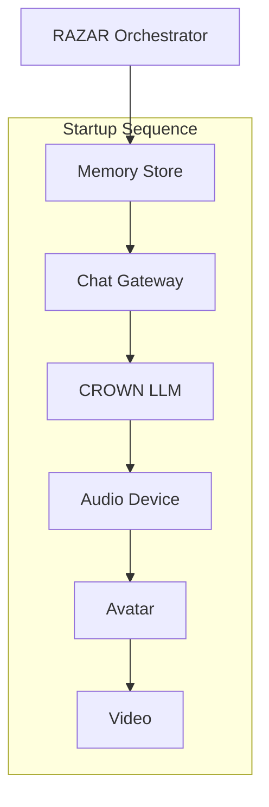

# RAZAR Agent

RAZAR acts as the external startup orchestrator for ABZU. It prepares a
dedicated Python environment, validates prerequisites, and launches chakra
layers in priority order before internal agents take over.

## External Role

RAZAR runs outside the chakra stack, managing its own virtual environment and
invoking services from a clean slate. It performs pre‑flight checks, installs
declared dependencies, and then hands off control once the stack reports
readiness.

## Objectives

- Bootstrap chakra layers according to a defined priority sequence.
- Ensure required packages are present before any service starts.
- Persist progress so restarts resume from the last successful component.

## Invariants

- Startup order is never skipped; each layer waits for the previous one to
  signal readiness.
- The orchestration state file is the only artifact written by RAZAR.
- Failures trigger retries but never bypass health checks.

## Chakra Layer Startup



## Configuration

Components and optional dependencies are defined in `config/razar_config.yaml`:

```yaml
dependencies:
  - pyyaml
components:
  - name: memory_store
    command: "echo 'starting memory_store'"
    priority: 1
  - name: chat_gateway
    command: "echo 'starting chat_gateway'"
    priority: 2
```

`dependencies` lists packages installed into the virtual environment before any
components are launched. Each component is launched in ascending priority. The
manager records the last successful component in a `.state` file so that
subsequent runs resume from that point if a failure occurs.

## Usage

Run the manager directly:

```bash
python -m agents.razar.runtime_manager config/razar_config.yaml
```

The virtual environment is created next to the configuration file in a
`.razar_venv` directory.

Both `start_dev_agents.py` and `launch_servants.sh` invoke the manager before
launching their own services. Override the configuration path by setting the
`RAZAR_CONFIG` environment variable.
