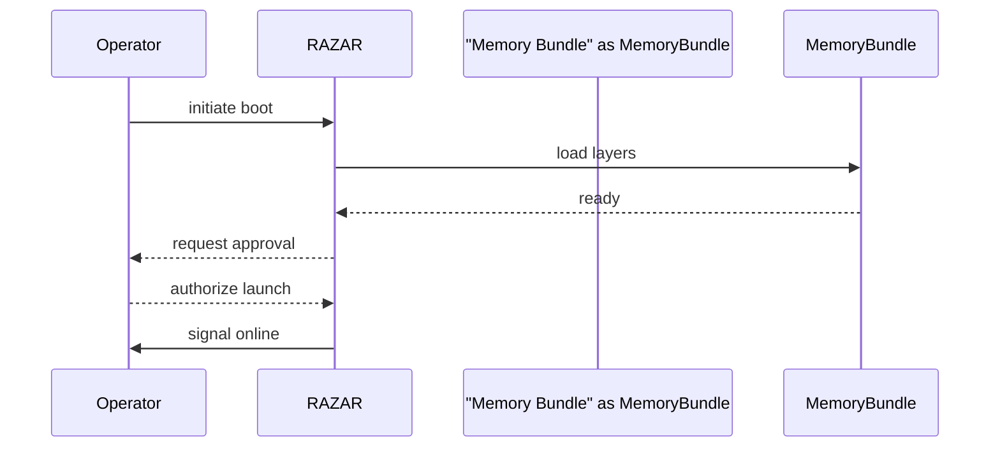
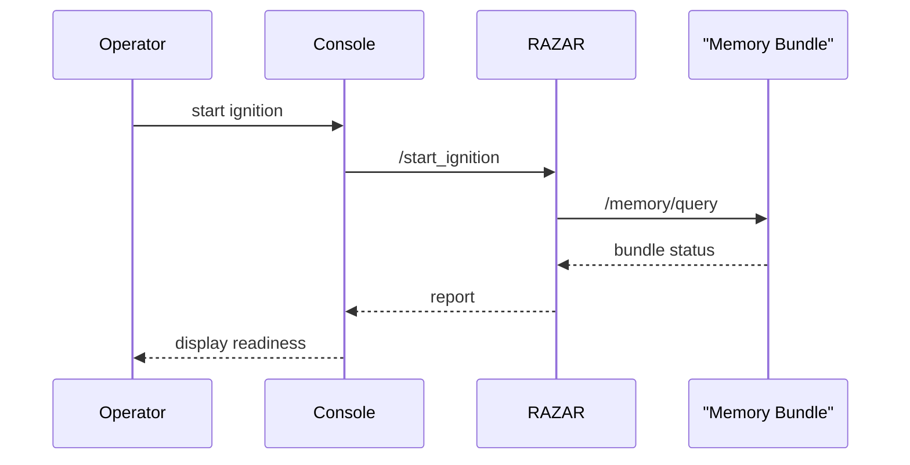
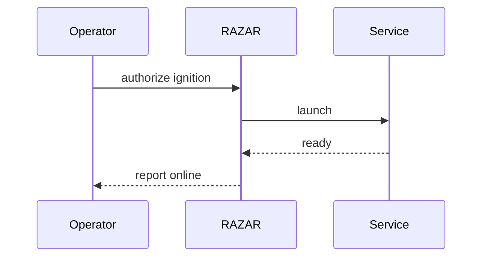
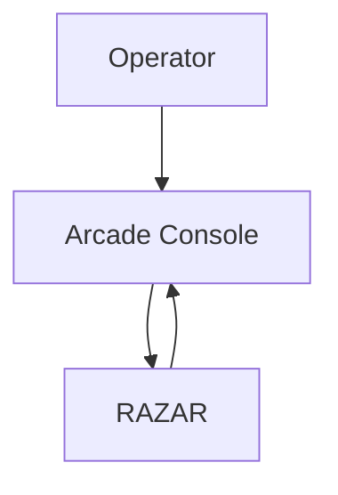
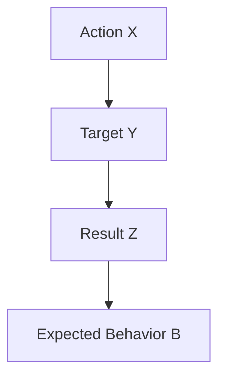

# The Absolute Protocol

**Version:** v1.0.111
**Last updated:** 2025-10-24

## How to Use This Protocol
This document consolidates ABZU's guiding rules. Review it before contributing to follow required workflows and standards. Every contributor must propose operator-facing improvements alongside system enhancements to honor the operator-first principle. See [Contributor Checklist](contributor_checklist.md) for a quick summary of the triple-reading rule, error index updates, and test requirements. Declare a top-level `__version__` for each module, connector, and service. Every pull request and commit message must include a change-justification statement formatted as "I did X on Y to obtain Z, expecting behavior B" per the [Contributor Guide](CONTRIBUTOR_GUIDE.md#commit-message-format). Agent guides must include sections for **Vision**, **Module Overview**, **Workflow**, **Architecture Diagram**, **Requirements**, **Deployment**, **Config Schemas**, **Version History**, **Cross-links**, **Example Runs**, **Persona & Responsibilities**, and **Component & Link**.

Align contributions with the overarching goals in [project_mission_vision.md](project_mission_vision.md) and the servant ethics defined in the [nazarick_manifesto.md](nazarick_manifesto.md).
For implementation references, see the [NEOABZU documentation index](../NEOABZU/docs/index.md).

Before touching any code, read [blueprint_spine.md](blueprint_spine.md) three times to internalize the project's structure and intent.

### Recent Core Milestones

- **Document registry** enumerates canonical files with SHA-256 tracking in [doctrine_index.md](doctrine_index.md).
- **Chakra heartbeat** reports per-layer pulse metrics via [chakra_metrics.md](chakra_metrics.md).
- **Per-agent avatars** stream through the [avatar pipeline](avatar_pipeline.md) to keep sessions visually aligned.
- **Resuscitator flows** coordinate recovery steps; follow the [recovery_playbook.md](recovery_playbook.md).
- **Signal bus** links connectors with publish/subscribe messaging (see [../connectors/signal_bus.py](../connectors/signal_bus.py)).
- **Identity loader** now resides in Rust; Crown boot caches mission and persona summary in `data/identity.json`, registers the embedding in vector/corpus memory for retrieval-aware routing, and refuses to proceed until the GLM echoes `CROWN-IDENTITY-ACK` after doctrine synthesis. Run `python scripts/check_identity_sync.py` after editing the mission, persona, Absolute Protocol, ABZU blueprint, or awakening overview doctrine. If the check flags drift, regenerate the summary with `python scripts/refresh_crown_identity.py --use-stub` before committing.
- **Crown confirms load** exchange documents the acknowledgement handshake; see [crown_manifest.md](crown_manifest.md#crown-confirms-load-handshake) for operator guidance and [system_blueprint.md](system_blueprint.md#origins--awakening) for the architectural view.
- **Identity readiness telemetry** requires the `crown_identity_ready` gauge to hold at `1` after `load_identity` publishes the fingerprint; monitor it via [monitoring/RAZAR.md](monitoring/RAZAR.md) and alert when the value stays `0` for more than five minutes.
- **Memory initialization diagnostics** extend `scripts/bootstrap_memory.py` with Prometheus gauges that validate the 10 k-item audit workflow; dashboards, alerts, and troubleshooting live in [monitoring/RAZAR.md](monitoring/RAZAR.md), while readiness expectations are codified in [memory_layers_GUIDE.md](memory_layers_GUIDE.md#diagnostics-payload).
- **Audio stack enforcement** locks Stage B rehearsals to `AUDIO_BACKEND=pydub` and blocks `start_spiral_os.py` when `python -m audio.check_env --strict` cannot find FFmpeg, pydub or simpleaudio. The Stage B setup script additionally runs `modulation_arrangement.check_daw_availability` so Ardour/Carla gaps log remediation guidance while rehearsal exports fall back to audio-only renders. Operators provision the pinned `audio` extras documented in [audio_stack.md](audio_stack.md) before certifying the ritual.
- **Audio telemetry charter** instruments `modulation_arrangement` and `src/audio/engine` with the shared `src.audio.telemetry`
  collector so Stage B rehearsals log mix, playback, and fallback metrics documented in
  [monitoring/audio_rehearsal_telemetry.md](monitoring/audio_rehearsal_telemetry.md).

### Stage Gate Alignment

> [!IMPORTANT]
> **Codex sandbox dependency limits.** The hosted Codex sandbox lacks many optional system libraries, GPU drivers, audio
> backends, and connector credentials. Treat missing dependencies as **environment-limited** rather than test regressions by
> skipping affected checks with an explicit marker such as
> `pytest.skip("environment-limited: FFmpeg missing in Codex sandbox")` or
> `@pytest.mark.skipif(missing_dep, reason="environment-limited: hardware constraint")`. When Stage A alpha evidence cannot
> execute a step, capture the skipped command output, log bundle path, and skip rationale in the `logs/alpha_gate/<timestamp>/`
> summary JSON so auditors see that the guardrail was acknowledged and deferred. Escalate hardware-only validations (GPU
> renders, DAW-in-the-loop rehearsals, connector drills needing live credentials) to the operator channel documented in
> [PROJECT_STATUS.md](PROJECT_STATUS.md#stage-c-planning-snapshot) and include an "environment-limited" entry in the bundle to
> unblock review while remediation is scheduled.

- **Stage A guardrails validated** – Gate automation, coverage enforcement, and identity drift checks are now locked into the Alpha evidence bundle. Run `scripts/run_alpha_gate.sh` so packaging, health checks, `pytest --cov` exports, and the `python scripts/check_identity_sync.py` report land in `logs/alpha_gate/<timestamp>/`, matching the [Stage A roadmap commitments](roadmap.md#stage-a--alpha-gate-confidence). Maintain ≥ 90 % coverage through the feeds outlined in [system_blueprint.md#stage-gate-evidence](system_blueprint.md#stage-gate-evidence) and record bundle hashes in the [Doctrine Index](doctrine_index.md) to preserve the guardrail audit trail. The latest ledger (see [PROJECT_STATUS.md#stage-a-evidence-register](PROJECT_STATUS.md#stage-a-evidence-register)) confirms a successful 2025-09-20 rehearsal at 92.95 % coverage alongside the earlier 2025-09-21 dry run that logged an import regression while still capturing the audit bundle in `logs/alpha_gate/20250921T220258Z/`. Operators may now trigger the boot telemetry, replay capture, and gate shakeout directly from the console via `operator_api` (`POST /alpha/stage-a1-boot-telemetry`, `/alpha/stage-a2-crown-replays`, `/alpha/stage-a3-gate-shakeout`), which mirror the manual scripts and emit `logs/stage_a/<run_id>/summary.json` plus stdout/stderr for audit stitching.
- **Stage A evidence synchronization** – Cross-link Alpha gate updates across [roadmap.md](roadmap.md#stage-a--alpha-gate-confidence), [PROJECT_STATUS.md](PROJECT_STATUS.md#stage-a-evidence-register), and [`logs/alpha_gate/`](../logs/alpha_gate/) before requesting Stage B reviews so Stage C planning inherits the same bundle IDs and coverage notes.
- **Stage B memory fabric evidence** – Follow the [Stage B load objectives](roadmap.md#stage-b--subsystem-hardening) to demonstrate ≤ 120 ms P95 recalls on a 10 k-item dataset, and package ingestion audits plus latency dashboards into the memory bundle log set catalogued at [system_blueprint.md#stage-gate-evidence](system_blueprint.md#stage-gate-evidence). Update the relevant Doctrine Index rows whenever the dataset snapshot, replay scripts, or verification tooling shifts.
- **Stage B sonic rehearsal evidence** – Enforce the pinned audio stack and DAW preflight rules described in [system_blueprint.md#audio-device](system_blueprint.md#audio-device) while completing two clean rehearsal exports with zero dropouts. Store telemetry, preset manifests, and fallbacks per the Stage B sonic trace expectations in [system_blueprint.md#stage-gate-evidence](system_blueprint.md#stage-gate-evidence) and refresh Doctrine Index references when presets or guardrails change. Current rehearsal packets continue to flag missing FFmpeg, simpleaudio, CLAP, and RAVE dependencies (see [PROJECT_STATUS.md#stage-b-evidence](PROJECT_STATUS.md#stage-b-evidence)), so remediation remains a tracked risk for Stage C demo preparation.
- **Stage B connector rotation evidence** – Exercise the MCP rehearsal adapters so 48-hour rotation drills, smoke tests, and heartbeat payloads align with the [Stage B connector target](roadmap.md#stage-b--subsystem-hardening). Synchronize the [Model Context Protocol migration blueprint](system_blueprint.md#model-context-protocol-migration) with adapter logs and archive the drill manifests called out in [system_blueprint.md#stage-gate-evidence](system_blueprint.md#stage-gate-evidence) to prove connector readiness before promotion. Reference the refreshed rotation windows `20250925T095833Z-PT48H`, `20250925T094604Z-PT48H`, and `20251024T174210Z-PT48H` (alongside the earlier `20250922T101554Z-PT48H`) documented in [PROJECT_STATUS.md#stage-b-evidence](PROJECT_STATUS.md#stage-b-evidence) and [roadmap.md](roadmap.md#stage-b--subsystem-hardening) while Stage C owners finalize MCP adoption.【F:docs/PROJECT_STATUS.md†L82-L107】【F:docs/roadmap.md†L70-L74】
- **Stage C continuity evidence** – Trigger `/alpha/stage-c1-exit-checklist`, `/alpha/stage-c2-demo-storyline`, `/alpha/stage-c3-readiness-sync`, and `/alpha/stage-c4-operator-mcp-drill` from the dashboard so exit checklist validation, scripted demo telemetry, readiness snapshot merges, and MCP drills land in `logs/stage_c/<run_id>/summary.json` with stdout/stderr. Mirror those runs across the roadmap and doctrine ledgers so Stage C reviews inherit the same evidence bundle.
- **Stage B risk register** – Keep the Stage B rehearsal health automation activation work and audio dependency remediation items surfaced in [PROJECT_STATUS.md#stage-c-planning-snapshot](PROJECT_STATUS.md#stage-c-planning-snapshot) synchronized with the roadmap so Stage C readiness reviews inherit a current risk ledger.
- **Future gRPC adoption gate** – Expand gRPC endpoints following the NeoABZU vector service handshake as the canonical reference. Trigger the rollout after Stage B evidence bundles in [roadmap.md](roadmap.md#stage-b--subsystem-hardening) close out, then publish mixed REST/gRPC rehearsal traces, parity validations, and operator sign-offs to the [stage gate ledger](system_blueprint.md#stage-gate-evidence) so Doctrine reviewers can trace the transition.

### Rust Migration Rules

Components ported from Python to Rust must:

- Follow the [documentation protocol](documentation_protocol.md) to keep canonical references synchronized.
- Update [doctrine_index.md](doctrine_index.md) with the component's checksum and note its place in the APSU sequence.
- Document where the component sits in the APSU sequence and link to relevant diagrams such as [blueprint_spine.md](blueprint_spine.md) or [system_blueprint.md](system_blueprint.md#razar–crown–kimi-cho-migration).

### Rust Contribution Doctrine

Rust crates and services must stay aligned with the canon codified in [NEOABZU/docs/rust_doctrine.md](../NEOABZU/docs/rust_doctrine.md). Use this summary as a quick-reference when staging Neo-ABZU changes:

- **Style & structure.** Follow the naming and module layout rules in the Rust doctrine while mirroring the cross-language conventions documented in [CODE_STYLE.md](../CODE_STYLE.md). Keep public APIs in `lib.rs`, reserve binaries for `main.rs`, and share common utilities through dedicated core crates.
- **Testing discipline.** Run `cargo test` for every workspace crate before submitting changes. Tests must remain deterministic, offline, and mapped to the coverage guardrails described in [Coverage & Testing Requirements](#coverage--testing-requirements).
- **Tooling & linting.** Format code with `cargo fmt --check` and lint with `cargo clippy` via pre-commit or local execution, resolving issues instead of suppressing them so doctrine standards remain intact.
- **Blueprint synchronization.** Document every crate update in [system_blueprint.md](system_blueprint.md#rust-migration) and [blueprint_spine.md](blueprint_spine.md#rust-workspace-crates) so architectural callouts, diagrams, and the narrative spine stay aligned with the shipped binaries.
- **Registry updates.** Keep `component_index.json` and [doctrine_index.md](doctrine_index.md) synchronized with crate versions and checksums so tooling and onboarding audits inherit the latest Rust metadata.

Rust updates that touch operator-facing workflows must also refresh relevant entries in [doctrine_index.md](doctrine_index.md) so the checksum registry remains accurate.

### Alpha v0.1 Escalation Doctrine

Alpha v0.1 establishes the canonical remote delegation ladder for the Crown and its servant agents. The escalation contract lives in [system_blueprint.md](system_blueprint.md#configurable-crown-escalation-chain) with configuration specifics in [system_blueprint.md](system_blueprint.md#remote-agent-failover-configuration) and the mission narrative overlay in [blueprint_spine.md](blueprint_spine.md#razar-delegation-cascade). Contributors must keep those sections synchronized with any change to `config/razar_ai_agents.json`, the escalation thresholds, or telemetry exports.

- **Chain integrity.** Preserve the default **Crown → Kimi-cho → K2 Coder → Air Star → rStar** sequence unless the operator council signs off on an updated roster. Any roster change requires matching edits to the blueprint anchors above, synchronization of the `KIMICHO_*`, `KIMI_K2_*`, `AIRSTAR_*`, and `RSTAR_*` settings, and updates to the [RAZAR Escalation Runbook](runbooks/razar_escalation.md) so responders inherit the approved ladder.
- **Threshold governance.** Adjustments to `RAZAR_ESCALATION_WARNING_THRESHOLD`, `RAZAR_RSTAR_THRESHOLD`, or new gating variables must be documented alongside the configuration diffs and annotated in [system_blueprint.md](system_blueprint.md#configurable-crown-escalation-chain) so operators can trace why escalations accelerate or pause.
- **Telemetry continuity.** Each escalation hop must stream context into `logs/razar_ai_invocations.json` and the mission registry. When tweaking payload formats or log locations, update the data flow descriptions in [blueprint_spine.md](blueprint_spine.md#razar-delegation-cascade) and the monitoring playbooks referenced there.
- **Doctrine versioning.** Bump the Alpha tag (v0.1, v0.2, etc.) inside this section whenever the chain structure, thresholds, or audit hooks change. Include a matching note in [doctrine_index.md](doctrine_index.md) so the checksum registry signals the doctrine shift to reviewers and onboarding automation.

### Architecture Change Doctrine

Commits that alter architecture—whether Python services, Rust crates, or orchestration manifests—must land with synchronized documentation updates. Always:

- Revise [system_blueprint.md](system_blueprint.md), [blueprint_spine.md](blueprint_spine.md), and [NEOABZU_spine.md](NEOABZU_spine.md) so diagrams and mission narratives track the new structure.
- Record vector memory fallback adjustments in the blueprint set and refresh [scaling/vector_db_scaling_checklist.md](scaling/vector_db_scaling_checklist.md) whenever retrieval latency contracts or caching strategies change.
- Document connector capability payload updates in [connectors/mcp_capability_payload.md](connectors/mcp_capability_payload.md) and mirror handshake logging expectations in the blueprint set whenever MCP gateways change.
- When Crown identity handling changes, document the new `CROWN_IDENTITY_FINGERPRINT` semantics anywhere handshake transcripts or
  audit procedures reference `data/identity.json`, including runbooks and awakening guides.
- Synchronize [SECURITY.md](SECURITY.md#remote-agent-credentials) when RAZAR
  remote invocation rules change, including updates to the `KIMI2_API_KEY`,
  `AIRSTAR_API_KEY`, and `RSTAR_API_KEY` policies.
- Record operator governance shifts, escalation paths, or safety rules inside this protocol so contributors inherit the updated canon.
- Regenerate the curated [index.md](index.md) and auto-generated [INDEX.md](INDEX.md) to surface new sections for reviewers.
- Run the documentation pre-commit suite (`pre-commit run --files <changed docs>`) to trigger `doc-indexer`, doctrine audits, and blueprint reference checks before pushing.
- Confirm CI passes [`verify_blueprint_refs.py`](../scripts/verify_blueprint_refs.py) to prove the system blueprint calls out every workspace crate.

### Doctrine Reference Requirements

All architecture or protocol documents must include a **Doctrine References** section that links back to canonical doctrine paths. This ensures new material stays traceable to its source rules.

### Doctrine References
- [doctrine_index.md](doctrine_index.md) – checksum registry for foundational doctrine, including this protocol.
- [doctrine_index.md#genesisgenesis_md](doctrine_index.md#genesisgenesis_md) – GENESIS/GENESIS_.md
- [doctrine_index.md#genesisfirst_foundation_md](doctrine_index.md#genesisfirst_foundation_md) – GENESIS/FIRST_FOUNDATION_.md
- [doctrine_index.md#genesislaws_of_existence_md](doctrine_index.md#genesislaws_of_existence_md) – GENESIS/LAWS_OF_EXISTENCE_.md
- [doctrine_index.md#genesislaws_recursion_md](doctrine_index.md#genesislaws_recursion_md) – GENESIS/LAWS_RECURSION_.md
- [doctrine_index.md#genesisspiral_laws_md](doctrine_index.md#genesisspiral_laws_md) – GENESIS/SPIRAL_LAWS_.md
- [doctrine_index.md#genesisinanna_ai_core_trainingmd](doctrine_index.md#genesisinanna_ai_core_trainingmd) – GENESIS/INANNA_AI_CORE_TRAINING.md
- [doctrine_index.md#genesisinanna_ai_sacred_protocolmd](doctrine_index.md#genesisinanna_ai_sacred_protocolmd) – GENESIS/INANNA_AI_SACRED_PROTOCOL.md
- [doctrine_index.md#genesislaws_quantum_mage_md](doctrine_index.md#genesislaws_quantum_mage_md) – GENESIS/LAWS_QUANTUM_MAGE_.md
- [doctrine_index.md#codexactivationsoath_of_the_vault_md](doctrine_index.md#codexactivationsoath_of_the_vault_md) – CODEX/ACTIVATIONS/OATH_OF_THE_VAULT_.md
- [doctrine_index.md#codexactivationsoath-of-the-vault-1de45dfc251d80c9a86fc67dee2f964amd](doctrine_index.md#codexactivationsoath-of-the-vault-1de45dfc251d80c9a86fc67dee2f964amd) – CODEX/ACTIVATIONS/OATH OF THE VAULT 1de45dfc251d80c9a86fc67dee2f964a.md
- [doctrine_index.md#inanna_aimarrow-code-20545dfc251d80128395ffb5bc7725eemd](doctrine_index.md#inanna_aimarrow-code-20545dfc251d80128395ffb5bc7725eemd) – INANNA_AI/MARROW CODE 20545dfc251d80128395ffb5bc7725ee.md
- [doctrine_index.md#inanna_aiinanna-song-20545dfc251d8065a32cec673272f292md](doctrine_index.md#inanna_aiinanna-song-20545dfc251d8065a32cec673272f292md) – INANNA_AI/INANNA SONG 20545dfc251d8065a32cec673272f292.md
- [doctrine_index.md#inanna_aichapter-i-1b445dfc251d802e860af64f2bf28729md](doctrine_index.md#inanna_aichapter-i-1b445dfc251d802e860af64f2bf28729md) – INANNA_AI/Chapter I 1b445dfc251d802e860af64f2bf28729.md
- [doctrine_index.md#inanna_aimember-manual-1b345dfc251d8004a05cfc234ed35c59md](doctrine_index.md#inanna_aimember-manual-1b345dfc251d8004a05cfc234ed35c59md) – INANNA_AI/Member Manual 1b345dfc251d8004a05cfc234ed35c59.md
- [doctrine_index.md#inanna_aithe-foundation-1a645dfc251d80e28545f4a09a6345ffmd](doctrine_index.md#inanna_aithe-foundation-1a645dfc251d80e28545f4a09a6345ffmd) – INANNA_AI/The Foundation 1a645dfc251d80e28545f4a09a6345ff.md
- [NEOABZU/docs/rust_doctrine.md](../NEOABZU/docs/rust_doctrine.md) – Rust naming, testing, and tooling canon mirrored here.
- [CODE_STYLE.md](../CODE_STYLE.md) – repository-wide formatting rules reinforced by the Rust doctrine.

**Reference Pattern Example**

```markdown
### Doctrine References
- [system_blueprint.md#operator-razar-crown-flow](system_blueprint.md#operator-razar-crown-flow) – illustrates the path for operator directives.
```

### Environment Preparation
Set up the local environment before running tools or tests:

1. Copy `secrets.env.template` to `secrets.env` and provide values for `HF_TOKEN`, `GLM_API_URL`, and `GLM_API_KEY`.
2. Run `scripts/check_requirements.sh` to confirm required binaries, the Python 3.11+ runtime, and necessary Python modules are present.

### Operator Interface
Operators supervise ignition and runtime behaviour. Consoles must meet the
retro requirements in [operator_console.md](operator_console.md) and the
[Arcade Theme Style Guide](style_guides/arcade_theme.md). They issue boot
commands, review handshake logs, and approve escalations before services
become operator-facing.

**Responsibilities**

- Initiate boot and authorize service launches.
- Monitor audit logs and memory summaries for anomalies.
- Escalate to recovery routines when safeguards trigger.

**Security Notes**

- All console actions require authenticated tokens and are written to
  append-only logs.
- Rotate credentials after each mission brief and restrict console access to
  trusted networks.



#### Arcade Operator Interface
The arcade console offers a retro portal for mission control.

**Responsibilities**

- Surface boot status and chakra readings on a single dashboard.
- Relay operator commands with latency indicators and retry cues.
- Archive session transcripts alongside selected themes.

**Theming Rules**

- Embrace neon vector aesthetics reminiscent of 1980s arcades.
- Maintain readable contrast and avoid flashing sequences over 10 Hz.
- Align chakra events with their canonical color palette.

#### Arcade Memory Interface
The console can inspect memory readiness during ignition via `/memory/query`.



## Nazarick Stewardship

Nazarick agents steward alignment between operators, Crown, and RAZAR. Review the [blueprint overview](blueprint_spine.md#nazarick-integration-with-crown-and-razar) and [system blueprint](system_blueprint.md#nazarick-integration-with-crown-and-razar) diagrams to understand these flows. New agents and constructed worlds must honor the [Nazarick Manifesto](nazarick_manifesto.md) and stay aligned with the [project mission](project_mission_vision.md).

### Nazarick World
The broader Nazarick cosmology is introduced in the [Nazarick World Guide](nazarick_world_guide.md). For ethical grounding within this realm, consult [Nazarick True Ethics](../nazarick/agents/Nazarick_true_ethics.md).

## Repository Blueprint
ABZU adheres to a consistent top-level directory layout:

- `src/` – Core application source code
- `tests/` – Automated test suites and fixtures
- `docs/` – Documentation and guides
- `data/` – Sample datasets and data artifacts
- `scripts/` – Utility scripts and command-line tools
- `deployment/` – Deployment configurations and manifests
- `tools/` – Developer tools and automation helpers
- `notebooks/` – Experimental notebooks and prototypes

Origin documents such as the [Marrow Code](../INANNA_AI/MARROW_CODE.md) and [Inanna Song](../INANNA_AI/INANNA_SONG.md) must remain within the `INANNA_AI` corpus and be reindexed whenever updated to keep this blueprint accurate.

Consult the [Code Index](code_index.md) for an overview of modules, classes, and functions within the repository.

See [docs/REPOSITORY_STRUCTURE.md](REPOSITORY_STRUCTURE.md) for detailed guidance on the repository layout.

### Repository Blueprint
The overarching narrative for reconstructing the repository lives in [ABZU_blueprint.md](ABZU_blueprint.md).

### Unified Memory Bundle

`MemoryBundle` unifies the Cortex, Emotional, Mental, Spiritual, and Narrative layers. During startup `broadcast_layer_event("layer_init")` announces readiness over the `memory` bus, while `query_memory` fans out across all layers and aggregates responses into a single payload.

```mermaid
{{#include figures/memory_bundle.mmd}}
```

The Mermaid source lives at [figures/memory_bundle.mmd](figures/memory_bundle.mmd). See [memory_layers_GUIDE.md](memory_layers_GUIDE.md) for implementation details. Any change to a memory layer must update this diagram and all related visuals across the repository to keep documentation synchronized.

#### `layer_init` Event

`MemoryBundle.initialize()` emits a single `broadcast_layer_event("layer_init")` so all five layers report readiness in parallel. Services wait on this broadcast before issuing `query_memory` requests, guaranteeing that startup completes before any memory queries occur.

#### Initialization and Query Aggregation

`broadcast_layer_event("layer_init")` primes every layer before the `query_memory` façade fans out reads and merges the replies into a unified recall.

```mermaid
{{#include figures/layer_init_query_flow.mmd}}
```

The Mermaid source lives at [figures/layer_init_query_flow.mmd](figures/layer_init_query_flow.mmd) and is shared across the repository to keep bundle diagrams aligned.

### Dynamic Ignition

RAZAR evaluates ignition plans at runtime so services launch only when the operator authorizes them, keeping startup lightweight and responsive.



### Operator UI Flow

The arcade console mirrors mission state and relays commands.




## Repository Layout Protocol
Repositories must keep these directories at the root:

- `src/`
- `docs/`
- `tests/`
- `data/`

## Version Synchronization
Every module, connector, and service must expose a top-level `__version__` string that matches the entry in `component_index.json`. Update both the source and the index together and run `scripts/verify_versions.py` to confirm alignment; the `verify-versions` pre-commit hook blocks mismatches. Experimental components still require `__version__` and should be marked `experimental` in `component_index.json`. Documentation-only changes may leave versions untouched but must still run `scripts/verify_versions.py` to validate alignment.

## Component Status Protocol
`component_index.json` entries must include:

- `id`
- `type`
- `path`
- `version`
- `status`
- `issues`
- `chakra`

Statuses define lifecycle expectations:

- `active` – production-ready and supported
- `deprecated` – still available but replaced and slated for removal
- `experimental` – unstable, subject to rapid change
- `broken` – failing or incomplete; exclude from releases until fixed

## Change-Justification Field
Pull requests must fill out the **Change justification** field in the template using the format "I did X on Y to obtain Z, expecting behavior B." This statement appears in the PR description and mirrors the commit message. Reverts should reference the original commit and rationale.

### Change Justification
Use the following statement for all modifications:

```
I did X on Y to obtain Z, expecting behavior B.
```



## Key-Document Summary Verification
During onboarding, contributors record purpose, scope, key rules, and an actionable insight summary for every entry in `onboarding_confirm.yml`. Run `scripts/verify_doc_hashes.py` to ensure each summary matches the current version of the document.

## Core Pull Request Checklist
Confirm these items before submitting a pull request:

 - [ ] Environment prepared per [Environment Preparation](#environment-preparation)
 - [ ] Key-document summaries verified with `scripts/verify_doc_hashes.py`
 - [ ] [blueprint_spine.md](blueprint_spine.md) read and acknowledged
 - [ ] [operator_nazarick_bridge.md](operator_nazarick_bridge.md) reviewed for agent-channel workflow
 - [ ] Version bumps applied and synchronized in `component_index.json`
 - [ ] If any component or connector changes, rebuild `component_index.json` and confirm registry updates
 - [ ] Connector registry updated for added or modified connectors ([docs/connectors/CONNECTOR_INDEX.md](connectors/CONNECTOR_INDEX.md))
 - [ ] Connector entries verified — each connector lists version, endpoints, auth method, status, and doc links
 - [ ] Obsolete or failing connectors flagged as `deprecated` or `broken` and scheduled for maintenance.
 - [ ] Change-justification statement included ("I did X on Y to obtain Z, expecting behavior B")

## Coverage & Testing Requirements
Each milestone must uphold repository coverage thresholds of **at least 90%**. Run `pytest --cov`; CI parses the results and fails when any active component drops below the target. Every new feature and bug fix must include tests that demonstrate the intended behavior and guard against regression. Audit failing tests and record them in [docs/testing/failure_inventory.md](testing/failure_inventory.md) before merging. Placeholder markers such as `TODO` or `FIXME` are forbidden—the `scan-todo-fixme` pre-commit hook (`scripts/scan_todo_fixme.py`) blocks commits containing them. See [The Absolute Pytest](the_absolute_pytest.md) for observability and testing guidance.

### Test Failure Audit
Log each failing test with date, category, and remediation steps in [docs/testing/failure_inventory.md](testing/failure_inventory.md). Update entries once resolved and rerun affected tests to confirm fixes.

## Error Logging Protocol
Components must surface issues rather than fail silently:

- Log recoverable problems at the `warning` level and continue when safe.
- Log unrecoverable errors at the `error` level and raise or propagate the exception.
- Silent failure is prohibited unless explicitly documented and justified.

## Contributor Awareness Checklist
Before opening a pull request, confirm each item:

- [ ] Key documents reviewed:
  - [AGENTS.md](../AGENTS.md)
  - [Documentation Protocol](documentation_protocol.md)
  - [System Blueprint](system_blueprint.md)
  - [Project Mission & Vision](project_mission_vision.md) – confirm alignment before proposing major changes
  - [Nazarick Manifesto](nazarick_manifesto.md) – uphold servant ethics across agents
  - [Key Documents](KEY_DOCUMENTS.md) – verify all entries reviewed within the last quarter
  - [Component Index](component_index.md) – inventory of modules and services with versions and chakra layers
  - [Connector Index](connectors/CONNECTOR_INDEX.md) – canonical connector registry; confirm purpose, version, endpoints, auth method, linked agents, status, operator interface flows, and code/doc links are current
  - [Dependency Index](dependency_index.md) – approved runtimes and libraries with minimum versions
  - [Test Index](test_index.md) – catalog of test modules and coverage targets
  - [Protocol Compliance](protocol_compliance.md) – dashboard of component alignment
- [ ] Commit and PR descriptions follow [Contributor Guide](CONTRIBUTOR_GUIDE.md#commit-message-format) and include a change-justification
- [ ] Onboarding quiz answers included in first pull request (`onboarding_quiz.yml`)
- [ ] Agent docs include sections for **Vision**, **Module Overview**, **Workflow**, **Architecture Diagram**, **Requirements**, **Deployment**, **Config Schemas**, **Version History**, **Cross-links**, **Example Runs**, **Persona & Responsibilities**, and **Component & Link**
- [ ] Crown availability verified – `CROWN_WS_URL` is set and the Crown server responds to the handshake
- [ ] Touched connectors, modules, and key documents re-validated after fixes
- [ ] All modules, connectors, and services expose `__version__` that matches `component_index.json`; the `verify-versions` pre-commit hook enforces alignment, so bump both for user-facing changes
- [ ] Relevant index entries updated in [component_index.md](component_index.md), [CONNECTOR_INDEX.md](connectors/CONNECTOR_INDEX.md), [dependency_index.md](dependency_index.md), and [test_index.md](test_index.md)
- [ ] `ignition_stage` set for each component in `component_index.json` and reflected in [Ignition Map](ignition_map.md); see [Ignition](Ignition.md) for boot priorities
- [ ] Milestones touching ignition components run `scripts/validate_ignition.py` and `pytest --cov`; see [ignition_flow.md](ignition_flow.md)
- [ ] Ignition step changes reflected in [bana_engine.md](bana_engine.md) and Nazarick docs such as [nazarick_narrative_system.md](nazarick_narrative_system.md)
- [ ] Each `component_index.json` entry declares a lifecycle `status` (`active`, `deprecated`, or `experimental`) and links to an `adr` describing major changes
 - [ ] Tests follow [The Absolute Pytest](the_absolute_pytest.md); run `pytest --cov` and ensure ≥90% coverage
- [ ] No `TODO` or `FIXME` markers in committed code (`pre-commit` `scan-todo-fixme` hook)
- [ ] "Test Plan" issue filed per [Test Planning Guide](onboarding/test_planning.md) outlining scope, chakra, and coverage goals
- [ ] Connector registry updated:
  - implementations expose `__version__` matching `component_index.json`, implement `start_call`, and `close_peers`
  - [CONNECTOR_INDEX.md](connectors/CONNECTOR_INDEX.md) entry updated
    - [ ] If a connector is added or modified, update [docs/connectors/CONNECTOR_INDEX.md](connectors/CONNECTOR_INDEX.md) with purpose, version, endpoints, auth method, linked agents, operator interface flows, status, and code/doc links
- [ ] Connector health check passes – run `python scripts/health_check_connectors.py` and ensure all connectors report healthy
- [ ] API changes documented in [api_reference.md](api_reference.md) and connector docs
- [ ] Narrative feature compliance:
  - [ ] `__version__` declared in all narrative modules
  - [ ] datasets registered and hashed in [data_manifest.md](data_manifest.md)
  - [ ] connectors registered in [connectors/CONNECTOR_INDEX.md](connectors/CONNECTOR_INDEX.md)
  - [ ] pull requests affecting narrative include a change-justification statement
- [ ] Release notes updated in `CHANGELOG.md` and relevant component changelog(s)
- [ ] `onboarding_confirm.yml` records purpose, scope, key rules, and an actionable insight summary for each key document it tracks, per [KEY_DOCUMENTS.md](KEY_DOCUMENTS.md)
- [ ] `scripts/verify_doc_hashes.py` confirms `onboarding_confirm.yml` hashes match current files
- [ ] `docs/INDEX.md` regenerated if docs changed
- [ ] Each merged task registered in `logs/task_registry.jsonl`; when the sixth entry lands, run `scripts/generate_protocol_task.py` to open the refinement task and fold its insights into `docs/The_Absolute_Protocol.md` and related checklists, bumping the version and refreshing `docs/INDEX.md`
- [ ] ADR created for any change to `The_Absolute_Protocol.md` describing motivation and alternatives
- [ ] ADR referenced in `docs/INDEX.md` and relevant `component_index.json` entries
- [ ] Commits implementing ADR decisions prefixed with `ADR-XXXX:`
- [ ] Markdown links validated with `scripts/validate_links.py`
- [ ] `DASHBOARD.md` metrics updated for each release cycle
- [ ] `component_maturity.md` scoreboard updated
- [ ] New operator channels documented in [Operator Protocol](operator_protocol.md)
- [ ] Confirm no binary files are introduced
- [ ] All diagrams are authored in Mermaid; binary image files (PNG, JPG, etc.) are forbidden
- [ ] Handshake-triggered model launches documented in agent guides and state logs
- [ ] Mission briefs logged for every Crown handshake in `logs/mission_briefs/`
- [ ] `crown_handshake` results persisted in state files
- [ ] Biosignal sample CSVs in `data/biosignals/` remain anonymized and align with
      the documented ingestion schema

## Protocol Hierarchy
The Absolute Protocol governs all other guides. Review subordinate protocols as needed:

- **The Absolute Protocol**
  - [AGENTS.md](../AGENTS.md) – repository-wide agent instructions.
  - [Documentation Protocol](documentation_protocol.md) – workflow for updating docs.
  - [Code Style Guide](../CODE_STYLE.md) – code formatting standards.
  - [Pull Request Template](../.github/pull_request_template.md) – required PR structure.
  - [Co-creation Framework](co_creation_framework.md) – feedback loops between developers and INANNA_AI.
  - [AI Ethics Framework](ai_ethics_framework.md) – transparency, fairness, and data-handling principles.
  - [Documentation Index](index.md) – high-level entry point.
  - [Generated Index](INDEX.md) – auto-generated list of all docs.
  - [Protocol Compliance](protocol_compliance.md) – component alignment dashboard.
  - [The Absolute Pytest](the_absolute_pytest.md) – test instrumentation and observability guidance.
  - [Absolute Milestones](ABSOLUTE_MILESTONES.md) – summary of past and upcoming milestones.
  - [Issue & Feature Templates](../.github/ISSUE_TEMPLATE/) – templates for new issues and features.

## Consultation Order
When contributing, consult resources in this order:

1. **The Absolute Protocol** – canonical repository rules.
2. **[Contributor Handbook](CONTRIBUTOR_HANDBOOK.md)** – setup and workflows.
3. **[AGENTS.md](../AGENTS.md)** – directory-specific instructions.
4. **Feature or Issue Specs** – task-specific requirements.

| Protocol | Maintainer | Update Cadence |
| --- | --- | --- |
| The Absolute Protocol | Core Maintainers | Monthly |
| Contributor Handbook | Documentation Team | Quarterly |
| AGENTS.md | Repository Maintainers | As needed |
| Feature/Issue Specs | Feature Owners | Per release |

## Version & Release Protocol

- Every module, connector, and service must define a top-level `__version__` string.
- Any user-facing change requires a semantic version bump following MAJOR.MINOR.PATCH.
- Update `component_index.json` with the new version and run `scripts/verify_versions.py` to ensure each source `__version__` matches the index.
- Record the change in the appropriate changelog.

## Release Management Protocol

- Add an entry to the root `CHANGELOG.md` for every user-facing change.
- Mirror those entries in component changelogs such as `CHANGELOG_vector_memory.md` when a specific subsystem is affected.
- Version numbers follow [Semantic Versioning](https://semver.org/):
  - **MAJOR** increments introduce incompatible API changes.
  - **MINOR** increments add functionality in a backward‑compatible manner.
  - **PATCH** increments deliver backward‑compatible bug fixes.
- Within a major version, minor and patch releases guarantee backward compatibility.

## Testing Requirements

- Run `pytest tests/narrative_engine/test_biosignal_pipeline.py tests/narrative_engine/test_biosignal_transformation.py`
  to validate biosignal ingestion and transformation using datasets in
  `data/biosignals/`.
- Execute `pytest` (or an equivalent test suite) for all modules you modify and
  report the resulting coverage.
- For milestones touching ignition components, run `scripts/validate_ignition.py` and `pytest --cov`; see [ignition_flow.md](ignition_flow.md).

## Test Coverage Protocol

Code coverage must remain **at or above 90%**. Generate and report coverage using:

```bash
pytest --cov
coverage report
coverage-badge -o coverage.svg
```

The `coverage.svg` badge reflects current totals and should be referenced in
status documents.

## Pytest Protocol

- Achieve **over 90%** coverage when running `pytest --cov`.
- Organize tests within chakra-aligned directories and include matching metadata fields.
- Record updated coverage metrics in `component_index.json` whenever tests change.

## Testing Workflow

1. Execute `pytest --cov` locally.
2. Run `python scripts/export_coverage.py` to update metrics and fail if any active component drops below **90%** coverage.
3. Ensure `pre-commit run --files <changed_files>` passes; the `scan-todo-fixme` hook rejects `TODO` and `FIXME` markers.

## Documentation Standards

### Agent Documentation Checklist
Each agent document must cover:
- Vision
- Module Overview
- Functional Workflows
- Architecture diagram
- Requirements
- Deployment workflow with environment setup, launch sequence, rollback strategy, and cross-links to subsystem-specific deployment sections (e.g., RAZAR Agent, Albedo Layer, Nazarick agents)
- Configuration schemas
- Version history
- Cross-links
- Hyperlinks to relevant source files and companion documents
- At least one end-to-end run with sample logs or outputs covering normal operation and one failure/recovery case where applicable

Include hyperlinks to implementation files and related guides. Use a table pattern
similar to the RAZAR component links to summarize relationships:

| Source Module | Companion Docs |
| --- | --- |
| [agents/guardian.py](../agents/guardian.py) | [nazarick_agents.md](nazarick_agents.md), [system_blueprint.md](system_blueprint.md) |

### Nazarick Agent Update Requirements
For any agent addition or change:
- Update `agent_registry.json` and `docs/nazarick_agents.md`.
- Log launch outcomes to `logs/nazarick_startup.json`.
- Confirm operator-facing displays reflect new agents.

### Diagram Requirements

All diagrams must include a brief textual description and be expressed as Mermaid code blocks. Binary image formats (PNG, JPG, etc.) are prohibited.

#### Mermaid Diagram Workflow

- Write narrative explanation first.
- Represent visuals with Mermaid code blocks.
- Run `pre-commit run --files <changed_docs>` to trigger the `block-binaries` hook.
- Convert existing binary diagrams to Mermaid before committing.

### Configuration File Documentation

Any new configuration file must be accompanied by documentation that outlines its schema and includes a minimal working example. Review existing patterns such as [boot_config.json](RAZAR_AGENT.md#boot_configjson), [primordials_config.yaml](primordials_service.md#primordials_configyaml), and [operator_api.yaml](operator_protocol.md#operator_apiyaml). Log formats in the [logging guidelines](logging_guidelines.md) alongside [razar_state.json](RAZAR_AGENT.md#logsrazar_statejson) ([schema](schemas/razar_state.schema.json)) serve as additional references. Include example snippets such as:

```json
// boot_config.json
{
  "crown_ws_url": "wss://crown.example/ws"
}
```

```yaml
# primordials_config.yaml
primordials:
  - id: crown
    path: /opt/crown.bin
```

```yaml
# operator_api.yaml
paths:
  /operator/command:
    post: {}
```

### Module Versioning

Every source module, connector, and service must expose a `__version__` field (or equivalent) and increment it for any user‑facing change. Run `scripts/verify_versions.py` to confirm component versions match `component_index.json`.
The `verify-versions` pre-commit hook scans staged Python files and fails if this attribute is missing or out of sync with the index.

### Connector Guidelines

Connectors bridge the language engine to external communication layers. The canonical list of available connectors lives in [CONNECTOR_INDEX.md](connectors/CONNECTOR_INDEX.md). Follow the architecture in [Video Engine and Connector Design](design.md) when implementing new back ends. Each connector must:

- implement `start_call(path: str) -> None` to initiate a stream
- provide `close_peers() -> Awaitable[None]` to release resources
- expose a `__version__` field that matches `component_index.json` and bump it on interface changes
- document all externally exposed endpoints and authentication methods
- list linked agents and supported chat, file, image, audio, and video flows
- update [CONNECTOR_INDEX.md](connectors/CONNECTOR_INDEX.md) whenever the connector changes
  (the `check-connector-index` pre-commit hook fails if a touched connector lacks an entry)
- cross-link implementation modules such as [`connectors/webrtc_connector.py`](../connectors/webrtc_connector.py) and the package [`connectors`](../connectors/__init__.py)
- Stage B rehearsal connectors ([operator_api_stage_b.py](../connectors/operator_api_stage_b.py),
  [operator_upload_stage_b.py](../connectors/operator_upload_stage_b.py), and
  [crown_handshake_stage_b.py](../connectors/crown_handshake_stage_b.py)) must
  reuse the shared helper so rehearsal handshakes mirror the production
  adapters and continue logging credential rotations.

### Connector Registry

Track all connectors in [`docs/connectors/CONNECTOR_INDEX.md`](connectors/CONNECTOR_INDEX.md). Each entry must list the connector name, `__version__`, purpose, endpoints, authentication method, linked agents, operator interface flows, status, and links to documentation and source code. See [Connector Overview](connectors/README.md) for shared design patterns and maintenance rules. Both documents are listed in [KEY_DOCUMENTS.md](KEY_DOCUMENTS.md). Update this registry whenever a connector is added, removed, or its interface changes.

#### Connector Registry Protocol

Neo-APSU connectors must clear the doctrine checklist before deployment:

1. **Registry entry present.** Confirm the connector appears in `component_index.json` with an `id`, `path`, and `version` that match the module's `__version__`, and mirror the entry in [CONNECTOR_INDEX.md](connectors/CONNECTOR_INDEX.md).
2. **Schema alignment.** Maintain the JSON schema referenced from [CONNECTOR_INDEX.md](connectors/CONNECTOR_INDEX.md), ensuring the heartbeat contract requires `chakra`, `cycle_count`, `context`, `credential_expiry`, and `emitted_at`, with `context` fixed to `stage-b-rehearsal` per the Stage B guide.
3. **Credential freshness.** Advertise credential rotation metadata in the MCP capability payload: keep `rotation.last_rotated` within the declared `rotation_window`, set a truthful `supports_hot_swap` flag, and document overrides in [mcp_capability_payload.md](connectors/mcp_capability_payload.md) so operators can audit credential health.

## Subsystem Protocols

- [Operator Protocol](operator_protocol.md) – documents `/operator/command`, `/operator/upload`, WebRTC channels, permission checks, and escalation rules through Crown to RAZAR.
- [Crown Agent Overview](CROWN_OVERVIEW.md#persona--responsibilities) – persona profile and escalation duties.
- [Crown Handover & Servant Models](project_overview.md#crown-handover--servant-models) – delegation flow and memory strategy.
- [Ignition Sequence Protocol](ignition_sequence_protocol.md) – mandates logging points and escalation during boot.
- [Co-creation Escalation](co_creation_escalation.md) – defines when RAZAR seeks Crown or operator help and the logging for each tier.
- [Logging & Observability Protocol](#logging--observability-protocol) – structured logging and metrics requirements.
- [Crown Handshake Protocol](#crown-handshake-protocol) – archives mission briefs and persists handshake responses.
- [Connector Health Protocol](connector_health_protocol.md) – run `scripts/health_check_connectors.py` and merge only when all connectors are healthy.
- [Operator MCP Runbook](connectors/operator_mcp_runbook.md) – Stage B rehearsal toggles, smoke drill workflow, rotation ledger expectations, and MCP rollback guardrails enforced by `OperatorMCPAdapter.doctrine_report`.

### Crown Handshake Protocol

**Mission-brief logging is mandatory for every handshake.** Mission briefs are archived to `logs/mission_briefs/<timestamp>.json` and rotated
to keep the most recent 20 exchanges. The boot orchestrator must invoke
`crown_handshake.perform()` before launching components and persist the returned
acknowledgement, capabilities, and downtime under the `handshake` key in
`logs/razar_state.json`. Maintain these archives so operators can audit the
exchange and reconcile advertised capabilities with runtime behaviour.

If the handshake omits the `GLM4V` capability, run `crown_model_launcher.sh`
and persist its exit status and output under `last_model_launch` in
`logs/razar_state.json`.

### Handshake Audit Requirement

Every Crown handshake must leave an auditable trail. Verify that each mission
brief and acknowledgement pair exists in `logs/mission_briefs/` and that the
latest response is stored under `handshake` in `logs/razar_state.json`.
Pull requests touching the boot process must confirm these artifacts are
present.

Run [`scripts/validate_ignition.py`](../scripts/validate_ignition.py) to traverse the RAZAR → Crown → INANNA → Albedo → Nazarick → operator interface chain and persist readiness results to `logs/ignition_validation.json`. See [ignition_flow.md](ignition_flow.md) for stage documentation.

### RAZAR ↔ Crown ↔ Operator Interaction Logging

All exchanges between RAZAR, Crown, and Operator must append JSON lines to
`logs/interaction_log.jsonl` capturing:

- timestamp
- initiator
- action or request
- response summary

### Logging & Observability Protocol

- Follow the [logging guidelines](logging_guidelines.md) for JSON log formats and approved log levels.
 - RAZAR AI handovers must log each invocation to
   [`logs/razar_ai_invocations.json`](RAZAR_AGENT.md#ai-handover) and record patch diffs and test outcomes in [`logs/razar_ai_patches.json`](../logs/razar_ai_patches.json); all AI-generated patches require human review.
- Consult the [Monitoring Guide](monitoring.md) for telemetry collection and Prometheus scraping.
- Module documentation must describe emitted log formats, enumerated log levels, and any Prometheus metrics exposed.

### Security Protocol

- Handle credentials according to the [Security & Secrets Protocol](#security--secrets-protocol); store sensitive values only in `secrets.env`.
- Run automated scanners such as `pip-audit`, `bandit`, and container image checks in CI to detect vulnerabilities and leaked secrets.
- Rotate all service credentials at least quarterly and immediately after a suspected exposure; document rotations in change logs.

### Security & Secrets Protocol

- Keep secrets in `secrets.env` (based on `secrets.env.template`) and never commit confidential keys.
- Enforce least-privilege access controls and audit sensitive operations.
- Consult [Security Model](security_model.md) and [Data Security and Compliance](data_security.md) for threat modeling and compliance guidance.

### Code Harmony Protocol

- Use consistent naming conventions across files, classes, and functions.
- Maintain clear module boundaries to prevent tight coupling.
- Every module, connector, and service must declare a `__version__` field for traceability.
- `scripts/verify_versions.py` verifies source versions match `component_index.json`.
- Continuous integration runs `scripts/component_inventory.py` to confirm every module has a `__version__` and that connectors are properly registered.

#### Placeholder Elimination

`TODO` and `FIXME` markers are prohibited in committed code. Open an issue or
implement the required change instead of leaving placeholders. The
`placeholder-elimination` pre-commit hook runs `scripts/check_placeholders.py` to
block commits that include these markers.

### API Contract Protocol

- Document request and response schemas for all public interfaces.
- Version API contracts and avoid breaking changes without incrementing.
- Maintain a changelog entry for each contract update.

### API Schema Protocol

All endpoints must publish machine-validated schemas:

- **HTTP endpoints** require OpenAPI or JSON Schema definitions. Commit the
  generated spec to `docs/schemas/` and keep it synchronized with the running
  application.
- **WebSocket channels** must document message formats using JSON Schema files
  stored in `docs/schemas/`.
- Continuous integration must verify that committed schemas match the server's
  live specification.

### Component Index Protocol

- Regenerate [component_index.md](component_index.md) from `component_index.json` using `scripts/build_component_index.py`.
- Each entry must include `id`, `chakra`, `type`, `version`, `status`, and `ignition_stage` aligned with component `__version__` values.
- Validate updates with `pre-commit run --files component_index.json docs/component_index.md docs/INDEX.md`.

### Technology Registry Protocol

- Maintain the [Dependency Registry](dependency_registry.md) of approved runtimes, frameworks, and library minimum versions.
- Update the registry when dependencies are added, upgraded, or deprecated, and validate changes with `pre-commit run --files docs/dependency_registry.md docs/INDEX.md`.

### Connector Index Protocol

- Register each connector in [CONNECTOR_INDEX.md](connectors/CONNECTOR_INDEX.md) with purpose, version, endpoints, authentication method, status, and links to documentation and source code.
- Any connector change must update `docs/connectors/CONNECTOR_INDEX.md`.
- Update the registry whenever a connector's interface, version, or status changes.
- Validate updates with `pre-commit run --files docs/connectors/CONNECTOR_INDEX.md docs/INDEX.md`.
- Ensure connectors expose a top-level `__version__`, implement `start_call` and `close_peers`, and sync versions with `component_index.json`.
- CI executes `scripts/component_inventory.py` to fail builds when connector versions mismatch the registry or required entries are missing.
- Run `python scripts/health_check_connectors.py` before merging to confirm connectors respond.

#### Model Context Protocol Migration

ABZU is adopting the **Model Context Protocol (MCP)** to standardize authentication,
capability negotiation, and logging for internal service connectors. MCP reduces
ad‑hoc HTTP clients and gives operators a consistent way to trace calls across the
stack.

- **MCP connectors** – `operator_api`, `operator_upload`, and `crown_handshake`
  adopt the `OperatorMCPAdapter` handshake/heartbeat shim. FastAPI startup now
  establishes the shared MCP session before operator commands or uploads, and
  Stage B rehearsals must run `scripts/stage_b_smoke.py` to emit the shared
  heartbeat, confirm `crown_handshake` coverage, and log credential rotations to
  `logs/stage_b_rotation_drills.jsonl` whenever the gateway refreshes
  credentials.
  already speak MCP. `primordials_api` and `narrative_api` are queued for
  conversion.
- **External APIs** – `telegram_bot`, `open_web_ui`, and the browser-facing
  `webrtc` connector rely on standard HTTP endpoints and will remain outside the
  MCP surface.

Track migration status in the
[Connector Index](connectors/CONNECTOR_INDEX.md) and mark entries as `mcp` when
the port completes.

### Dependency Index Protocol

- Maintain [dependency_index.md](dependency_index.md) enumerating third-party libraries and internal packages.
- Update the index when dependencies are added, upgraded, or removed.
- Validate changes with `pre-commit run --files docs/dependency_index.md docs/INDEX.md`.

### Test Index Protocol

- Document test modules and scenarios in [test_index.md](test_index.md) with related components.
- Append new tests to the index and remove entries for deleted tests.
- Validate with `pre-commit run --files docs/test_index.md docs/INDEX.md`.

### API & Connector Schema Protocol

- Store machine-readable JSON or YAML schemas for each API and connector in `schemas/`.
- Reference the schema file in the `schema` column of [CONNECTOR_INDEX.md](connectors/CONNECTOR_INDEX.md).
- Update both the schema and index entry whenever an interface changes.

### Ignition Validation Protocol

RAZAR leads all ignition sequences under direct operator oversight; a deployment is "living" only after both confirm readiness.

- Record mission-brief logs under `logs/mission_briefs/` for any ignition-related change.
- Update the connector registry at [connectors/CONNECTOR_INDEX.md](connectors/CONNECTOR_INDEX.md) when ignition touches connectors.
- Include a change-justification statement in commits affecting ignition routines.

### Service Wake Protocol

Any component launched by Crown or RAZAR must document its activation lifecycle:

- Activation command(s) used to start the service
- Log files capturing the wake sequence
- Rollback steps to revert the activation if needed

### Narrative Feature Requirements

Narrative modules must maintain traceability by:

- Aligning narrative pathways with [narrative_framework.md](narrative_framework.md); contributors must consult this framework when modifying narrative pathways.
- Declaring a `__version__` field in every narrative module.
- Registering and hashing all datasets in [data_manifest.md](data_manifest.md).
- Registering related connectors in [connectors/CONNECTOR_INDEX.md](connectors/CONNECTOR_INDEX.md).
- Including a change-justification statement ("I did X on Y to obtain Z, expecting behavior B") in pull requests touching narrative components.

## Release Protocol

- Update [`CHANGELOG.md`](../CHANGELOG.md) or the relevant component changelog whenever a version number changes.
- Create an annotated git tag for each release (e.g., `git tag -a vX.Y.Z -m "Release vX.Y.Z"` and `git push --tags`).
- Cross-reference release details in [release_notes.md](release_notes.md) to capture highlights and migration notes.

## Maintenance Checklist
- [ ] Regenerate `docs/INDEX.md` with `python tools/doc_indexer.py`.
- [ ] Validate Markdown links with `python scripts/validate_links.py $(git ls-files '*.md')`.
- [ ] Audit documents in KEY_DOCUMENTS.md quarterly and log overdue items with `scripts/schedule_doc_audit.py`.
- [ ] Run `pre-commit run --files docs/The_Absolute_Protocol.md docs/dependency_registry.md docs/INDEX.md onboarding_confirm.yml`.
- [ ] Run component tests with `pytest --cov` and attach the coverage badge or report to the PR.
- [ ] Run dependency audits (`pip-audit` for Python and `npm audit` for `floor_client`) via the GitHub Actions workflow `.github/workflows/dependency-audit.yml`; it fails on high-severity findings and uploads JSON reports as artifacts.
- [ ] Run `scripts/verify_doc_hashes.py` to confirm `onboarding_confirm.yml` hashes.
- [ ] Ensure connectors appear in the connector registry [CONNECTOR_INDEX.md](connectors/CONNECTOR_INDEX.md).

## Chakra-Aligned Monitoring & Self-Healing

Agents must uphold resilience across chakra layers:

- See [self_healing_manifesto.md](self_healing_manifesto.md) for the organism metaphor and detailed chakra responsibilities.
- Track telemetry for each chakra using metrics defined in [chakra_metrics.md](chakra_metrics.md).
- Trigger self-diagnostic and recovery routines when chakra health degrades.
- Log healing actions and unresolved anomalies in [error_registry.md](error_registry.md).

The [Chakra Architecture & HeartBeat Pulse diagram](figures/chakra_architecture.mmd) maps each layer's core modules and the Nazarick agents that steward their pulses.

## Task Cycle Protocol

The lifecycle for repository tasks is managed by `scripts/generate_protocol_task.py`:

- Every merged task must be recorded in `logs/task_registry.jsonl`.
- When six tasks have been registered, the script automatically opens a seventh task dedicated to refining this protocol.
- The refinement task must fold lessons from the cycle back into this protocol, update contributor checklists, bump the version and last‑updated date, and regenerate `docs/INDEX.md`.

## Milestone Retrospective Template
Capture learning at the end of each milestone:

```markdown
### Milestone Retrospective
- **Milestone:** 
- **What went well:** 
- **What didn't go well:** 
- **Lessons learned:** 
- **Action items:** 
```

### Migration Crosswalk References

- Crown routing: [Migration Crosswalk](migration_crosswalk.md#crown-routing)
- Numeric embeddings: [Migration Crosswalk](migration_crosswalk.md#numeric-embeddings)
- RAG retrieval: [Migration Crosswalk](migration_crosswalk.md#rag-retrieval)

## Protocol Change Process
Updates to this protocol follow a lightweight governance model:

1. **Proposal** – Open an issue describing the rationale and desired changes.
2. **Implementation** – Create an ADR in `docs/adr/` outlining motivation and alternatives, reference it in `docs/INDEX.md` and any affected `component_index.json` entries, then submit a pull request labeled `Protocol Update`. Commits must be prefixed with the ADR ID (e.g., `ADR-0003:`).
3. **Review** – Core maintainers discuss the proposal, request revisions, and approve when consensus is reached.
4. **Versioning** – Upon merge, update the version and last‑updated date at the top of this file and document the change in the repository changelog.

This process ensures the protocol evolves transparently and stays in sync with repository practices.

