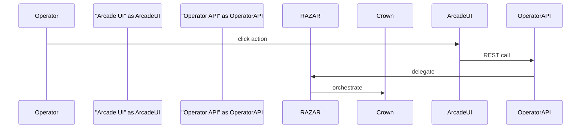

# Arcade UI

Operator-facing arcade interface that bridges the Operator API and RAZAR.

## Features
- **Ignition Control** – trigger system startup through `/start_ignition`.
- **Component Handover** – escalate failing modules via `/handover`.
- **Status Panel** – poll `/status` for health and memory summaries.
- **Mission Logs** – stream RAZAR events and crown readiness messages.

## Environment Variables
- `OPERATOR_API_URL` – base URL of the Operator API (default `http://localhost:8000`).
- `OPERATOR_TOKEN` – bearer token used for authenticated requests.
- `CROWN_URL` – Crown service RAZAR delegates to after approval.

## Operator Interaction
The operator uses the Arcade UI to send HTTP commands to the Operator API. Each button forwards a request that RAZAR interprets
and relays to Crown. Responses bubble back to the arcade, giving the operator real‑time feedback on system state.

## Version History
| Version | Date       | Notes                   |
|---------|------------|-------------------------|
| 0.1.0   | 2025-09-06 | Initial arcade UI doc.  |
