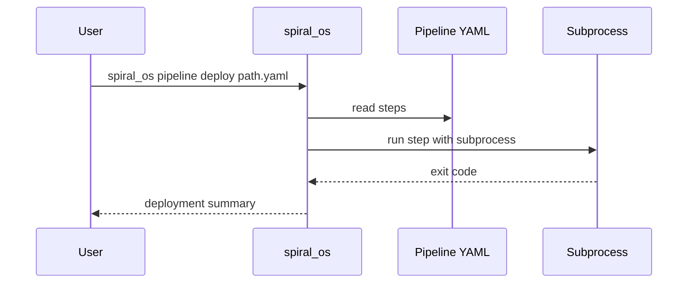
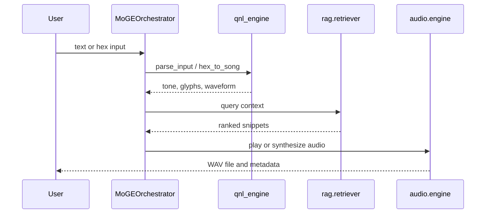

# Architecture

This guide maps the core packages that shape the ABZU system and how they
cooperate.

## SPIRAL_OS

`SPIRAL_OS` houses the Quantum Narrative Language (QNL) engine and symbolic
parser. The QNL engine converts hexadecimal or text input into tonal
representations and waveforms. The symbolic parser inspects parsed QNL data to
derive intents that influence downstream routing.

## Audio Modules

The `audio` package provides ingestion, digital signal processing and playback.
`audio_ingestion.py` analyses imported clips, `dsp_engine.py` applies effects
such as pitch shifting or time stretching, and `engine.py` plays or loops
samples for rituals and responses.

## RAG Components

Retrieval-Augmented Generation lives under `rag`. `orchestrator.py` acts as the
central router, calling `retriever.py` to search vector memory, `embedder.py` to
create sentence embeddings and `music_oracle.py` to craft musical prompts.

## Entry Points

- `start_dev_agents.py` launches the planner, coder and reviewer agents for a
  development cycle.
- `spiral_os` is a command line utility for deploying YAML-defined pipelines.

## Pipeline Deployment Flow

## QNL Processing Flow

