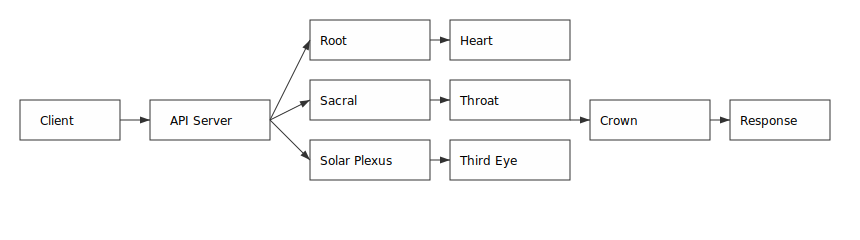
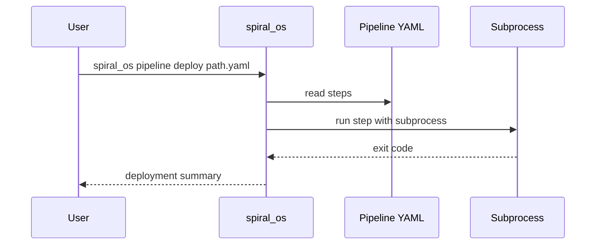
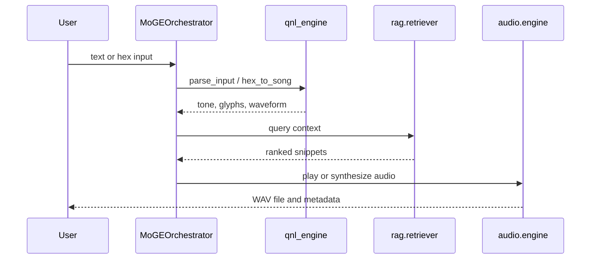

# Architecture

This guide maps the core packages that shape the ABZU system and how they
cooperate. The diagram below highlights the end-to-end flow of a request as it
travels through the chakra pipeline.



## SPIRAL_OS

`SPIRAL_OS` houses the Quantum Narrative Language (QNL) engine and symbolic
parser. The QNL engine converts hexadecimal or text input into tonal
representations and waveforms. The symbolic parser inspects parsed QNL data to
derive intents that influence downstream routing.

## Audio Modules

The `audio` package provides ingestion, digital signal processing and playback.
`audio_ingestion.py` analyses imported clips, `dsp_engine.py` applies effects
such as pitch shifting or time stretching, and `engine.py` plays or loops
samples for rituals and responses.

## RAG Components

Retrieval-Augmented Generation lives under `rag`. `orchestrator.py` acts as the
central router, calling `retriever.py` to search vector memory, `embedder.py` to
create sentence embeddings and `music_oracle.py` to craft musical prompts.


## INANNA_AI Package

`INANNA_AI` contains ritual analysis, memory helpers and network utilities. The command line interface in [INANNA_AI_AGENT/inanna_ai.py](../INANNA_AI_AGENT/inanna_ai.py) exposes these components.

```bash
python INANNA_AI_AGENT/inanna_ai.py --activate
```

Key modules include [INANNA_AI/ethical_validator.py](../INANNA_AI/ethical_validator.py) for prompt filtering and [INANNA_AI/network_utils](../INANNA_AI/network_utils/) for packet capture.

## Core Package

`core` hosts the language engines that analyse sentiment, select models and log experiences.

```python
from core.model_selector import ModelSelector

selector = ModelSelector()
model = selector.choose_model({"text": "greetings"})
```

See [core/emotion_analyzer.py](../core/emotion_analyzer.py), [core/memory_logger.py](../core/memory_logger.py) and [core/model_selector.py](../core/model_selector.py) for implementations.

## Dashboard Package

The `dashboard` folder contains a Streamlit interface for monitoring usage and experiments.

```bash
streamlit run dashboard/app.py
```

Refer to [dashboard/app.py](../dashboard/app.py) and [DASHBOARD.md](DASHBOARD.md) for details.

## Entry Points

- `start_dev_agents.py` launches the planner, coder and reviewer agents for a
  development cycle.
- `spiral_os` is a command line utility for deploying YAML-defined pipelines.

## Pipeline Deployment Flow



## QNL Processing Flow



## Assumptions, Design Trade-offs, and Extension Points

### Assumptions
- Single-node deployment with direct access to local models and vector stores.
- Sequential chakra processing where each layer receives the previous output.
- Configuration files such as `voice_avatar_config.yaml` are present and
  readable at runtime.

### Design Trade-offs
- The modular chakra chain favors clarity over raw throughput, introducing
  additional IPC and data copying between layers.
- Reliance on external vector databases enables flexible memory retrieval but
  adds a network dependency and latency cost.
- Mermaid diagrams in this document aid comprehension yet require preprocessing
  for rendering outside Git platforms.

### Extension Points
- New chakras or modules can be inserted by extending the router in
  `crown_prompt_orchestrator.py`.
- Additional third-party services (e.g., alternative LLM APIs or databases) can
  be wired into the existing interfaces.
- Data schemas are JSON-based; new fields can be appended without breaking
  existing consumers when following additive versioning.
