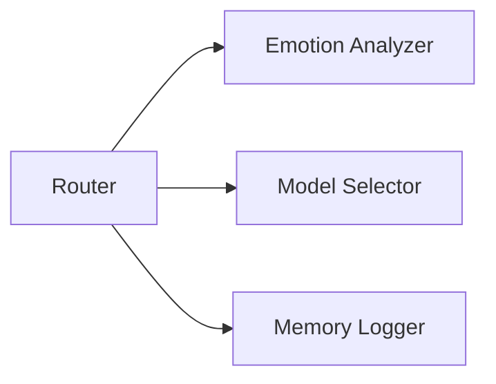

# Architecture Overview

For broader project context read [project_overview.md](project_overview.md)
and [README_CODE_FUNCTION.md](../README_CODE_FUNCTION.md). A consolidated
reference lives in [CRYSTAL_CODEX.md](../CRYSTAL_CODEX.md).

This guide breaks down Spiral OS into its primary components. Each section
includes a small diagram, links to implementation and tests, and a brief note
on how the design has evolved.

Architecture decisions are recorded as [ADRs](adr/). Key choices include
[using FAISS for vector search](adr/0001-use-faiss-for-vector-search.md) and
[preferring asyncio over threads](adr/0002-prefer-asyncio-over-threads.md).

## Router

- [`neoabzu_crown`](../NEOABZU/crown/src/lib.rs)
- Tests: [tests/crown/test_crown_router_memory.py](../tests/crown/test_crown_router_memory.py)

**Design Evolution:** Score 2; depends on `rag`.

## Emotion Analyzer

- [src/core/emotion_analyzer.py](../src/core/emotion_analyzer.py)
- Tests: [tests/test_core_services.py](../tests/test_core_services.py)

**Design Evolution:** Score 1; depends on `INANNA_AI`.

## Model Selector

- [src/core/model_selector.py](../src/core/model_selector.py)
- Tests: [tests/test_core_services.py](../tests/test_core_services.py)

**Design Evolution:** Score 1; depends on `INANNA_AI`.

## Memory Logger

- [src/core/memory_logger.py](../src/core/memory_logger.py)
- Tests: [tests/test_core_services.py](../tests/test_core_services.py)

**Design Evolution:** Score 1; no external dependencies.

## Cortex Memory

- [memory/cortex.py](../memory/cortex.py)
- Tests: [tests/test_cortex_memory.py](../tests/test_cortex_memory.py)

**Design Evolution:** Score 1; no external dependencies.

## Spiral Cortex Memory

- [memory/spiral_cortex.py](../memory/spiral_cortex.py)
- Tests: [tests/test_spiral_cortex_memory.py](../tests/test_spiral_cortex_memory.py)

**Design Evolution:** Score 1; no external dependencies.

## Emotional Memory

- [memory/emotional.py](../memory/emotional.py)
- Tests: [tests/test_memory_emotional.py](../tests/test_memory_emotional.py)

**Design Evolution:** Score 2; depends on `dlib`, `transformers`.

## Mental Memory

- [memory/mental.py](../memory/mental.py)
- Tests: [tests/test_seven_dimensional_music.py](../tests/test_seven_dimensional_music.py)

**Design Evolution:** Score 1; depends on `core`, `crown_config`.

## Spiritual Memory

- [memory/spiritual.py](../memory/spiritual.py)
- Tests: [tests/test_memory_spiritual.py](../tests/test_memory_spiritual.py)

**Design Evolution:** Score 2; no external dependencies.

## Sacred Memory

- [memory/sacred.py](../memory/sacred.py)
- Tests: [tests/test_vast_pipeline.py](../tests/test_vast_pipeline.py)

**Design Evolution:** Score 1; depends on `PIL`, `torch`.

## Cortex Sigil Labs

- [labs/cortex_sigil.py](../labs/cortex_sigil.py)
- Tests: [tests/test_cortex_sigil_logic.py](../tests/test_cortex_sigil_logic.py)

**Design Evolution:** Score 1; no external dependencies.
