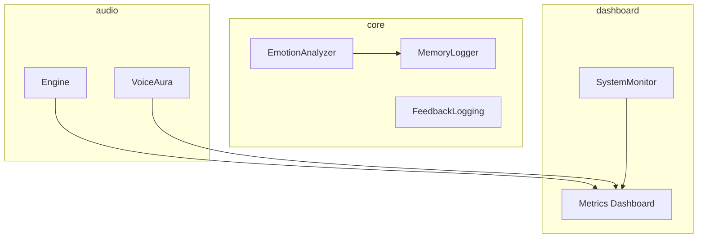
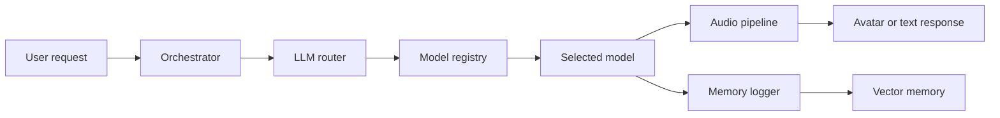

# Architecture Overview

For broader project context read [project_overview.md](project_overview.md)
and [README_CODE_FUNCTION.md](../README_CODE_FUNCTION.md). A consolidated
reference lives in [CRYSTAL_CODEX.md](CRYSTAL_CODEX.md).

This guide explains in plain language how a request travels through Spiral OS. For a chakra‑oriented map of the codebase, see [spiritual_architecture.md](spiritual_architecture.md).

## Canonical Diagram

```mermaid
graph TD
    subgraph Core
        Router
        "Emotion Analyzer"
        "Model Selector"
        "Memory Logger"
    end
    subgraph Memory
        "memory.cortex"
        "memory.spiral_cortex"
        "memory.emotional"
        "memory.mental"
        "memory.spiritual"
        "memory.sacred"
    end
    subgraph Labs
        "labs.cortex_sigil"
    end
    Router --> "Emotion Analyzer" --> "Model Selector" --> "Memory Logger"
    "Memory Logger" --> "memory.cortex"
    "Memory Logger" --> "memory.spiral_cortex"
    "Memory Logger" --> "memory.emotional"
    "Memory Logger" --> "memory.mental"
    "Memory Logger" --> "memory.spiritual"
    "Memory Logger" --> "memory.sacred"
    Router --> "labs.cortex_sigil"
```

### Package Layout



### Service Boundaries

Spiral OS separates outward‑facing interfaces from heavy model logic. The
**API layer** (``src/api``) exposes HTTP endpoints and orchestrates incoming
requests. Core algorithms live in the **model layer** (``src/core``) which
handles emotion analysis, memory logging, feedback collection and model
selection. These layers communicate only through the contracts defined in
``core.contracts`` so each service can scale horizontally or be deployed
independently.

### Service Contracts

- `core.contracts.EmotionAnalyzerService` – protocol for mood analysis.
- `core.emotion_analyzer.EmotionAnalyzer` – classify mood of incoming text.
- `core.contracts.MemoryLoggerService` – protocol for persistence.
- `core.memory_logger.MemoryLogger` – persist events to the memory stores.
- `core.model_selector.ModelSelector` – choose the appropriate language model.
- `core.feedback_logging` – record and retrieve user feedback.
- `memory.cortex` – `record_spiral` / `query_spirals` for spiral decisions.
- `memory.spiral_cortex` – `log_insight` / `load_insights` for retrieval traces.
- `labs.cortex_sigil` – `interpret_sigils` to extract symbolic triggers.

### Inter-module Dependencies

- `recursive_emotion_router` persists results via `memory.cortex` and augments decisions with `labs.cortex_sigil`.
- `crown_prompt_orchestrator` maps experiences with `memory.mental`, `memory.spiritual`, and `memory.sacred`.
- `rag.retriever` records search context to `memory.spiral_cortex`.
- `audio.voice_aura` feeds processed clips into `dashboard.system_monitor` for logging.

### Request Flow



### LLM Router
The LLM router acts as a traffic controller for prompts. When a message arrives, `crown_router.py` checks recent emotion stored in `vector_memory` and chooses a language model and voice that fit the conversation. It returns both the model choice and hints for speech style so replies stay in tune with the current mood.

### Model Registry
`servant_model_manager.py` is a catalogue of helper models. Each servant registers a name and how to run it—either as a Python function or an external process. The orchestrator asks this registry to invoke a model by name, making it straightforward to plug in new specialised tools.

### Audio Pipeline
The audio pipeline has two stops. `audio/audio_ingestion.py` brings in clips and analyses features such as tempo, key and CLAP embeddings. `audio/engine.py` then plays the sound, adds effects or synthesises missing notes. A new `audio/voice_aura.py` module applies emotion‑driven effects before final output. Together they handle capture, analysis and playback.

### Dependency Mapping

External package relationships were generated with `pipdeptree`:

```
fastapi
  starlette
    anyio
      idna
      sniffio
```

