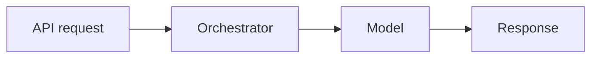

# Architecture Overview

This guide surveys the major pieces of Spiral OS in everyday engineering terms.

## Request Flow

## LLM Router
The LLM router decides which language model and voice pathway should handle a message. `crown_router.py` calls the `MoGEOrchestrator` and considers recent emotional context from `vector_memory`. It returns a model choice along with recommendations for text‑to‑speech and avatar style so the reply matches the current mood.

## Audio Pipeline
Audio flows through two main modules. `audio_ingestion.py` loads samples and can extract features such as MFCCs, musical key, tempo and CLAP embeddings. `audio_engine.py` applies DSP effects, plays ritual loops and can synthesise tones when assets are missing. Together they cover capture, analysis and playback.

## Model Registry
`servant_model_manager.py` keeps a registry of helper models. Handlers may be native Python functions or subprocesses, and the Kimi‑K2 servant registers here by default. The orchestrator can invoke a model by name through a uniform `invoke` API, simplifying the addition of new specialised models.

