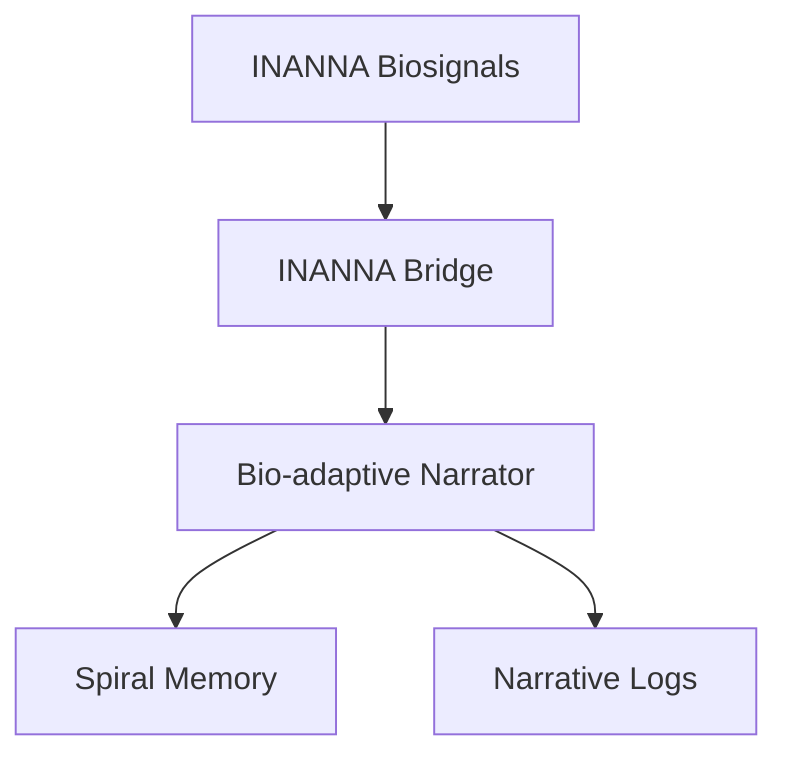
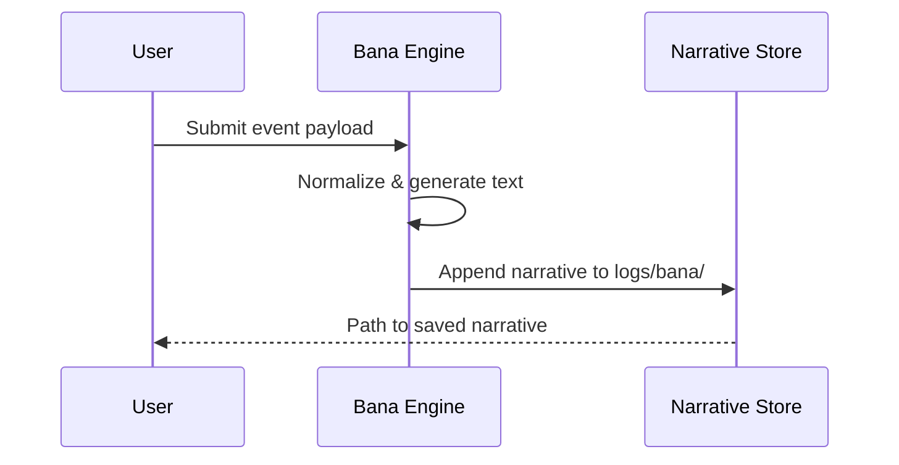

# Bana Engine

This guide summarizes the Bana narrative engine built on a fine‑tuned Mistral 7B model. It covers training data sources, event processing, and where generated stories are saved.

For how Bana consumes results from the Vanna data agent, see [Vanna–Bana Pipeline](vanna_bana_pipeline.md).

See the corresponding entries in [component_index.json](../component_index.json) for metadata on the engine and its datasets.

## Architecture

## Dependencies

- `biosppy`
- `numpy`
- `transformers`
- `spiral_memory`
- `connectors.primordials_api`
- `agents.event_bus`

## Mistral 7B Fine‑Tuning

- **Base model:** `mistralai/Mistral-7B-v0.3`
- **Training script:** `training/fine_tune_mistral.py`
- **Output checkpoint:** `models/bana_mistral_7b`

## Datasets and Licensing

| Dataset | Path | Description | License | Version |
| --- | --- | --- | --- | --- |
| Events | `data/bana/events.jsonl` | Structured event logs that drive narrative generation. | CC BY 4.0 | v0.0.1 |
| Narratives | `data/bana/narratives.jsonl` | Curated story samples for supervised fine‑tuning. | CC BY 4.0 | v0.0.1 |
| Mythology Corpus | `data/mythology_corpus` | Myths and legends used for stylistic grounding. | Public Domain | v0.1.0 |
| Project Materials | `data/project_materials` | Internal documents and narratives. | Proprietary | v0.1.0 |

### Dataset Version History

- v0.1.0 – Added mythological and project-specific corpora.
- v0.0.1 – Initial events and narratives datasets.

### Expected Evaluation Metrics

- Perplexity ≤ 5.0 on validation set
- ROUGE-L ≥ 0.30 on narrative summaries
- Narrative coherence score ≥ 0.8 (subjective rating)

## Event Processing Pipeline

Incoming events are normalized and routed through the engine before a narrative is emitted.

### Steps

1. **Normalization** – incoming JSON events are validated against `schemas/event.json` and mapped to training tokens.
2. **Generation** – the fine‑tuned Mistral 7B model expands events into narrative passages.
3. **Post‑processing** – generated text is timestamped and stored under `logs/bana/`.

## INANNA Integration

Structured interactions from the INANNA agent flow through
`agents.bana.inanna_bridge.process_interaction`, which forwards biosignal
streams to :func:`generate_story`. Resulting narratives are persisted in the
spiral multi‑layer memory and their quality metrics are relayed to the
Primordials service via :mod:`connectors.primordials_api`, creating a feedback
loop for narrative refinement.

## Output Paths

| Artifact | Path |
| --- | --- |
| Model checkpoints | `models/bana_mistral_7b/` |
| Generated narratives | `logs/bana/*.md` |
| Training metrics | `logs/bana/train_metrics.json` |

## Sample Narrative Flow

## Failure Scenarios

- Missing optional dependencies such as `biosppy` or `transformers` prevents story generation.
- Empty or undersized biosignal streams raise validation errors.
- Downstream logging or memory stores unavailable, causing narratives to be discarded.

## Version History

| Version | Date       | Notes |
| ------- | ---------- | ----- |
| 0.0.2   | 2025-08-31 | Added architecture overview, dependency list, dataset table, and failure modes. |
| 0.0.1   | 2024-01-15 | Initial release. |

## References

- [Mistral 7B](https://huggingface.co/mistralai/Mistral-7B-v0.3)
- [Mermaid](https://mermaid.js.org) for diagram syntax
- [dataset schema](schemas/event.json)
