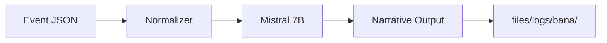
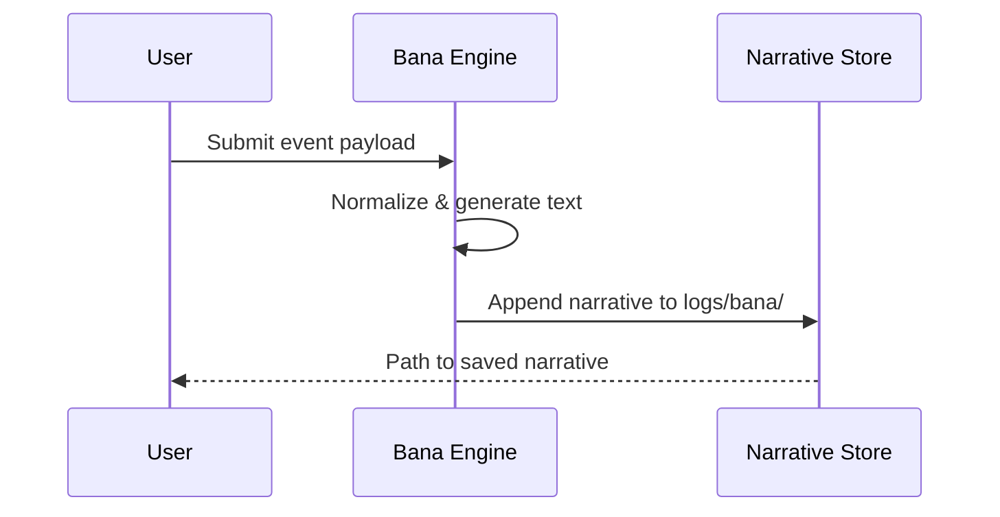

# Bana Engine

This guide summarizes the Bana narrative engine built on a fine‑tuned Mistral 7B model. It covers training data sources, event processing, and where generated stories are saved.

See the corresponding entries in [component_index.json](../component_index.json) for metadata on the engine and its datasets.

## Mistral 7B Fine‑Tuning

- **Base model:** `mistralai/Mistral-7B-v0.3`
- **Training script:** `scripts/train_bana.py`
- **Datasets:**
  - `data/bana/events.jsonl` – structured event logs used to drive narrative generation.
  - `data/bana/narratives.jsonl` – curated story samples for supervised fine‑tuning.
- **Output checkpoint:** `models/bana_mistral_7b`

## Event Processing Pipeline

Incoming events are normalized and routed through the engine before a narrative is emitted.

### Steps

1. **Normalization** – incoming JSON events are validated against `schemas/event.json` and mapped to training tokens.
2. **Generation** – the fine‑tuned Mistral 7B model expands events into narrative passages.
3. **Post‑processing** – generated text is timestamped and stored under `logs/bana/`.

## Output Paths

| Artifact | Path |
| --- | --- |
| Model checkpoints | `models/bana_mistral_7b/` |
| Generated narratives | `logs/bana/*.md` |
| Training metrics | `logs/bana/train_metrics.json` |

## Sample Narrative Flow

## References

- [Mistral 7B](https://huggingface.co/mistralai/Mistral-7B-v0.3)
- [Mermaid](https://mermaid.js.org) for diagram syntax
- [dataset schema](schemas/event.json)
