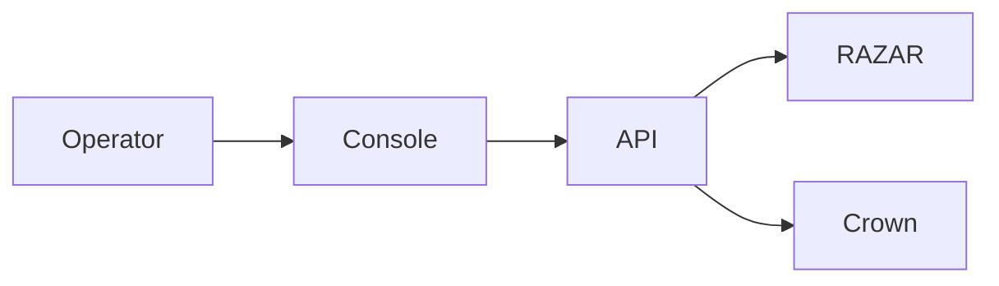
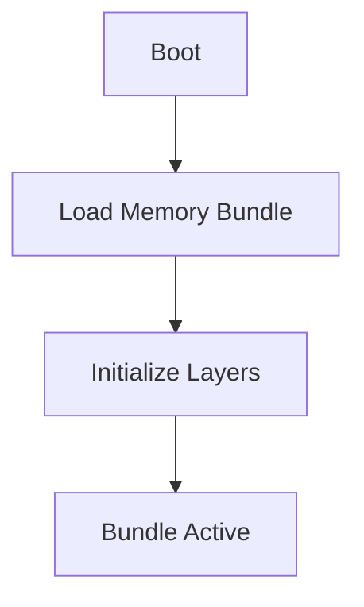

# Blueprint Manual

## Preamble & Vision
ABZU's blueprint manual articulates the project's guiding intent and sets a unified direction for chakra-aligned development. It frames the operator-first ethos and describes how each subsystem contributes to a resilient, evolving intelligence.

## Chakra Architecture
The chakra architecture synchronizes services from Root to Crown. Each layer transmits signals upward while providing stability and feedback to lower layers, forming a recursive loop of intent, action, and reflection.

## System Overview
Crown orchestrates servant agents while RAZAR handles recovery and ignition logic. The operator guides flows that traverse the console and API before reaching the appropriate service.

## Operator Console
The console bridges human intent with ABZU's inner systems. Operators can review telemetry, issue commands, and observe responses via a unified interface. See the [Nazarick Web Console](nazarick_web_console.md) and the [Operator Interface Guide](operator_interface_GUIDE.md) for detailed usage patterns.

## Memory Bundle
Memories initialize in layered bundles that merge vector embeddings with narrative summaries. Each layer stores context and exposes hooks for rapid recall. Consult the [Memory Layers Guide](memory_layers_GUIDE.md) for canonical schemas.

## Dynamic Ignition
Dynamic ignition sequences coordinate model loading, memory alignment, and operator handoff. RAZAR triggers ignition while Crown validates readiness before routing tasks.

## Appendices
Additional specifications, component registries, and operational checklists live throughout the documentation set. Cross-reference this manual with the [System Blueprint](system_blueprint.md) and related guides for deeper context.
