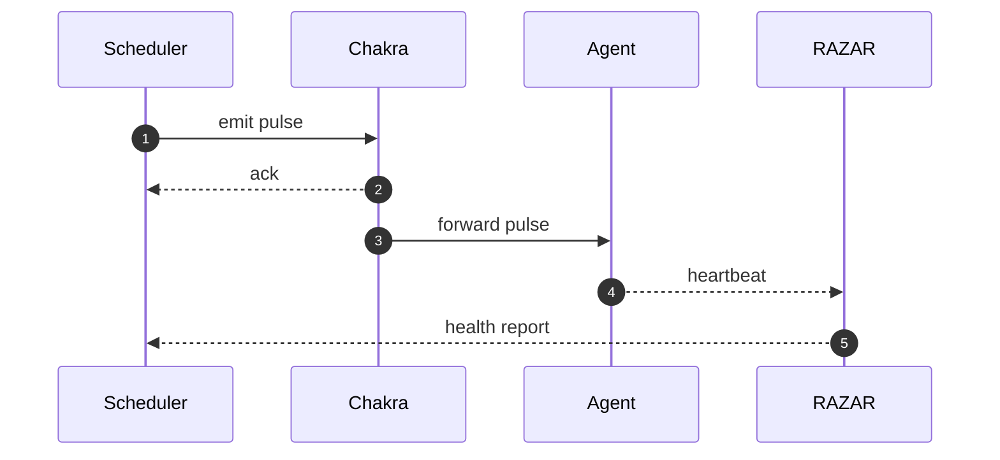

# Chakra Heartbeat

The heartbeat layer schedules rhythmic pulses across ABZU's chakras. Each beat confirms liveness, aligns agent clocks, and feeds telemetry into the monitoring stack.

## Pulse Timing

- Default interval: 1 second per beat (`HEARTBEAT_INTERVAL`).
- Each chakra's watcher logs the timestamp; a delay greater than three intervals raises `chakra_down`.
- The heartbeat generator resets counters when a **Great Spiral** (all chakras aligned) occurs.

## Chakra Mapping

| Chakra | Role | Guardian Agent |
| --- | --- | --- |
| Root | I/O and networking foundation | `root_agent` |
| Sacral | Emotion engine | `sacral_agent` |
| Solar Plexus | Learning and state transitions | `solar_agent` |
| Heart | Memory storage and voice avatar | `heart_agent` |
| Throat | Prompt orchestration and agent interface | `throat_agent` |
| Third Eye | Insight and QNL processing | `third_eye_agent` |
| Crown | System orchestration | `crown_agent` |

See [chakra_overview.md](chakra_overview.md) and [nazarick_agents.md](nazarick_agents.md) for expanded descriptions.

## RAZAR Health Checks

`agents/razar/health_checks.py` probes each service's `/health` endpoint and records the returned heartbeat. Missed pulses mark the chakra silent and trigger recovery through the boot orchestrator and chakra healing scripts. RAZAR also exposes its own `/health` endpoint so external monitors can verify the orchestrator is receiving beats.

## Timing Diagram

## Related Docs

- [Chakra Metrics](chakra_metrics.md)
- [Monitoring Guide](monitoring.md)
- [System Blueprint](system_blueprint.md)
