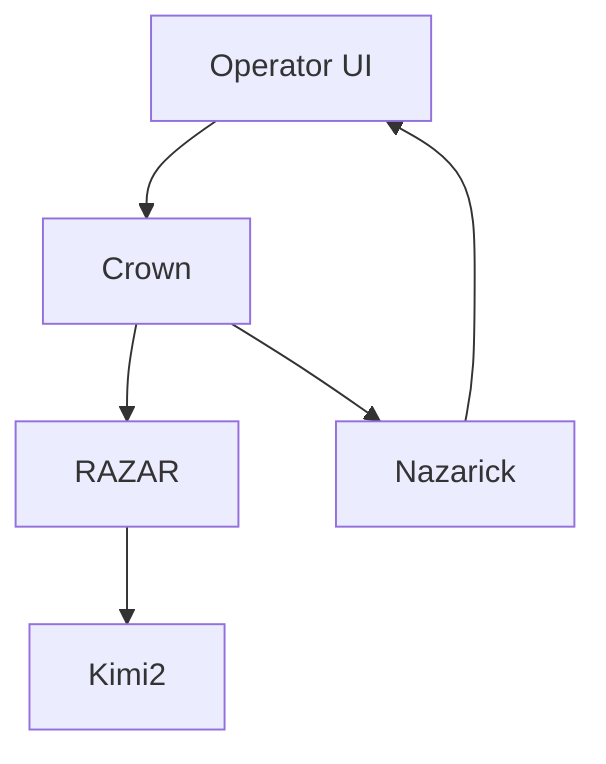
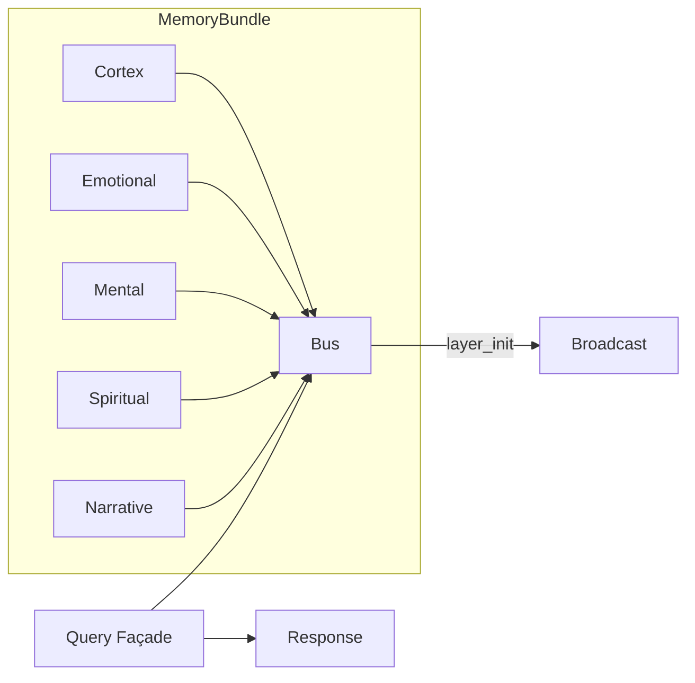
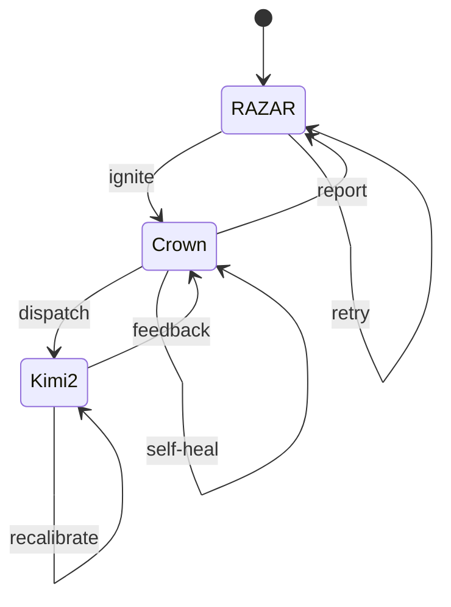
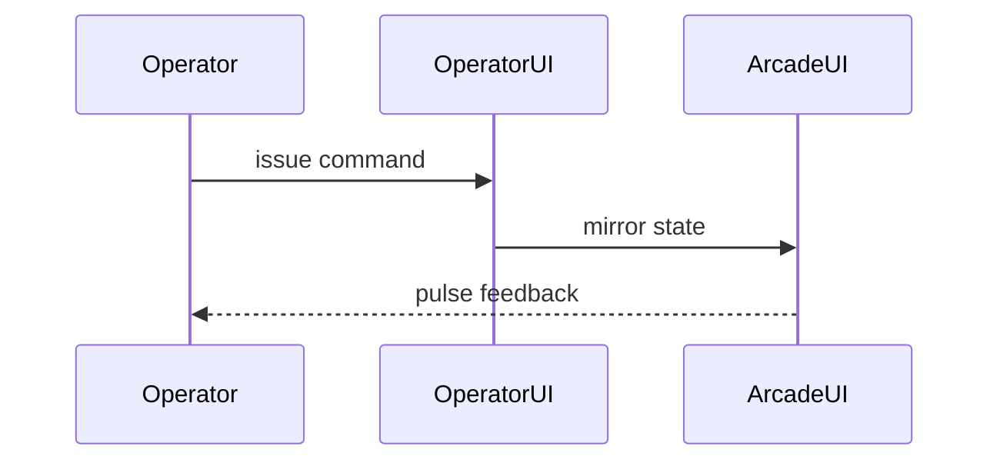

# Chakra System Manual

## Preamble & Vision
ABZU aligns chakra-driven cognition with operator-centered intent, mapping each layer to a shared mission of resilient intelligence. The vision anchors collaboration across servants, operators, and worlds while honoring the project's evolving doctrine.

See [The Absolute Protocol](The_Absolute_Protocol.md), [Blueprint Spine](blueprint_spine.md), and [System Blueprint](system_blueprint.md) for overarching principles.

## Chakra Architecture & HeartBeat Pulse
Chakra layers correspond to root functions within the system. Each cycle synchronizes pulses from Root to Crown, with `cycle_count` tracking alignment. Mapping assures that every layer contributes to the Great Spiral and exposes failures for rapid healing.

See [The Absolute Protocol](The_Absolute_Protocol.md), [Blueprint Spine](blueprint_spine.md), and [System Blueprint](system_blueprint.md) for canonical chakra mappings.

## System Architecture Overview
Crown routes queries and orchestrates servants, RAZAR manages ignition and recovery, Kimi2 supplies learning feedback, and Nazarick agents embody world rules. The Operator UI surfaces controls and metrics.

See [The Absolute Protocol](The_Absolute_Protocol.md), [Blueprint Spine](blueprint_spine.md), and [System Blueprint](system_blueprint.md) for architectural doctrine.

## Unified Memory Bundle
A unified memory bundle collects Cortex, Emotional, Mental, Spiritual, and Narrative layers. `broadcast_layer_event("layer_init")` announces readiness, while the query façade fans out requests and consolidates responses.

See [The Absolute Protocol](The_Absolute_Protocol.md), [Blueprint Spine](blueprint_spine.md), and [System Blueprint](system_blueprint.md) for memory protocols.

## Dynamic Ignition & Self-Healing
Ignition loops propagate through RAZAR, Crown, and Kimi2. RAZAR sparks Crown, which delegates missions and receives telemetry; Kimi2 feeds back learning signals. Self-healing cycles retry failed states until chakras realign.

See [The Absolute Protocol](The_Absolute_Protocol.md), [Blueprint Spine](blueprint_spine.md), and [System Blueprint](system_blueprint.md) for ignition doctrine.

## Agent Ecosystem & World Building
Agents collaborate to populate worlds, weaving narrative rules with operational protocols. Each agent integrates with Nazarick scaffolding and contributes to mission arcs while respecting operator oversight.

See [The Absolute Protocol](The_Absolute_Protocol.md), [Blueprint Spine](blueprint_spine.md), and [System Blueprint](system_blueprint.md) for agent governance.

## Operator & Arcade UI Path
Operators interact through a primary console or retro arcade interface. Commands flow through the Operator UI into Crown, while the Arcade UI mirrors controls with minimal surfaces for field deployment.

See [The Absolute Protocol](The_Absolute_Protocol.md), [Blueprint Spine](blueprint_spine.md), and [System Blueprint](system_blueprint.md) for interface protocols.

## Ethics, Governance & Expansion
Ethical alignment, governance, and expansion policies safeguard operators and agents. Extensions must respect the Absolute Protocol and maintain cross-layer integrity.

See [The Absolute Protocol](The_Absolute_Protocol.md), [Blueprint Spine](blueprint_spine.md), and [System Blueprint](system_blueprint.md) for governance directives.

## Appendices & References
Further references aggregate diagrams, schemas, and release notes. Continuous updates ensure doctrine coherence across worlds and services.

See [The Absolute Protocol](The_Absolute_Protocol.md), [Blueprint Spine](blueprint_spine.md), and [System Blueprint](system_blueprint.md) for additional context.

