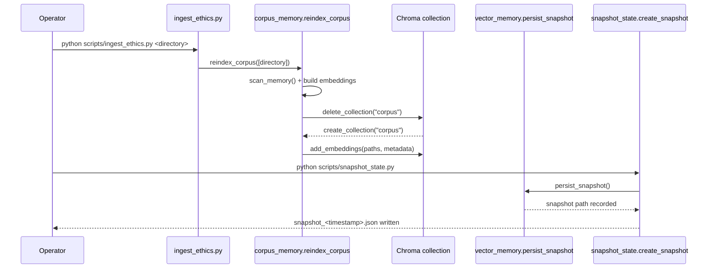

# Corpus Ingestion Workflow

The corpus ingestion routine rebuilds the ethics memory collection so the Crown can retrieve up-to-date doctrine passages. This guide walks through the full process—from invoking the CLI helper to persisting a snapshot for disaster recovery.

## Prerequisites

- The `sentence-transformers` and `chromadb` packages must be installed so embeddings can be generated and stored.
- Markdown source files (for example the ethics canon) should live under a directory such as `sacred_inputs/`.
- Ensure you have credentials or filesystem access required by the Chroma persistent client at `data/chroma/`.

## Step-by-step flow

1. **Invoke the helper script.** Run `python scripts/ingest_ethics.py <directory>` to start a reindex. The script validates the path and logs the directory it will process.
2. **Scan Markdown sources.** `INANNA_AI.corpus_memory.scan_memory` walks the provided directory (or the default memory set) and reads each Markdown file into memory.
3. **Embed new documents.** `SentenceTransformer` creates embeddings for each document, packaging file metadata including the last modification timestamp.
4. **Rebuild the Chroma collection.** `corpus_memory.reindex_corpus` deletes the existing `corpus` collection, creates a fresh collection, and uploads the embeddings.
5. **Persist a snapshot.** Run `python scripts/snapshot_state.py` after the reindex completes. This calls `vector_memory.persist_snapshot()` to write the updated embeddings to `vector_memory`'s snapshot directory and records the snapshot path inside a JSON manifest.

## Sequence diagram

## Validation checklist

- Confirm the CLI exited with status code `0` and printed `Ethics corpus reindexed` in the logs.
- Inspect `data/chroma/` to verify the Chroma store timestamp updates.
- Review the JSON written to `storage/snapshots/` to confirm the snapshot path captures the new embeddings.

Keeping this workflow in sync ensures the ethics corpus stays searchable while snapshots provide an audit trail for recovery drills.
