# Request to Memory Data Flow

```mermaid
graph LR
    A[Client Request] --> B[Root Chakra]
    B --> C[Sacral]
    C --> D[Solar Plexus]
    D --> E[Heart]
    E --> F[Throat]
    F --> G[Third Eye]
    G --> H[Crown]
    H --> I[(Memory)]
    click B "../server.py" "server.py"
    click C "../emotional_state.py" "emotional_state.py"
    click D "../learning_mutator.py" "learning_mutator.py"
    click E "../vector_memory.py" "vector_memory.py"
    click F "../crown_prompt_orchestrator.py" "crown_prompt_orchestrator.py"
    click G "../insight_compiler.py" "insight_compiler.py"
    click H "../start_spiral_os.py" "start_spiral_os.py"
    click I "../memory_store.py" "memory_store.py"
```

## Key Modules

- [server.py](../server.py) – receives external requests and initiates processing.
- [emotional_state.py](../emotional_state.py) – manages emotional context.
- [learning_mutator.py](../learning_mutator.py) – handles learning transformations.
- [vector_memory.py](../vector_memory.py) – writes and reads embeddings.
- [crown_prompt_orchestrator.py](../crown_prompt_orchestrator.py) – coordinates prompts.
- [insight_compiler.py](../insight_compiler.py) – compiles insights and QNL output.
- [start_spiral_os.py](../start_spiral_os.py) – boots the crown agent.
- [memory_store.py](../memory_store.py) – persists structured memories.
