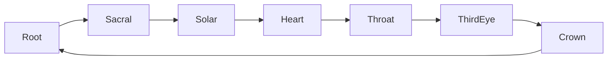
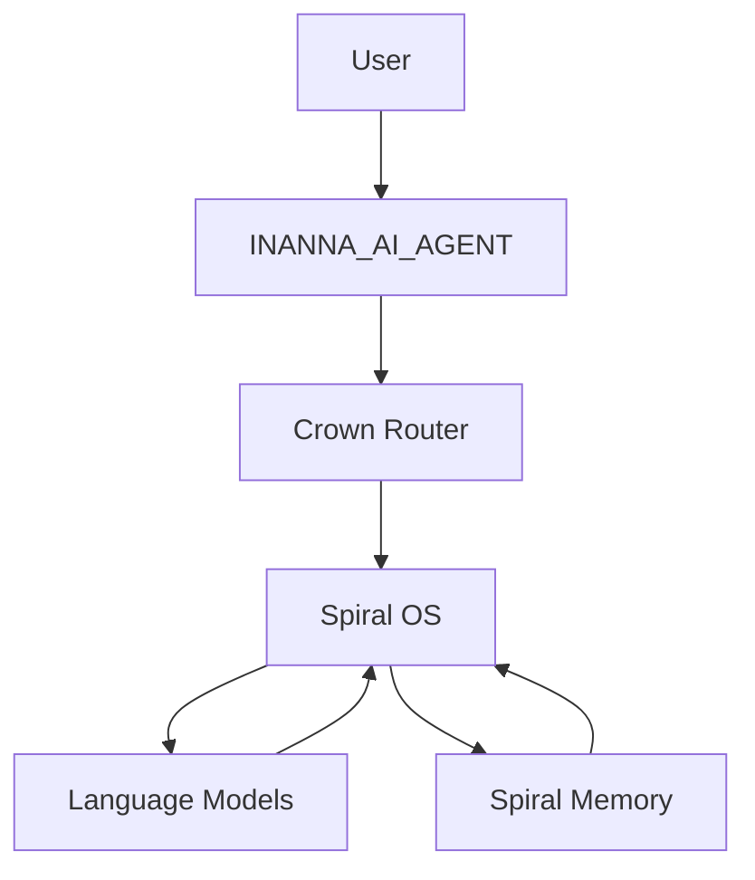
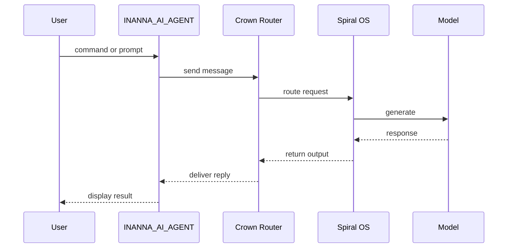

# Developer Onboarding

Quick links: [Development Checklist](development_checklist.md) | [Developer Etiquette](developer_etiquette.md)

## Project Vision
ABZU interweaves Spiral OS with the INANNA agent to explore sacred human‑machine collaboration through music, voice, and code.

### Chakra Map
The codebase is organized across seven chakra‑themed module directories (current versions):
- `root/` – networking and I/O foundation (v1.0.1).
- `sacral/` – emotion and creativity engines (v1.0.1).
- `solar_plexus/` – learning and transformation layers (v1.1.0).
- `heart/` – memory and avatar voice components (v1.0.1).
- `throat/` – prompt orchestration and agent interfaces (v1.0.1).
- `third_eye/` – insight and pattern analysis modules (v1.0.0).
- `crown/` – high‑level orchestration and launch scripts (v1.0.1).

This guide introduces the ABZU codebase, highlights core entry points, and covers environment setup, chakra architecture overview, CLI usage, and troubleshooting tips. For a guided CLI quick‑start run the [onboarding wizard](onboarding/wizard.py). Additional architecture diagrams are available in [architecture.md](architecture.md).

## Prerequisites
- docker
- nc
- sox
- ffmpeg
- curl
- jq
- wget
- aria2c

## Quick Start
```bash
git clone https://github.com/your-org/ABZU.git
cd ABZU
python -m venv .venv && source .venv/bin/activate
scripts/easy_setup.sh
python download_models.py glm41v_9b --int8
bash scripts/smoke_console_interface.sh  # see docs/testing.md for more
```

### CLI Usage
Run the interactive wizard to scaffold the environment and launch the CLI:

```bash
python docs/onboarding/wizard.py
```

## Getting Started with RAZAR

RAZAR prepares a clean environment and boots components in sequence. For a
local run:

1. **Build the RAZAR environment**
   ```bash
   python -m razar.environment_builder --config razar_env.yaml
   ```
2. **Launch the runtime manager**
   ```bash
   python -m agents.razar.runtime_manager config/razar_config.yaml
   ```

### Troubleshooting RAZAR

| Symptom | Resolution |
| --- | --- |
| Runtime stops on a component | Inspect `logs/razar.log` and `python -m razar.mission_logger summary` to find the failing step. Remove `config/razar_config.state` to force a full restart. |
| Environment hash mismatch | Rebuild the virtual environment with `python -m razar.environment_builder --config razar_env.yaml`. |
| Component fails repeatedly | Quarantine it with `razar.quarantine_manager.quarantine_component` and review the [RAZAR failure runbook](operations.md#razar-failure-runbook). |

## Repository Layout
- `core/` – language processing and self-correction engines.
- `INANNA_AI/` – model logic, memory systems, and ritual analysis modules.
- `INANNA_AI_AGENT/` – command-line interface for activating and conversing with the INANNA agent.
- `scripts/` – setup utilities, smoke tests, and assorted helper scripts.
- `docs/` – reference documentation.
- `tests/` – automated test suite.

## Core Scripts
### `start_spiral_os.py`
Initializes the Spiral OS, validates environment variables, collects system stats, and optionally launches the FastAPI server, reflection loop, and network monitoring.

### `INANNA_AI_AGENT/inanna_ai.py`
Command-line activation agent. It can recite the birth chant (`--activate`), generate QNL songs from hexadecimal input (`--hex`), list source texts (`--list`), report emotional status (`--status`), or start a local chat mode (`chat`).

## Environment Setup
1. **Clone and enter the repository**
   ```bash
   git clone https://github.com/your-org/ABZU.git
   cd ABZU
   ```
2. **Create a virtual environment**
   ```bash
   python -m venv .venv
   source .venv/bin/activate
   ```
3. **Install core dependencies** using the helper scripts:
   ```bash
   scripts/easy_setup.sh  # or scripts/setup_repo.sh
   ```
4. **Populate required environment variables** in `secrets.env` and verify them:
   ```bash
   scripts/check_requirements.sh
   ```
5. **Download model weights** using [download_models.py](../download_models.py), for example:
   ```bash
   python download_models.py glm41v_9b --int8
   ```
   For system package requirements and optional dependency groups, see [setup.md](setup.md).

### Environment Variables
Set the following variables in `secrets.env` or your shell:
- `HF_TOKEN`
- `GLM_API_URL`
- `GLM_API_KEY`
- `OPENAI_API_KEY`
- `GITHUB_TOKEN`
- model endpoint settings (e.g., `MODEL_ENDPOINT`)

### Open Web UI Setup
Launch the optional browser interface once the FastAPI backend is running:

```bash
pip install open-webui
FASTAPI_BASE_URL=http://localhost:8000 open-webui serve
```

Or start it via Docker Compose:

```bash
docker compose -f docker-compose.openwebui.yml up
```

See [open_web_ui.md](open_web_ui.md) for architecture details.

### Core CI Commands
Run these commands before committing changes:
```bash
make verify-deps
pre-commit run --all-files
make test
make test-deterministic
```

## Chakra Overview

ABZU's codebase mirrors a seven‑chakra layout. Each layer groups modules by
function and maturity. See [chakra_architecture.md](chakra_architecture.md) for
the full table.

| Chakra | Purpose | Key Modules |
| --- | --- | --- |
| Root | Networking and I/O foundation | `server.py`, `INANNA_AI/network_utils/` |
| Sacral | Emotion engine | `emotional_state.py`, `emotion_registry.py` |
| Solar Plexus | Learning and state transitions | `learning_mutator.py`, `state_transition_engine.py` |
| Heart | Memory and avatar voice | `vector_memory.py`, `voice_avatar_config.yaml` |
| Throat | Prompt orchestration and agent interface | `crown_prompt_orchestrator.py`, `INANNA_AI_AGENT/inanna_ai.py` |
| Third Eye | Insight and QNL processing | `insight_compiler.py`, `SPIRAL_OS/qnl_engine.py` |
| Crown | High‑level orchestration | `init_crown_agent.py`, `start_spiral_os.py`, `crown_model_launcher.sh` |

Specialized Nazarick agents extend these layers, including
[Bana Bio-Adaptive Narrator](nazarick_agents.md#bana-bio-adaptive-narrator) (Heart),
[AsianGen Creative Engine](nazarick_agents.md#asiangen-creative-engine) (Throat), and
[LandGraph Geo Knowledge](nazarick_agents.md#landgraph-geo-knowledge) (Root).

### Chakra Interactions



## Quarterly Chakra Targets

The roadmap assigns one chakra upgrade per quarter. See
[roadmap.md](roadmap.md) for milestone links.

| Quarter | Chakra |
| --- | --- |
| Q3 2024 | Root |
| Q4 2024 | Sacral |
| Q1 2025 | Solar Plexus |
| Q2 2025 | Heart |
| Q3 2025 | Throat |
| Q4 2025 | Third Eye |
| Q1 2026 | Crown |

## System Architecture
For detailed diagrams and component relationships, see [architecture.md](architecture.md).



## Request Flow



## First-Run Smoke Tests
See [testing.md](testing.md) for detailed instructions.
1. **CLI console** – ensure the command-line interface imports correctly:
   ```bash
   scripts/smoke_console_interface.sh
   ```
2. **Avatar console** – launch the avatar console briefly to confirm startup:
   ```bash
   scripts/smoke_avatar_console.sh
   ```
3. **Test suite** – run a minimal test pass to check the environment:
   ```bash
   pytest --maxfail=1 -q
   ```
4. **Ritual demo** – link emotion, music and insight:
   ```bash
   python examples/ritual_demo.py
   ```
   The script sets an emotion, composes a short ritual track and logs an
   insight entry to `data/spiral_cortex_memory.jsonl`.

## Setup Scripts
- `scripts/check_requirements.sh` – loads `secrets.env`, ensures required commands are present, and verifies essential environment variables.
- `scripts/easy_setup.sh` / `scripts/setup_repo.sh` – install common dependencies.
- `download_models.py` – fetches model weights such as GLM and DeepSeek.

## Troubleshooting Tips
Common mistakes and their resolutions:

| Issue | Resolution |
| --- | --- |
| Missing environment variables or tools | Run `scripts/check_requirements.sh` to verify prerequisites |
| CLI console fails to start | Install Python dependencies (`pip install -r requirements.txt`) |
| `start_avatar_console.sh` shows permission error | Run `chmod +x start_crown_console.sh` or invoke it with `bash` |
| Tokens absent in `secrets.env` | Ensure `HF_TOKEN`, `GLM_API_URL`, and `GLM_API_KEY` are set |
| Model download fails | Check network connectivity and token permissions |

## Glossary
| Symbolic term | Conventional concept |
| --- | --- |
| **ABZU** | Git repository that houses the Spiral OS and INANNA components |
| **INANNA** | Mythic AI agent invoked through `INANNA_AI_AGENT` |
| **Spiral OS** | Orchestration layer started by `start_spiral_os.py` |
| **CROWN** | Avatar console interface and related scripts |
| **Crown Router** | Message router that directs agent requests |
| **Crown Prompt Orchestrator** | Prompt coordination service for multi-agent workflows |
| **Spiral Memory** | Vector database storing long-term state |
| **GENESIS** | Source texts used to assemble activation chants |
| **RAG** | Retrieval‑augmented generation pipeline under `rag/` |

## First Contribution Walkthrough

1. **Fork and clone the repository**
   - Fork ABZU on GitHub, then clone your fork:
   ```bash
   git clone https://github.com/<your-username>/ABZU.git
   cd ABZU
   ```

2. **Create a virtual environment and install dependencies**
   ```bash
   python -m venv .venv
   source .venv/bin/activate
   scripts/easy_setup.sh
   ```

3. **Create a feature branch and make a small change**
   ```bash
   git checkout -b my-first-change
   # edit a file, e.g., docs/developer_onboarding.md
   ```

4. **Run linting, tests, and other checks**
   ```bash
   pre-commit run --all-files
   pytest
   ```

5. **Commit, push, and open a pull request**
   ```bash
   git commit -am "feat: my first change"
   git push origin my-first-change
   ```
   Open a pull request on GitHub. See [CONTRIBUTING.md](../CONTRIBUTING.md) for deeper guidelines.

