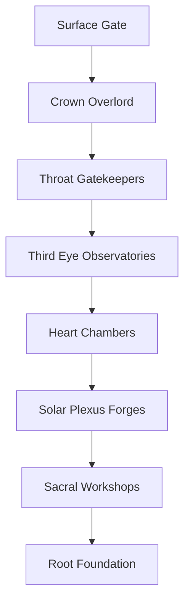
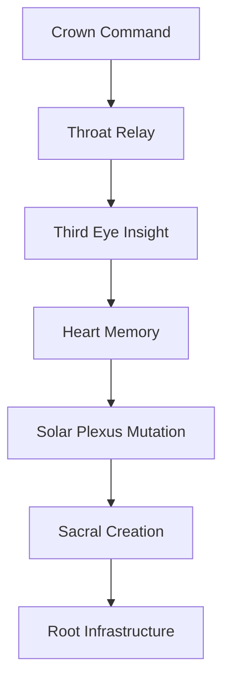
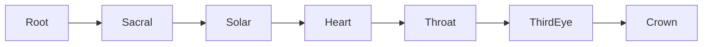
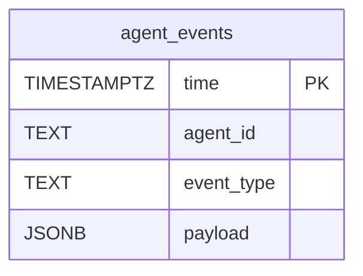
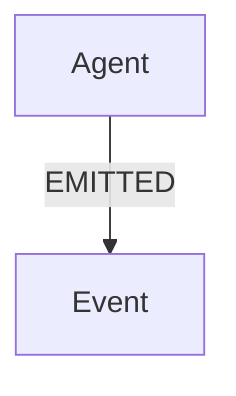

# Great Tomb of Nazarick

The foundational design for ABZU's servant hierarchy. For guiding
principles see the [Nazarick Manifesto](nazarick_manifesto.md) and for
implementation details see [Nazarick Agents](nazarick_agents.md).

## Objectives
- Fortify ABZU with a Nazarick‑inspired command structure.
- Provide clear communication channels for guardian agents.
- Ground every layer in chakra principles for balanced creative flow.
- Document the core technologies that power each layer.

## Architecture Diagram


## Channel Hierarchy
| Channel | Purpose |
| --- | --- |
| Crown Command Channel | Issues directives and oversees guardians |
| Throat Relay | Routes prompts and responses between layers |
| Third Eye Insight Channel | Streams vision analysis and QNL output |
| Heart Memory Conduit | Preserves avatar state and emotional context |
| Solar Plexus Mutation Bus | Carries learning updates and state transitions |
| Sacral Creation Channel | Shapes creative output and style modulation |
| Root Infrastructure Line | Interfaces with hardware, storage, and network |



## Tech Stack
1. **Surface Gate** – RAZAR validates prerequisites and opens the arena.
2. **Crown Overlord** – Orchestration Master coordinates subordinate agents.
3. **Throat Gatekeepers** – Prompt Orchestrator and chat gateway relay commands.
4. **Third Eye Observatories** – Vision and insight modules such as `SPIRAL_OS/qnl_engine.py`.
5. **Heart Chambers** – Memory store and voice avatar facilities.
6. **Solar Plexus Forges** – Learning mutator and state transition engine.
7. **Sacral Workshops** – Emotion registry and modulation engines.
8. **Root Foundation** – Server, network utilities, and logging.

## Chakra Alignment
- **Crown** – Orchestration Master and the Crown Command Channel.
- **Third Eye** – QNL engine and vision observatories.
- **Throat** – Prompt Orchestrator and relay services.
- **Heart** – Memory Scribe and avatar voice.
- **Solar Plexus** – Learning mutator and state transition engine.
- **Sacral** – Emotion registry and creative modulation tools.
- **Root** – Infrastructure interfaces and system logging.



See [System Blueprint](system_blueprint.md), [Nazarick Agents](nazarick_agents.md),
and the [Nazarick Manifesto](nazarick_manifesto.md) for broader context.

## Event Schema
Agent interactions generate structured JSON events routed through the Citadel
bus. Each event contains the following fields:

| Field | Description |
| --- | --- |
| `agent_id` | Identifier of the emitting agent |
| `event_type` | Action being recorded |
| `payload` | Arbitrary metadata for the event |
| `timestamp` | UTC time the event was created |

## Event Pipeline
1. Agents call `emit_event` which publishes the JSON payload to Redis or
   Kafka depending on deployment settings.
2. The FastAPI processor (`citadel.event_processor`) consumes these streams and
   persists them to two backends:
   - **TimescaleDB** for temporal queries over the `agent_events` table.
   - **Neo4j** for relational exploration of agent interactions.
3. Downstream services can query either store to reconstruct the activity
   history of the Great Tomb.

## Database Schemas
### TimescaleDB

- Hypertable on `time` with indexes on `(agent_id, time)` and `event_type`.
- Retention policy removes data older than 30 days.

```sql
-- recent events for an agent
SELECT * FROM agent_events
WHERE agent_id = 'Cocytus'
ORDER BY time DESC
LIMIT 100;
```

### Neo4j

- `Agent.agent_id` is unique with indexed `Event.timestamp` and `event_type`.

```cypher
// collaborators sorted by interaction count
MATCH (a1:Agent)-[:EMITTED]->(e:Event)<-[:EMITTED]-(a2:Agent)
RETURN a1.agent_id AS source, a2.agent_id AS collaborator, COUNT(e) AS interactions
ORDER BY interactions DESC;
```

## API Endpoints
- `POST /nlq` – query databases using Vanna AI.
- `POST /nlq/logs` – natural language queries against log data via the self-hosted Vanna service.
- `POST /operator/command` – dispatch operator commands with access controls and logging.

## NLQ Examples
```bash
curl -X POST localhost:8000/nlq/logs \\
     -H 'Content-Type: application/json' \\
     -d '{"query":"list all failed logins today"}'
```

## Security Model
- The `OperatorDispatcher` enforces role-based access for guardian commands.
- Private per-operator channels are written to `logs/operators/<operator>.log`.
- Actions targeting Cocytus or Victim are mirrored to append-only files under `audit_logs/` for WORM retention.

## Retro & Projection
### Retro
- Early prototypes hard-wired channel flows without chakra mapping, causing
  brittle communication paths.
- Event schemas originally logged directly to flat files before the Citadel
  bus unified telemetry.

### Projection
- Expand chakra-aware routing to dynamically re-balance loads across channels.
- Extend the Citadel bus with real-time dashboards for guardian activities.
