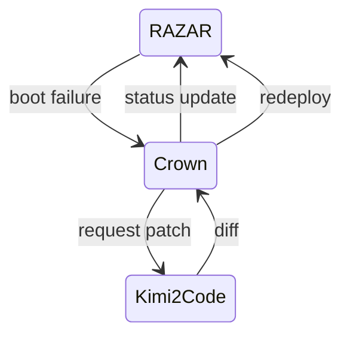

# Ignition Blueprint

The ignition workflow cycles components between orchestrators and repair agents.

```mermaid
stateDiagram-v2
    RAZAR --> Crown: boot failure
    Crown --> RAZAR: status update
    Crown --> Kimi2Code: request patch
    Kimi2Code --> Crown: diff
    Crown --> RAZAR: redeploy
```
