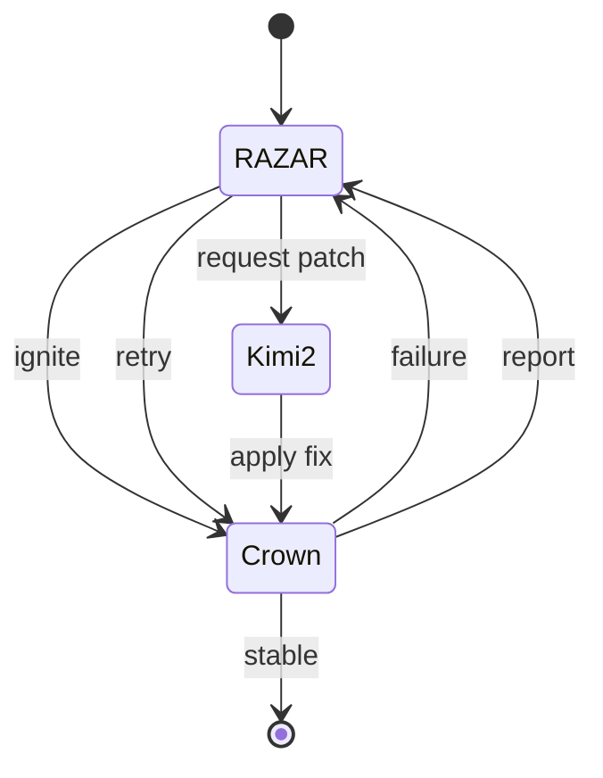

# Ignition Blueprint

## Overview
This blueprint outlines adaptive ignition sequences coordinated by RAZAR. When Crown fails to launch or report healthy status, RAZAR can loop back for another attempt or delegate recovery to the Kimi2 assistant before retrying Crown.

## Flexible Recovery Flow
- **Initial ignition** – RAZAR launches Crown and waits for a healthy status.
- **Failure loop** – If Crown reports a failure, RAZAR re-enters the ignition cycle.
- **Delegated patch** – After repeated failures, RAZAR routes context to Kimi2 for a patch and then retries Crown.
- **Sustained operation** – Successful recovery returns Crown to steady state and ends the loop.

## State Diagram

## Cross-links
- [Project Overview](project_overview.md)
- [RAZAR Agent](RAZAR_AGENT.md)

## Version History
| Version | Date | Notes |
|---------|------|-------|
| 0.1.0 | 2025-10-17 | Initial flexible ignition loops and state diagram. |
