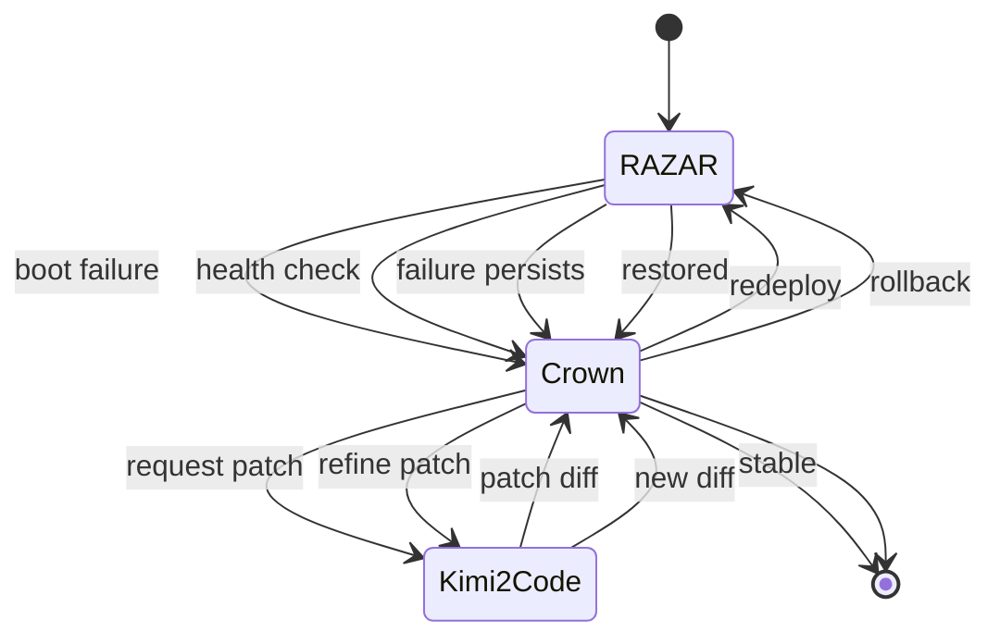

# Ignition Blueprint

The ignition workflow cycles components between RAZAR, Crown and Kimi2Code, handing off failures and looping through recovery until stability returns.

```mermaid
stateDiagram-v2
    [*] --> RAZAR
    RAZAR --> Crown: boot failure
    Crown --> Kimi2Code: request patch
    Kimi2Code --> Crown: patch diff
    Crown --> RAZAR: redeploy
    RAZAR --> Crown: health check
    Crown --> [*]: stable
    RAZAR --> Crown: failure persists
    Crown --> Kimi2Code: refine patch
    Kimi2Code --> Crown: new diff
    Crown --> RAZAR: rollback
    RAZAR --> Crown: restored
    Crown --> [*]
```
