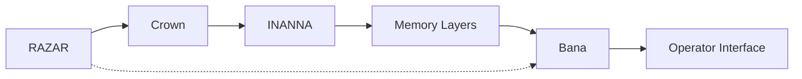

# Ignition Flow

This guide traces the activation sequence from **RAZAR** through to the final **operator interface**, linking each stage to its subsystem documentation and source code.

Run [`scripts/validate_ignition.py`](../scripts/validate_ignition.py) to walk the ignition chain and log component readiness to `logs/ignition_validation.json`.

## Stages

### RAZAR
- Guide: [RAZAR Agent](RAZAR_AGENT.md)
- Source: [`razar/boot_orchestrator.py`](../razar/boot_orchestrator.py)

### Crown
- Guide: [Crown Overview](CROWN_OVERVIEW.md)
- Service wake sequence: [Service Wake Sequence](CROWN_OVERVIEW.md#service-wake-sequence)
- Source: [`crown_router.py`](../crown_router.py)

### INANNA
- Guide: [INANNA Core](INANNA_CORE.md)
- Source: [`INANNA_AI_AGENT/inanna_ai.py`](../INANNA_AI_AGENT/inanna_ai.py)

### Memory Layers
- Guide: [Memory Architecture](memory_architecture.md)
- Source: [`memory`](../memory)

### Bana
- Guide: [Bana Engine](bana_engine.md)
- Trigger: Activated by RAZAR after memory initialization
- Source: [`agents/bana/bio_adaptive_narrator.py`](../agents/bana/bio_adaptive_narrator.py)

### Operator Interface
- Guide: [Operator Protocol](operator_protocol.md)
- Source: [`operator_api.py`](../operator_api.py)

