# Ignition Flow

This guide traces the activation sequence from **RAZAR** through to the final **operator interface**, linking each stage to its subsystem documentation and source code.

Run [`scripts/validate_ignition.py`](../scripts/validate_ignition.py) to execute a minimal boot, confirm the Crown handshake, check connector availability, and record results to `logs/ignition_validation.json`.

```mermaid
graph LR
    RAZAR[RAZAR] --> Crown[Crown]
    Crown --> INANNA[INANNA]
    INANNA --> Albedo[Albedo]
    Albedo --> Nazarick[Nazarick]
    Nazarick --> Bana[Bana]
    Bana --> Operator[Operator Interface]
    click RAZAR "RAZAR_AGENT.md" "RAZAR guide"
    click Crown "CROWN_OVERVIEW.md" "Crown overview"
    click INANNA "INANNA_CORE.md" "INANNA core"
    click Albedo "ALBEDO_LAYER.md" "Albedo layer"
    click Nazarick "nazarick_narrative_system.md" "Nazarick narrative system"
    click Bana "bana_engine.md" "Bana engine"
    click Operator "operator_protocol.md" "Operator protocol"
```

## Stages

### RAZAR
- Guide: [RAZAR Agent](RAZAR_AGENT.md)
- Source: [`razar/boot_orchestrator.py`](../razar/boot_orchestrator.py)

### Crown
- Guide: [Crown Overview](CROWN_OVERVIEW.md)
- Source: [`crown_router.py`](../crown_router.py)

### INANNA
- Guide: [INANNA Core](INANNA_CORE.md)
- Source: [`INANNA_AI_AGENT/inanna_ai.py`](../INANNA_AI_AGENT/inanna_ai.py)

### Albedo
- Guide: [Albedo Layer](ALBEDO_LAYER.md)
- Source: [`albedo/state_machine.py`](../albedo/state_machine.py)

### Nazarick
- Guide: [Nazarick Narrative System](nazarick_narrative_system.md)
- Source: [`agents/nazarick/narrative_scribe.py`](../agents/nazarick/narrative_scribe.py)

### Bana
- Guide: [Bana Engine](bana_engine.md)
- Source: [`agents/bana/bio_adaptive_narrator.py`](../agents/bana/bio_adaptive_narrator.py)

### Operator Interface
- Guide: [Operator Protocol](operator_protocol.md)
- Source: [`operator_api.py`](../operator_api.py)

