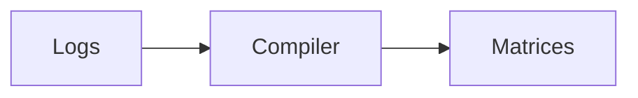

# Insight System

The insight system aggregates interaction logs into structured matrices used by
reflection and adaptive learning components.

## Vision

Transform raw interaction logs into validated matrices so downstream agents can
reason over trusted summaries.

## Architecture Diagram



## Requirements

- Python 3.10+
- `jsonschema`

## Deployment

Run the compiler whenever matrices change:

```bash
python insight_compiler.py
```

## Config Schemas

`insight_manifest.json` tracks semantic versions and SHA-256 checksums for the
matrix files listed below:

- [../schemas/insight_matrix.schema.json](../schemas/insight_matrix.schema.json)
- [../schemas/mirror_thresholds.schema.json](../schemas/mirror_thresholds.schema.json)
- [../schemas/intent_matrix.schema.json](../schemas/intent_matrix.schema.json)
- [../schemas/insight_manifest.schema.json](../schemas/insight_manifest.schema.json)

Validate matrices against their schemas before committing changes:

```bash
python -m jsonschema ./schemas/insight_matrix.schema.json ./insight_matrix.json
python -m jsonschema ./schemas/mirror_thresholds.schema.json ./mirror_thresholds.json
python -m jsonschema ./schemas/intent_matrix.schema.json ./intent_matrix.json
python -m jsonschema ./schemas/insight_manifest.schema.json ./insight_manifest.json
```

## Version History

- v0.1.0 – baseline matrix tracking

## Cross-links

- [RAG Pipeline](rag_pipeline.md)
- [Memory Architecture](memory_architecture.md)

## Example Runs

The test suite runs the schema checks automatically via
`tests/test_insight_compiler.py`.
