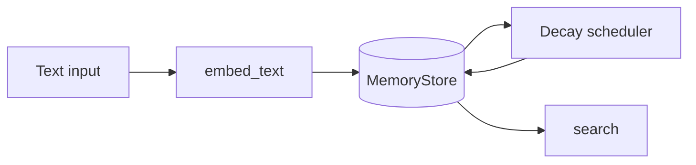

# Memory Architecture

Spiral OS persists experiences across several layers. For runtime placement see
[architecture_overview.md](architecture_overview.md) and for project goals see
[project_overview.md](project_overview.md).

## Cortex memory

[`memory/cortex.py`](../memory/cortex.py) logs each decision cycle as JSON lines
and exposes query helpers for later analysis.

## Emotional memory

[`memory/emotional.py`](../memory/emotional.py) stores feature vectors inside a
SQLite database. Optional transformers or dlib extract features from raw media.

## Mental memory

[`memory/mental.py`](../memory/mental.py) keeps task graphs in Neo4j and can
train a reinforcement learner to improve future decisions.

## Music memory

[`memory/music_memory.py`](../memory/music_memory.py) saves embedding vectors
with emotion labels for retrieval‑augmented music creation.

## Spiritual memory

[`memory/spiritual.py`](../memory/spiritual.py) maps events to symbolic glyphs
in a lightweight ontology stored in SQLite.

## Spiral registry

[`spiral_memory.py`](../spiral_memory.py) aggregates multi‑layer data and logs
major events with optional sacred glyphs. When available, a small PyTorch
transformer refines cross‑layer aggregates.

## Vector memory

[`vector_memory.py`](../vector_memory.py) embeds text through a
FAISS/SQLite-backed `MemoryStore`, optionally replicating to Redis. It applies
exponential decay so recent conversations have more influence. Dependencies
include `faiss`, `numpy` and optional `redis` for distributed backups.

