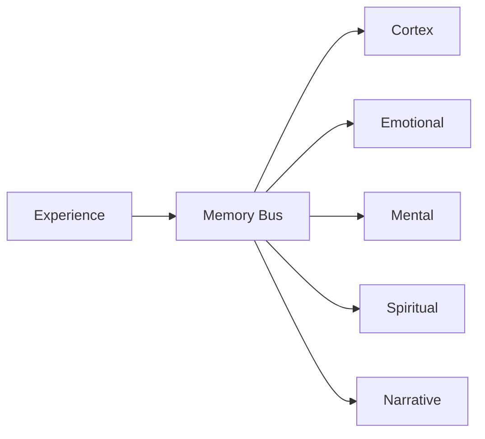

# Memory Architecture

The system layers multiple specialised stores, each recording a different facet
of experience. Every layer supports two storage back‑end families:

- **File system** – default local persistence using JSON or SQLite files.
- **Vector database** – retrieval‑oriented storage backed by Chroma via
  `spiral_vector_db`.

Environment variables toggle the back‑end and location for each layer. The
sections below outline initialisation commands, back‑end options and
persistence strategies for each store. Each section also includes a minimal
query example:

- **Cortex** – persistent application state with semantic tags.
- **Emotional** – affective snapshots mirroring the agent's mood.
- **Mental** – short‑lived reasoning fragments for active tasks.
- **Spiritual** – transcendent insights and ritual state.
- **Narrative** – story events linking actors, actions and symbolism.

## Flow



The Mermaid source lives at [assets/memory_flow.mmd](assets/memory_flow.mmd).

### Cortex store

Implementation: [memory/cortex.py](../memory/cortex.py)

The cortex layer persists application state as JSON lines while maintaining an
inverted index for semantic tags and a full‑text index for tag tokens. Reader
and writer locks guard the log and index so multiple threads can record and
query safely. Helper utilities allow concurrent queries and pruning of old
entries.

#### Storage back-end options

- **File system** – default JSONL log and index under `data/`. Override the
  location with `CORTEX_PATH`.
- **Vector database** – set `CORTEX_BACKEND=vector` and point
  `SPIRAL_VECTOR_PATH` to the Chroma directory.

#### Initialization

```bash
# Choose a back-end
export CORTEX_BACKEND=file           # or "vector"
export CORTEX_PATH=data/cortex.jsonl
export SPIRAL_VECTOR_PATH=/tmp/cortex_vectors   # for vector DB
```

```python
# File system
from memory.cortex import record_spiral, query_spirals
# Vector database
from spiral_vector_db import init_db as cortex_db
cortex_collection = cortex_db()
```

#### Query example

Store and retrieve a record:

```bash
python - <<'PY'
from memory.cortex import record_spiral, query_spirals

class Node:
    children = []

record_spiral(Node(), {"result": "demo", "tags": ["example"]})
print(query_spirals(tags=["example"]))
PY
```

### Emotional store

Implementation: [memory/emotional.py](../memory/emotional.py)

The emotional layer captures affective reactions and valence values. Entries
can be queried to modulate tone or influence downstream reasoning.

#### Storage back-end options

- **File system** – SQLite database at `data/emotions.db`. Override with
  `EMOTION_DB_PATH`.
- **Vector database** – set `EMOTION_BACKEND=vector` and `SPIRAL_VECTOR_PATH`
  for a Chroma collection.

#### Initialization

```bash
export EMOTION_BACKEND=file          # or "vector"
export EMOTION_DB_PATH=/tmp/emotions.db
export SPIRAL_VECTOR_PATH=/tmp/emotion_vectors  # for vector DB
```

```python
# File system
from memory.emotional import get_connection, log_emotion, fetch_emotion_history
conn = get_connection()
# Vector database
from spiral_vector_db import init_db as emotion_db
emotion_collection = emotion_db()
```

#### Query example

Store and retrieve a record:

```bash
python - <<'PY'
from memory.emotional import get_connection, log_emotion, fetch_emotion_history

conn = get_connection()
log_emotion([0.1, 0.2], conn=conn)
print(fetch_emotion_history(window=60, conn=conn))
PY
```

### Mental store

Implementation: [memory/mental.py](../memory/mental.py)

The mental layer keeps temporary working memory for in‑progress reasoning and
planning. Items decay quickly to keep the space focused on current tasks.

#### Storage back-end options

- **Vector DB / Graph** – default Neo4j instance configured via
  `NEO4J_URI`, `NEO4J_USER` and `NEO4J_PASSWORD`.
- **File system** – set `MENTAL_JSON_PATH` to log tasks as JSON lines when
  Neo4j is unavailable.

#### Initialization

```bash
export NEO4J_URI=bolt://localhost:7687
export NEO4J_USER=neo4j
export NEO4J_PASSWORD=pass
# Fallback file log
export MENTAL_JSON_PATH=/tmp/tasks.jsonl
```

```python
from memory.mental import init_rl_model, record_task_flow, query_related_tasks
init_rl_model()  # uses NEO4J_* variables
```

#### Query example

Store and retrieve a record:

```bash
python - <<'PY'
from memory.mental import init_rl_model, record_task_flow, query_related_tasks

init_rl_model()
record_task_flow("taskA", {"step": 1})
print(query_related_tasks("taskA"))
PY
```

### Spiritual store

Implementation: [memory/spiritual.py](../memory/spiritual.py)

The spiritual layer maintains ritual insights and symbolic states that extend
beyond immediate computation. These records provide long‑range guidance during
ceremonial flows.

#### Storage back-end options

- **File system** – SQLite ontology at `data/ontology.db`; override via
  `SPIRITUAL_DB_PATH`.
- **Vector database** – set `SPIRIT_BACKEND=vector` and `SPIRAL_VECTOR_PATH`
  for a Chroma collection.

#### Initialization

```bash
export SPIRITUAL_DB_PATH=/tmp/ontology.db
export SPIRIT_BACKEND=file        # or "vector"
export SPIRAL_VECTOR_PATH=/tmp/spirit_vectors  # for vector DB
```

```python
# File system
from memory.spiritual import get_connection, map_to_symbol, lookup_symbol_history
conn = get_connection()
# Vector database
from spiral_vector_db import init_db as spirit_db
spirit_collection = spirit_db()
```

#### Query example

Store and retrieve a record:

```bash
python - <<'PY'
from memory.spiritual import get_connection, map_to_symbol, lookup_symbol_history

conn = get_connection()
map_to_symbol(("eclipse", "☾"), conn=conn)
print(lookup_symbol_history("☾", conn=conn))
PY
```

### Narrative store

Implementation: [memory/narrative_engine.py](../memory/narrative_engine.py)

The narrative layer outlines interfaces for recording story events. Each event
binds an actor, an action and optional symbolism so later modules can weave a
coherent narrative thread across memories.

#### Storage back-end options

- **In-memory** – default ephemeral list.
- **File system** – set `NARRATIVE_LOG_PATH` to append events to a log file.
- **Vector database** – set `NARRATIVE_BACKEND=vector` and `SPIRAL_VECTOR_PATH`
  for persisted embeddings.

#### Initialization

```bash
export NARRATIVE_LOG_PATH=/tmp/story.log
export NARRATIVE_BACKEND=file     # or "vector"
export SPIRAL_VECTOR_PATH=/tmp/narrative_vectors  # for vector DB
```

```python
# In-memory or file
from memory.narrative_engine import log_story, stream_stories
# Vector database
from spiral_vector_db import init_db as narrative_db
narrative_collection = narrative_db()
```

#### Query example

Store and retrieve a record:

```bash
python - <<'PY'
from memory.narrative_engine import log_story, stream_stories

log_story("hero meets guide")
print(list(stream_stories()))
PY
```

## Version History

| Version | Date | Summary |
|---------|------|---------|
| [Unreleased](../CHANGELOG.md#documentation-audit) | - | Mapped cortex, emotional, mental, spiritual and narrative memory stores. |
