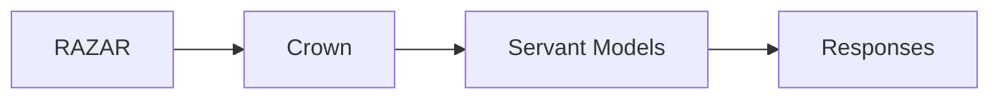

# Mission Brief Exchange & Servant Routing

This guide outlines how RAZAR hands mission briefs to Crown, how failures escalate through `ai_invoker.handover`, and how Crown dispatches work to servant models.

## Mission Brief Exchange
- RAZAR parses mission briefs and forwards them to Crown during startup.
- Crown records the brief and acknowledges readiness for operator review.

## Failure Escalation via `ai_invoker.handover`
When a component fails, RAZAR calls `ai_invoker.handover` to delegate recovery to a remote agent. Suggested patches are applied before services resume.

## Servant Model Routing
Crown routes operator requests or delegated tasks to registered servant models, returning their responses to the operator.

See also the [RAZAR Agent](RAZAR_AGENT.md) and the [CROWN Manifest](crown_manifest.md) for implementation details.
