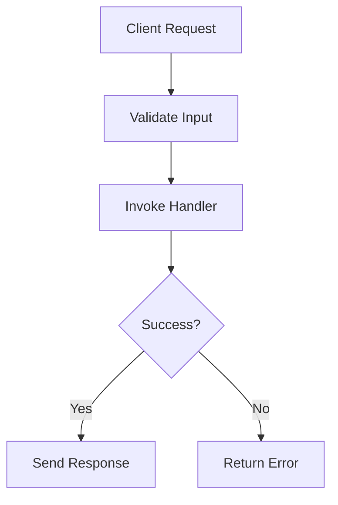
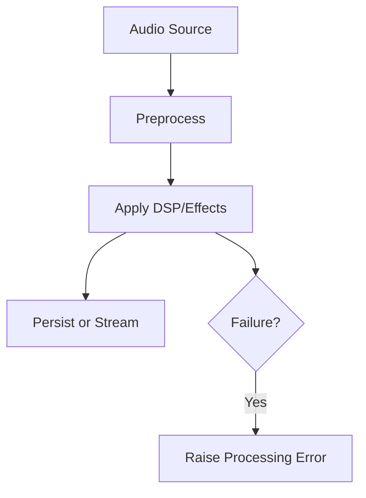
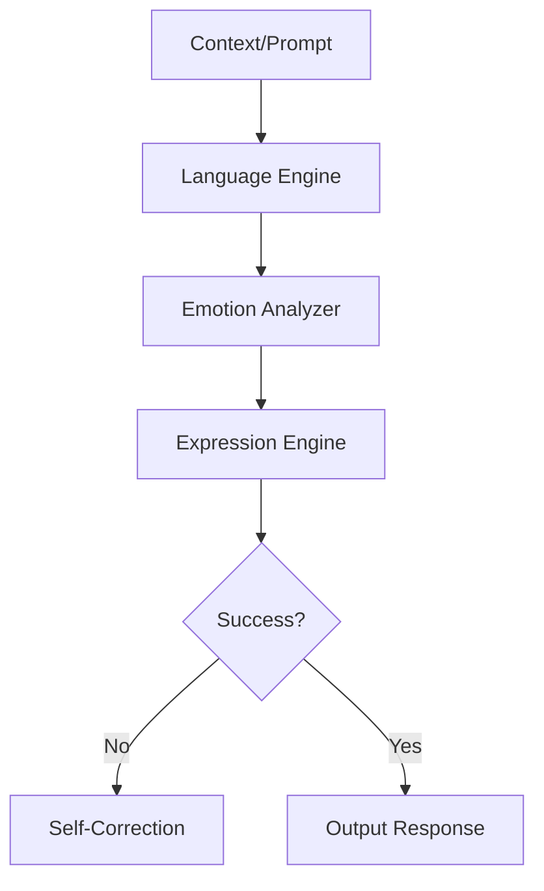
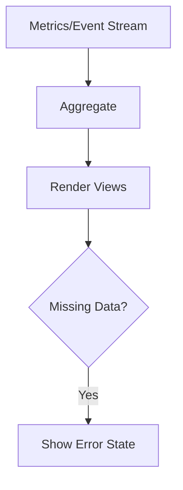
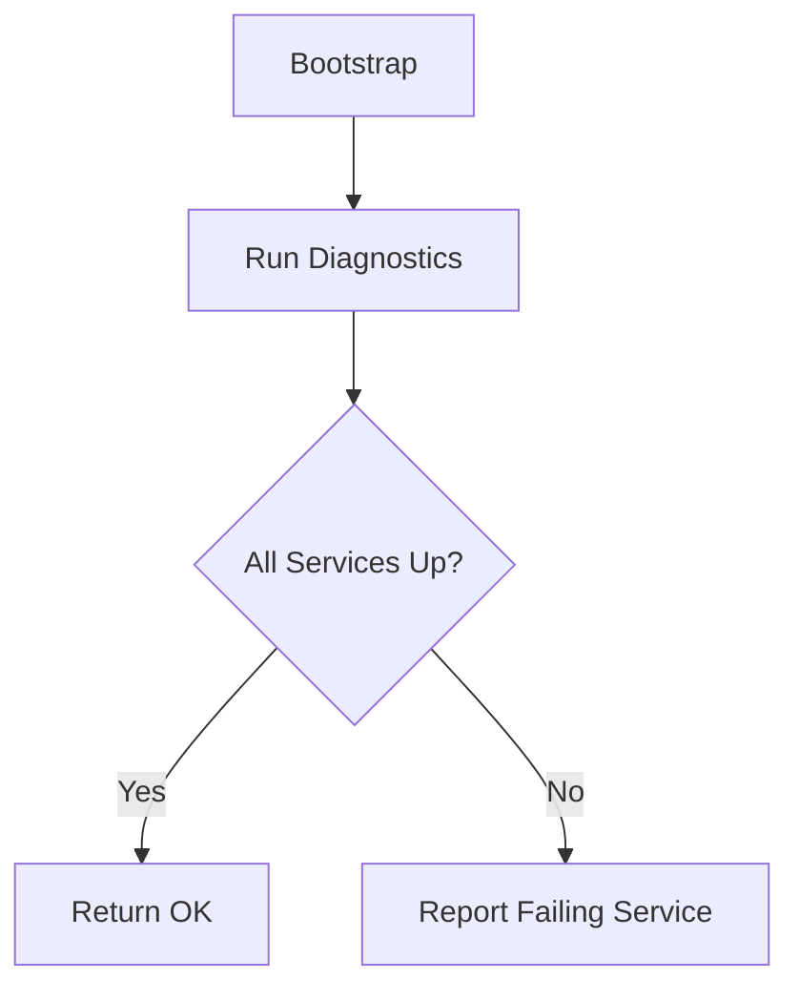
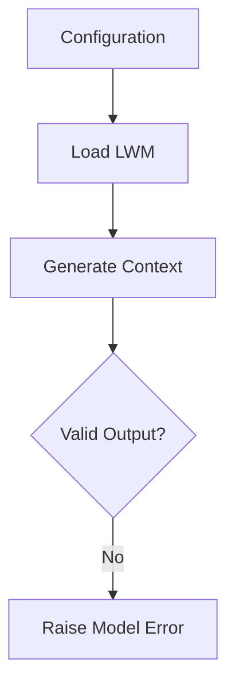
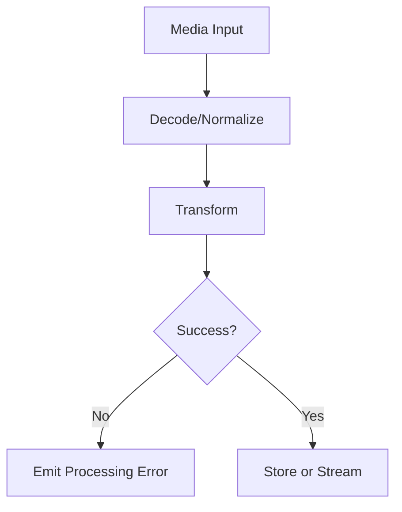
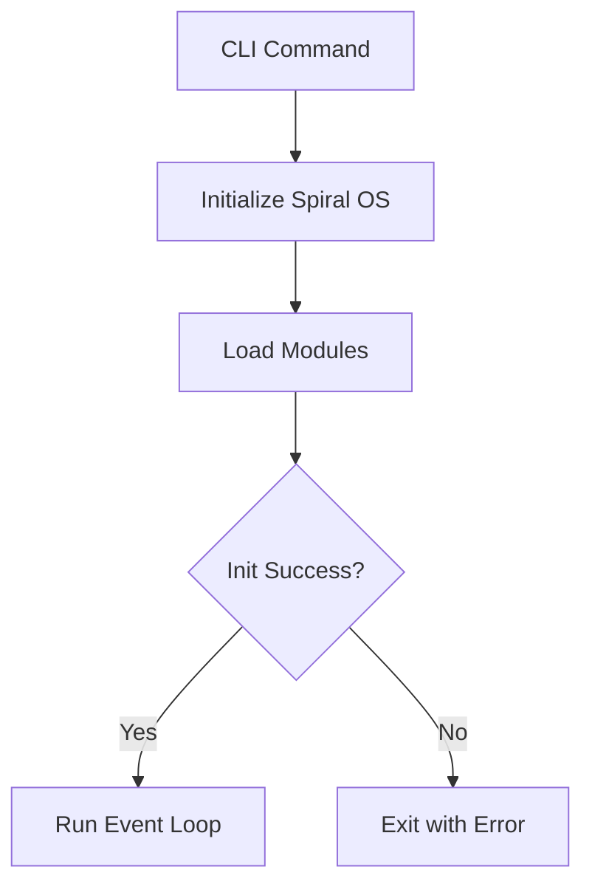

# Module Execution Flow

Overview of key modules with their inputs, core processing, outputs, and error handling. Flowcharts summarize the execution path.

## API Server

- **Inputs**: JSON payloads or websocket messages.
- **Processing Steps**: FastAPI routes validate data, execute core logic (video generation, style listing, voice cloning) and manage active websocket connections.
- **Outputs**: JSON responses or streamed websocket updates.
- **Error Paths**: Runtime errors caught and returned as `{ "error": message }` payloads.

## Audio Module

- **Inputs**: Raw audio files or microphone samples.
- **Processing Steps**: Ingestion checks environment, applies DSP via engines, and can mix or segment tracks.
- **Outputs**: Processed waveforms, cloned voices, or mixed audio tracks.
- **Error Paths**: Missing dependencies or invalid parameters raise `RuntimeError`.

## Core Module

- **Inputs**: Context objects, user prompts, and model configurations.
- **Processing Steps**: Tracks context, selects models, analyzes emotion, and composes expressive output.
- **Outputs**: Generated text, expressions, or task profiles.
- **Error Paths**: Contract validation or model selection issues propagate exceptions for logging.

## Dashboard

- **Inputs**: Usage metrics, RL feedback, system monitor data.
- **Processing Steps**: Aggregates streams, updates dashboards, and exposes QNL mixers.
- **Outputs**: Web dashboards and usage reports.
- **Error Paths**: If metrics unavailable, views display error state and logs record the issue.

## Health Checks

- **Inputs**: Service registry and configuration.
- **Processing Steps**: Boot diagnostics verify essential services and environment.
- **Outputs**: Health status reports.
- **Error Paths**: Missing dependencies or failing services raise exceptions noted in logs.

## Large World Model (LWM)

- **Inputs**: Model configuration files and prompt context.
- **Processing Steps**: Loads weights, constructs world model, and generates context-aware data.
- **Outputs**: Structured representations for downstream modules.
- **Error Paths**: Bad configuration or failed generation raises `ValueError`.

## Media Pipeline

- **Inputs**: Audio, image, or video data.
- **Processing Steps**: Base classes normalize media then audio/avatar/video submodules apply transformations.
- **Outputs**: Encoded media assets or streams.
- **Error Paths**: Unsupported formats or transform failures raise custom exceptions.

## Spiral OS

- **Inputs**: Command-line arguments and configuration files.
- **Processing Steps**: Entry points bootstrap Spiral OS, loading necessary modules and event loops.
- **Outputs**: Operating session within the spiral environment.
- **Error Paths**: Initialization failures or module load errors terminate startup with stack traces.

