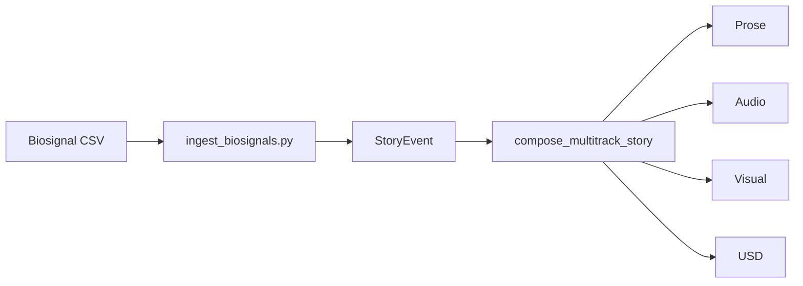

# Narrative System

The narrative system transforms physiological data into cohesive multitrack stories.

## Flow



## Retrieval Example

```python
from scripts.ingest_biosignals import ingest_directory
from memory.narrative_engine import query_events

tracks = ingest_directory()
print(tracks["prose"])

for event in query_events(agent_id="subject"):
    print(event["payload"])
```
