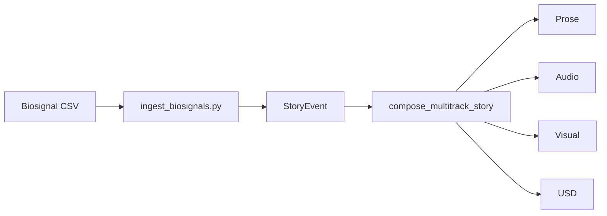

# Narrative System

The narrative system transforms physiological data into cohesive multitrack stories.

## Flow



## Retrieval Example

```python
from scripts.ingest_biosignals import ingest_directory
from memory.narrative_engine import query_events

tracks = ingest_directory()
print(tracks["prose"])

for event in query_events(agent_id="subject"):
    print(event["payload"])
```

## Sample Output

```json
{
  "prose": "Hero draws sword.",
  "audio": [{"cue": "Hero_draws_sword"}],
  "visual": [{"directive": "frame Hero draws sword"}],
  "usd": [{"op": "AddPrim", "path": "/Hero", "action": "draws sword"}]
}
```

## Troubleshooting

- No audio or avatar motion: ensure ``stream=True`` and that a frame callback
  is registered via ``expressive_output.set_frame_callback``.
- Video displays without sound: browsers may block autoplay; interact with the
  page to enable playback.
- Narrative text missing: verify that the server sends ``prose`` messages over
  the data channel.

## Test Invocation

Run the narrative engine tests:

```bash
pytest tests/test_bana_narrative_engine.py
```

Run a single test:

```bash
pytest tests/test_bana_narrative_engine.py::test_multitrack_track_schemas
```
