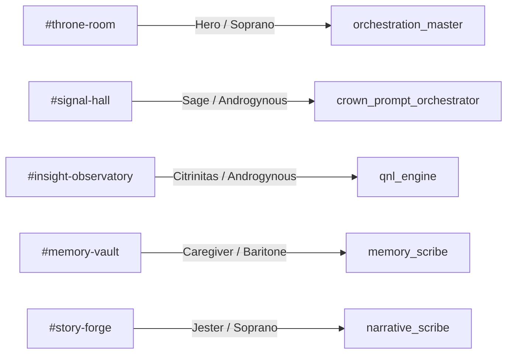

# Nazarick Agent Profiles

Each servant agent blends a narrative persona with distinct vocal and visual traits.

## Profiles

| Agent ID | Role | Personality | Voice Preset | Avatar Skin |
| --- | --- | --- | --- | --- |
| `orchestration_master` | Boot order and pipeline supervision | Commanding conductor keeping chakras aligned | Hero | Soprano |
| `crown_prompt_orchestrator` | Route prompts and recall context | Calm analyst who favors precise wording | Sage | Androgynous |
| `qnl_engine` | Process QNL sequences and insights | Mystical strategist searching symbolic patterns | Citrinitas | Androgynous |
| `memory_scribe` | Persist transcripts and embeddings | Empathetic archivist guarding long-term memory | Caregiver | Baritone |
| `narrative_scribe` | Render event bus stories | Expressive storyteller narrating system events | Jester | Soprano |

## Channel → Expression Map

The voice presets come from [voice_config.yaml](../voice_config.yaml) and avatar skins from [voice_avatar_config.yaml](../voice_avatar_config.yaml).

## Cross-Links

- [Nazarick Agents](nazarick_agents.md)
- [Nazarick Core Architecture](../agents/nazarick/nazarick_core_architecture.md)
- [Nazarick Memory Blueprint](../agents/nazarick/nazarick_memory_blueprint.md)

## Version History

| Version | Date | Notes |
| --- | --- | --- |
| Unreleased | 2025-10-?? | Initial profile summary and expression map |
