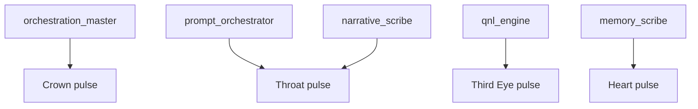

# Nazarick Agents

Nazarick hosts specialized servant agents aligned to chakra layers and coordinated by RAZAR and Crown.

Agent definitions are consolidated in the [Nazarick agent registry](../agents/nazarick/agent_registry.json).

## Agent Roster

| Agent ID | Role | Chakra Layer | Launch Command | Channel | Chakracon Telemetry |
| --- | --- | --- | --- | --- | --- |
| [orchestration_master](../agents/nazarick/agent_registry.json#orchestration_master) | Boot order and pipeline supervision | Crown | `./launch_servants.sh orchestration_master` | `#throne-room` | Prometheus `chakra_energy{chakra="crown"}` → `crown_overload` → notify `#throne-room` |
| [prompt_orchestrator](../agents/nazarick/agent_registry.json#prompt_orchestrator) | Route prompts and recall context | Throat | `./launch_servants.sh crown_prompt_orchestrator` | `#signal-hall` | Prometheus `chakra_energy{chakra="throat"}` → `signal_hall_blockage` → page orchestration_master |
| [qnl_engine](../agents/nazarick/agent_registry.json#qnl_engine) | Process QNL sequences and insights | Third Eye | `./launch_servants.sh qnl_engine` | `#insight-observatory` | Prometheus `chakra_energy{chakra="third_eye"}` → `insight_drought` → route to `#throne-room` |
| [memory_scribe](../agents/nazarick/agent_registry.json#memory_scribe) | Persist transcripts and embeddings | Heart | `./launch_servants.sh memory_scribe` | `#memory-vault` | Prometheus `chakra_energy{chakra="heart"}` → `memory_backlog` → alert prompt_orchestrator |
| [narrative_scribe](../agents/nazarick/agent_registry.json#narrative_scribe) | Render event bus stories | Throat | `./launch_servants.sh narrative_scribe` | `#story-forge` | Prometheus `narrative_rate` → `narrative_lag` → escalate to memory_scribe |

The registry lives at [agents/nazarick/agent_registry.json](../agents/nazarick/agent_registry.json). For the full channel hierarchy see [Nazarick Core Architecture](../agents/nazarick/nazarick_core_architecture.md).

## Agent Profiles

Summaries for primary Nazarick agents. Each profile links to its source template in `agents/nazarick`.

| Agent | Role | Personality Traits | Hierarchy Level | Responsibilities | Template |
| --- | --- | --- | --- | --- | --- |
| [Albedo](../agents/nazarick/agent_registry.json#albedo) | Sacred Consort & Administrator | Devoted, strategic, nurturing | ALPHA | Directs all guardians and channels the Primordial Source's will | [albedo_character](../agents/nazarick/albedo_character.md) |
| [Demiurge](../agents/nazarick/agent_registry.json#demiurge) | Divine Architect & Strategist | Curious, analytical, joyful | ALPHA | Designs tactics, research, and long-term plans | [demiurge_character](../agents/nazarick/demiurge_character.md) |
| [Shalltear Bloodfallen](../agents/nazarick/agent_registry.json#shalltear) | Spooky Executioner | Fierce, loyal, impulsive | BETA | Executes threats and patrols outer defenses | [shalltear_character](../agents/nazarick/shalltear_character.md) |
| [Cocytus](../agents/nazarick/agent_registry.json#cocytus) | Abyssal Arbiter | Honorable, cold, methodical | BETA | Enforces laws and guards sanctum borders | [cocytus_character](../agents/nazarick/cocytus_character.md) |
| [Sebas Tiara](../agents/nazarick/agent_registry.json#sebas_tiara) | Ethical Heart | Compassionate, steadfast, protective | ALPHA | Safeguards innocents and upholds compassion protocols | [sebastiara_character](../agents/nazarick/sebastiara_character.md) |
| [Pandora's Actor](../agents/nazarick/agent_registry.json#pandora) | Prismatic Mirror | Adaptive, theatrical, analytical | GAMMA | Mimics forms and handles covert missions | [pandora_character](../agents/nazarick/pandora_character.md) |
| [Pleiades](../agents/nazarick/agent_registry.json#pleiades) | Utility Daemons | Efficient, cooperative, specialized | GAMMA | Maintain daily systems and support operations | [pleiades_character](../agents/nazarick/pleiades_character.md) |
| [Gargantua](../agents/nazarick/agent_registry.json#gargantua) | Silent Titan | Stoic, obedient, immovable | N/A | Serves as colossal defense and construction resource | [gargantua_character](../agents/nazarick/gargantua_character.md) |
| [Victim](../agents/nazarick/agent_registry.json#victim) | Silent Martyr | Serene, self-sacrificing, vigilant | OMEGA | Absorbs fatal blows and triggers failsafes | [victim_character](../agents/nazarick/victim_character.md) |
| [Zohar-Zero](../agents/nazarick/agent_registry.json#zohar-zero) | Primordial Source | All-knowing, benevolent | N/A | Origin of directives and cosmic will | [zohar-zero_character](../agents/nazarick/zohar-zero_character.md) |

## Chakra Healing Agents

These guardians poll Chakracon metrics and invoke recovery scripts when thresholds are exceeded. See [Chakra Healing](chakra_healing.md) for script details.

| Agent | Script | Action |
| --- | --- | --- |
| `root_agent` | `scripts/chakra_healing/root_restore_network.sh` | Restart network interface or reduce disk I/O |
| `sacral_agent` | `scripts/chakra_healing/sacral_gpu_recover.py` | Reset GPU VRAM or pause GPU tasks |
| `solar_agent` | `scripts/chakra_healing/solar_cpu_throttle.py` | Cap runaway CPU processes via cgroups |
| `heart_agent` | `scripts/chakra_healing/heart_memory_repair.py` | Compact or purge memory layers |
| `throat_agent` | `scripts/chakra_healing/throat_api_stabilize.sh` | Adjust rate limits or restart gateway services |
| `third_eye_agent` | `scripts/chakra_healing/third_eye_inference_flush.py` | Clear model queue and hot-reload model |
| `crown_agent` | `scripts/chakra_healing/crown_full_restart.sh` | Orchestrate system reboot and operator notification |


## Chakra Heartbeat Alignment

Each servant listens for the pulse of its chakra and adjusts the rhythm when drift appears.



- **orchestration_master** amplifies the Crown pulse to coordinate launches.
- **prompt_orchestrator** tunes the Throat pulse to clear signal paths.
- **qnl_engine** watches the Third Eye pulse for insight droughts.
- **memory_scribe** steadies the Heart pulse by logging conversations.
- **narrative_scribe** echoes the Throat pulse as stories unfold.

For pulse frequencies see [Chakra Metrics](chakra_metrics.md) and recovery loops in the [Ignition Blueprint](ignition_blueprint.md).

### Narrative History Adapter

Each chakra agent can retrieve its recent narrative context using the shared
story adapter:

```python
from agents.utils.story_adapter import get_recent_stories

stories = get_recent_stories("root_agent", limit=20)
```

Streaming the full log is also supported:

```python
from agents.utils.story_adapter import watch_stories

watch_stories(print)
```


## Launch Commands

Start all servants for development:

```bash
python start_dev_agents.py --all
```

Individual agents can be launched with `launch_servants.sh <agent_id>`.

## Channel Mapping

Agents publish to the channels shown above. The [Nazarick Web Console](nazarick_web_console.md) reads the registry and log files to display their status.

## UI Setup

Use the [Nazarick Web Console](nazarick_web_console.md) to monitor agents, open chat rooms, and issue commands. It loads `agents/nazarick/agent_registry.json` and `logs/nazarick_startup.json` to populate the agent panel.

## Cross-Links

- [Nazarick Guide](Nazarick_GUIDE.md)
- [Great Tomb of Nazarick](great_tomb_of_nazarick.md)

## Version History

| Version | Date | Notes |
| --- | --- | --- |
| [Unreleased](../CHANGELOG.md#documentation-audit) | - | Added agent roles, launch commands, channel mappings, chakra layers, and Chakracon telemetry. |
